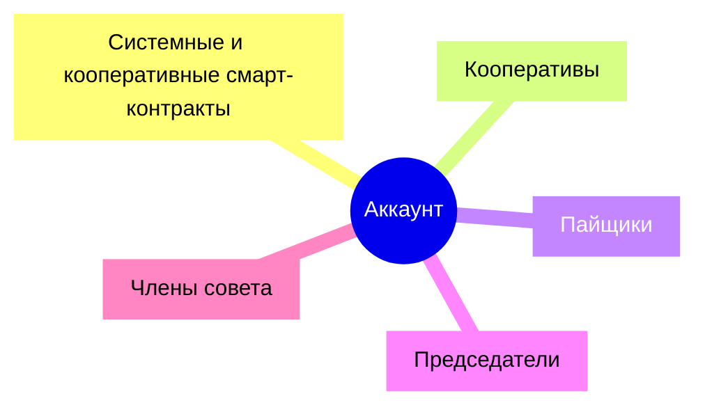
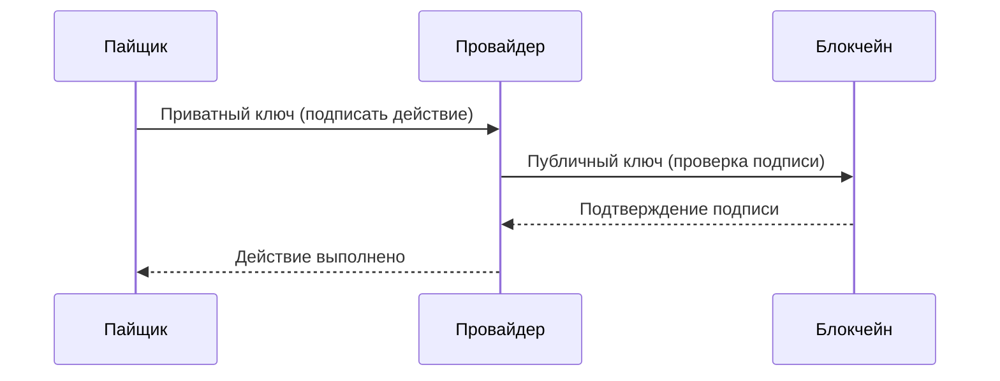
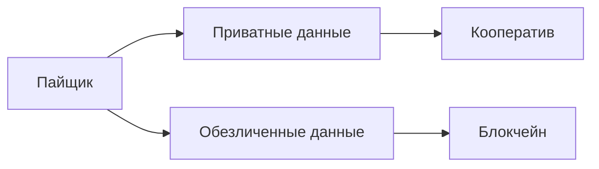
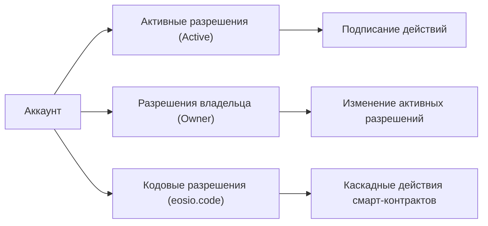
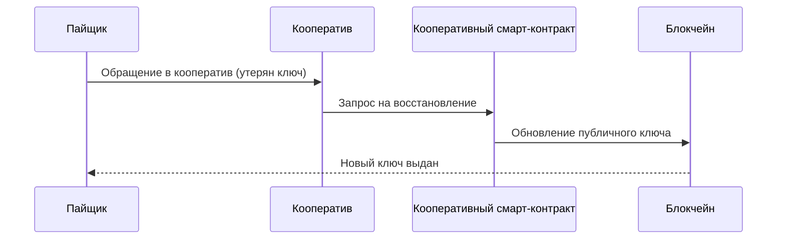

## Аккаунты



Аккаунт - это идентификатор области хранения информации пользователей и смарт-контрактов. Любая информация в блокчейне может храниться только в областях памяти аккаунтов. Каждый аккаунт имеет уникальное имя, обычно из 12 латинских символов: 

!!!note "примеры аккаунтов"
    gzxcsdaqwejf, dfjlkeifjdka, djkqufgisdjf - это примеры случайных комбинаций символов, которые используются в качестве идентификаторов аккаунтов пайщиков.

Все аккаунты обладает неизменяемой историей и могут совершать действия, отправляя транзакции. Системные и кооперативные смарт-контракты - это тоже аккаунты. Кооперативы, их председатели, и члены совета - тоже обладают аккаунтами. Доступ к аккаунтам определяется на основании наличия ключей и соответствующих разрешений. 

!!!note ""
    подробнее о том, как происходит процесс идентификации и криптографического соединения цифровой и собственноручной подписи пайщика смотри в разделе "Кооперативные контракты". 


## Ключи доступа
Ключи доступа - это уникальная криптографически связанная пара строковых символов, которые как ключ и замок, подходят друг к другу, и открывают доступ пайщику на вход в систему и совершение действий. 

!!!note "приватный ключ"
    5KQwrPbwdL6PhXujxW37FSSQZ1JiwsST4cqQzDeyXtP79zkvFD3 - приватный ключ всегда начинается с цифры 5
    
!!!note "публичный ключ"
    EOS6MRyAjQq8ud7hVNYcfnVPJqcVpscN5So8BhtHuGYqET5GDW5CV - публичный ключ может нажиться с букв EOS или PUB

Каждая пара ключей связана криптографическими преобразованиями таким образом, что из публичного ключа невозможно получить приватный, однако, используя приватный можно не только всегда получить публичный, но и использовать его для получения цифровой подписи произвольных данных. Которую, затем, возможно проверить с помощью публичного ключа, который хранится в распределенной базе данных блокчейна. 

Публичный ключ хранится в блокчейне, и устанавливается в нём при регистрации пайщика. Приватный ключ же используется пайщиком как криптографическое доказательство того, что именно он является собой и обладает правом доступа к аккаунту и цифровой подписи документов от своего лица. 



## Цифровая подпись
Приватные и публичные ключи используются для входа пайщика в систему, а также, для создания простой цифровой подписи электронных документов. Каждый раз, когда пайщик нажимает ту или иную кнопку, Провайдер может создать документ и наложить на него простую электронную подпись пайщика, отправив действие в смарт-контракт. 

Благодаря тому, что кооператив, который обеспечивает регистрацию аккаунта своего пайщика, идентифицирует его, то он может с достоверной точностью сказать, кому принадлежит аккаунт и пара ключей, которую он выдал при регистрации. Обладая этой информацией и дополнительными юридическими соглашениями с пайщиком, кооператив может использовать простую электронную подпись пайщика на равне с его собственноручной подписью - все такие документы несут одинаковую юридическую силу. 

Таким образом, все пайщики на Платформе анонимизированны, и деанонимизируются в контуре программного обеспечения провайдеров, которые предоставляют его для своих кооперативов. А всем другим кооперативам и провайдерам, в которых пайщик еще не состоит, узнать то, кому принадлежит тот или иной аккаунт, или какой документ был подписан - оказывается невозможно. И используются для идентификации пайщиков - ключи доступа и имена аккаунтов. 



## Разрешения доступа
У каждого аккаунта есть таблица разрешений, которая позволяет определить, какие действия допустимы с использованием указанного ключа. У каждого аккаунта всегда есть два основных разрешения: активные (active) и владельца (owner). 



Активные разрешения используются для удостоверения подписи действий в транзакциях и электронных документах. Разрешения владельца позволяют изменить активные разрешения для своего аккаунта.

Также, существуют еще кодовые разрешения доступа (eosio.code), которые используются системными смарт-контрактами. Они позволяют предоставить разрешения исполнять смарт-контракту действия, которые были вызваны из другого смарт-контракта, или, из самого себя. Таким образом, системные контракты связываются во внутреннюю сеть, допуская вызовы каскадных действий внутри неё, когда одни действия пайщиков влекут за собой транзакции, которые совершаются смарт-контрактами автоматически. 

Разрешения доступа могут выдаваться как на ключи, так и на аккаунты. Например, если у системного смарт-контракта будет установлено активное разрешение на другой системный смарт-контракт, то тот смарт-контракт (или аккаунт) получит возможность вызывать действия от его имени так, будто ему это разрешили (а так и есть). 

```mermaid
flowchart TB
    subgraph Транзакция["Транзакция"]
        ДействиеПайщика["Действие пайщика"]
        ДействиеСмартКонтракта1["Действие смарт-контракта 1"]
        ДействиеСмартКонтракта2["Действие смарт-контракта 2 (каскадное)"]
    end

    ДействиеПайщика -->|@active| ДействиеСмартКонтракта1
    ДействиеСмартКонтракта1 -.->|@eosio.code| ДействиеСмартКонтракта2

```

Мы используем систему разрешений по именам аккаунтов для системных смарт-контрактов, которые устанавливают разрешения eosio.code на имена других системных смарт-контрактов, а также, применяем для установки разрешений владельца аккаунтов всех пайщиков на системный смарт-контракт, который позволяет организовать восстановление доступа в случае утери ключа. 

!!!note "короткое обозначение"
    Здесь и далее для обозначения используемых разрешений доступа мы используем символ @, который устанавливается до названия разрешения.

Также, следует сказать, что если у аккаунта вообще не будет разрешений доступа (их возможно изъять путём замены на ничего), то такой аккаунт теряет возможность вызывать действия, однако, если это смарт-контракт, то он сохраняет возможность исполняться полностью автономно. Мы сейчас не используем этот кейс, но он технически возможен. 

## Восстановление доступа
Восстановление доступа происходит за счёт замены утерянного ключа по кооперативному смарт-контракту восстановления. Для этого, при достижении условий выполнения указанного кооперативного контракта, смарт-контракт заменит публичный ключ в блокчейне на новый, и тем самым, восстановит возможность входа и цифровой подписи документов. 

Все старые, ранее подписанные документы по-прежнему будут соотносится с тем же именем аккаунта, доступ к которому был восстановлен. А все новые документы и транзакции, будут создаваться с использованием новых пар ключей, которые точно также будут соотноситься с тем же аккаунтом. 



## Спецификация
```json
{
  "account_name": "example",             // Имя аккаунта
  "head_block_num": 123456,             // Номер последнего блока, в котором были изменения
  "head_block_time": "2023-11-24T10:00:00.000", // Время последнего блока, в котором были изменения
  "privileged": false,                  // Является ли аккаунт привилегированным
  "last_code_update": "2023-01-01T12:00:00.000", // Дата последнего обновления кода
  "created": "2021-05-10T14:00:00.000", // Дата создания аккаунта
  "ram_quota": 8192,                    // Объем выделенной RAM
  "net_weight": 1000,                   // Вес ресурсов сети, выделенных аккаунту
  "cpu_weight": 1000,                   // Вес вычислительных ресурсов, выделенных аккаунту
  "net_limit": {                        // Лимиты сети
    "used": 0,                          // Использовано ресурсов сети
    "available": 50000,                 // Доступно ресурсов сети
    "max": 50000                        // Максимум ресурсов сети
  },
  "cpu_limit": {                        // Лимиты CPU
    "used": 0,                          // Использовано CPU
    "available": 50000,                 // Доступно CPU
    "max": 50000                        // Максимум CPU
  },
  "ram_usage": 1024,                    // Использованная RAM
  "permissions": [                      // Список разрешений аккаунта
    {
      "perm_name": "owner",             // Имя разрешения (владелец)
      "parent": "",                     // Родительское разрешение (нет для owner)
      "required_auth": {                // Требуемая авторизация
        "threshold": 1,                 // Порог авторизации
        "keys": [                       // Список ключей
          {
            "key": "EOS6MRyAjQq8ud7hVNYcfnVPJqcVpscN5So8BhtHuGYqET5GDW5CV", // Публичный ключ
            "weight": 1                 // Вес ключа
          }
        ],
        "accounts": [],                 // Аккаунты с разрешениями
        "waits": []                     // Таймеры ожидания
      }
    },
    {
      "perm_name": "active",            // Имя разрешения (активное)
      "parent": "owner",                // Родительское разрешение (owner)
      "required_auth": {                // Требуемая авторизация
        "threshold": 1,
        "keys": [
          {
            "key": "EOS7T3XhQiLzRYCZCsD6qZZLmRud8kLzjhKrmfN3oBczmXtB5uPiP",
            "weight": 1
          }
        ],
        "accounts": [],
        "waits": []
      }
    }
  ],
  "total_resources": {                  // Общие ресурсы аккаунта
    "owner": "example",                 // Владелец аккаунта
    "net_weight": "1.0000 AXON",         // Выделенные ресурсы сети
    "cpu_weight": "1.0000 AXON",         // Выделенные ресурсы CPU
    "ram_bytes": 8192                   // Выделенная RAM
  },
  "self_delegated_bandwidth": {         // Делегированные самому себе ресурсы
    "from": "example",                  // Аккаунт-источник
    "to": "example",                    // Аккаунт-получатель (сам аккаунт)
    "net_weight": "1.0000 AXON",         // Выделенные ресурсы сети
    "cpu_weight": "1.0000 AXON"          // Выделенные ресурсы CPU
  },
  "refund_request": null,               // Запрос на возврат ресурсов (если есть)
  "voter_info": {                       // Информация о голосовании
    "owner": "example",                 // Владелец аккаунта
    "proxy": "",                        // Прокси-аккаунт (если установлен)
    "producers": [],                    // Список производителей блоков
    "staked": 10000,                     // Вес голоса === 1 
    "last_vote_weight": "0.00000000000000000", // Последний вес голоса
    "proxied_vote_weight": "0.00000000000000000", // Вес голосов через прокси
    "is_proxy": 0                       // Флаг прокси-аккаунта (0 - нет)
  }
}

```

