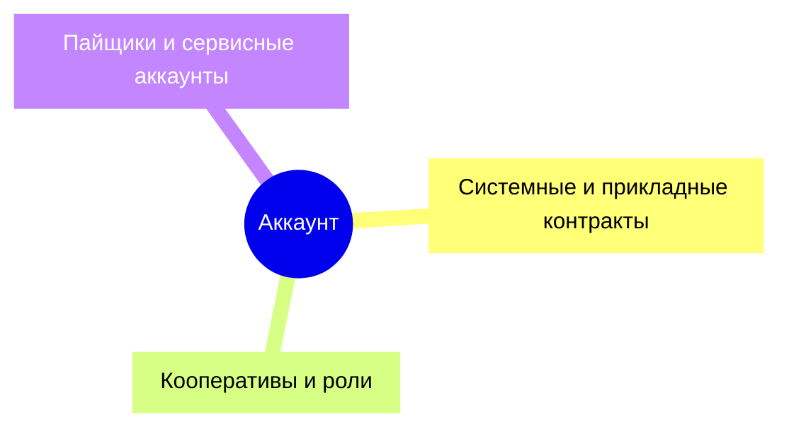
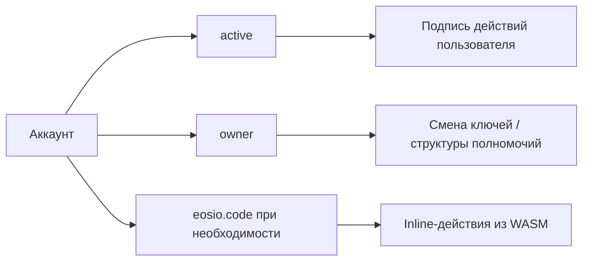
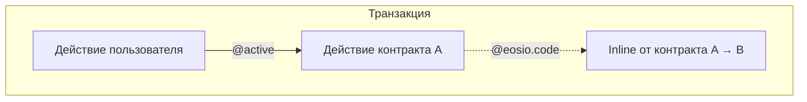
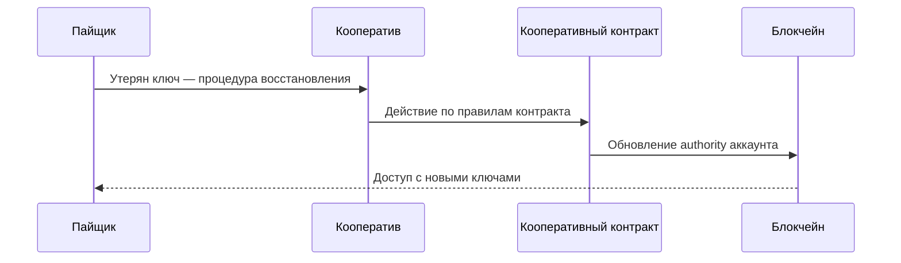

# Аккаунты и разрешения

Аккаунт в COOPOS — это **именованная сущность протокола**: область в глобальном состоянии, где хранятся разрешения, квоты ресурсов и (если развёрнут контракт) WASM+ABI. Пользователи, сервисные роли и смарт-контракты представлены одинаково — как аккаунты. Криптография ключей и подписей вынесена в [Ключи и подписи](keys-signatures.md); общая картина — в разделе [концептуальная модель COOPOS](system-model.md).


```mermaid
mindmap
  root((Аккаунт))
    Контракты["Системные и прикладные контракты"]
    Организации["Кооперативы и роли"]
    Участники["Пайщики и сервисные аккаунты"]
```

## Имя аккаунта (`name`)

Имя кодируется как 64-битное значение; в тексте это до **12** символов из набора **`a–z`** и **`1–5`**. Это ограничение протокола, а не произвольное соглашение: от него зависят таблицы контрактов (`_n` у имён таблиц в коде на CDT).

!!! note "Примеры имён"
    `gzxcsdaqwejf`, `dfjlkeifjdka` — условные обезличенные идентификаторы; в продакшене имена могут быть осмысленными, если укладываются в алфавит и длину.

## Иерархия разрешений

У каждого аккаунта есть набор **именованных разрешений**. Минимальный стандартный набор:

| Имя | Назначение |
|-----|------------|
| **`owner`** | Высший уровень: смена структуры `active` и других потомков, восстановление контроля. Родителя нет (`parent` пустой). |
| **`active`** | Повседневные операции: подпись действий, переводы, вызовы контрактов. Обычно дочерний к `owner`. |

Каждое разрешение содержит **`required_auth`**: порог (`threshold`), список **ключей** с весами, список **аккаунтов** (делегирование authority другого аккаунта) и опционально **`wait`** (задержка). Порог должен быть достигнут суммой весов выбранных ключей/аккаунтов при проверке транзакции.


```mermaid
flowchart LR
    Аккаунт["Аккаунт"]
    Аккаунт --> АктивныеРазрешения["active"]
    Аккаунт --> ВладелецРазрешения["owner"]
    Аккаунт --> КодовыеРазрешения["eosio.code при необходимости"]
    АктивныеРазрешения --> Действия["Подпись действий пользователя"]
    ВладелецРазрешения --> Изменение["Смена ключей / структуры полномочий"]
    КодовыеРазрешения --> КаскадныеДействия["Inline-действия из WASM"]
```

## Авторизация действия

В каждом **действии** указывается список пар **`actor@permission`** (в сериализованном виде — `actor` + строка `permission`). Узел проверяет, что подписи транзакции закрывают требуемые authority для **каждого** действия в пакете. Несовпадение — отказ **всей** транзакции.

Сокращение в документации: символ **`@`** перед именем разрешения, например `@active`, `@owner`.

## Разрешение `eosio.code`

Чтобы контракт мог порождать **встроенные (inline)** действия от своего имени, у его аккаунта в соответствующей ветке authority должна быть возможность исполнения кода контракта — на практике это оформляется как участие **`eosio.code`** в `authority` (политика развёртывания контракта). Так связываются многошаговые сценарии в **одной** атомарной транзакции.


```mermaid
flowchart TB
    subgraph TX["Транзакция"]
        ДействиеПайщика["Действие пользователя"]
        ДействиеСмартКонтракта1["Действие контракта A"]
        ДействиеСмартКонтракта2["Inline от контракта A → B"]
    end
    ДействиеПайщика -->|"@active"| ДействиеСмартКонтракта1
    ДействиеСмартКонтракта1 -.->|"@eosio.code"| ДействиеСмартКонтракта2
```

## Делегирование между аккаунтами

В `required_auth` можно указать **другой аккаунт** с весом: тогда действия от имени первого аккаунта может подписывать ключами второго (если это разрешено конфигурацией). Системные сценарии платформы могут жёстко задавать схемы делегирования между системными контрактами; прикладной смысл см. в документации по контрактам кооператива.

## Привилегированные аккаунты

Аккаунт может быть помечен как **privileged** — ему разрешён расширенный набор встроенных примитивов на уровне узла (зависит от версии и политики сети). В публичной цепи такие аккаунты ограничены и задаются генезисом/управлением сети.

## Восстановление доступа

Потеря приватного ключа не «отменяет» аккаунт: пока `owner` можно сменить по согласованной процедуре (мультисиг кооператива, системный контракт восстановления и т.д.), в цепь записывается новая `authority`. Имя аккаунта неизменно; юридическая идентификация участника вне цепи остаётся на стороне кооператива.


```mermaid
sequenceDiagram
    participant Пайщик as Пайщик
    participant Кооператив as Кооператив
    participant СмартКонтракт as Кооперативный контракт
    participant Блокчейн as Блокчейн
    Пайщик->>Кооператив: Утерян ключ — процедура восстановления
    Кооператив->>СмартКонтракт: Действие по правилам контракта
    СмартКонтракт->>Блокчейн: Обновление authority аккаунта
    Блокчейн-->>Пайщик: Доступ с новыми ключами
```

## Справка: вид аккаунта в API

Ниже — ориентировочная структура ответа узла (поля могут отличаться в зависимости от версии и плагинов). Используйте как карту полей, а не как жёсткую схему.

```json
{
  "account_name": "example",
  "head_block_num": 123456,
  "head_block_time": "2023-11-24T10:00:00.000",
  "privileged": false,
  "last_code_update": "2023-01-01T12:00:00.000",
  "created": "2021-05-10T14:00:00.000",
  "ram_quota": 8192,
  "net_weight": 1000,
  "cpu_weight": 1000,
  "net_limit": { "used": 0, "available": 50000, "max": 50000 },
  "cpu_limit": { "used": 0, "available": 50000, "max": 50000 },
  "ram_usage": 1024,
  "permissions": [
    {
      "perm_name": "owner",
      "parent": "",
      "required_auth": {
        "threshold": 1,
        "keys": [{ "key": "EOS6MRyAjQq8ud7hVNYcfnVPJqcVpscN5So8BhtHuGYqET5GDW5CV", "weight": 1 }],
        "accounts": [],
        "waits": []
      }
    },
    {
      "perm_name": "active",
      "parent": "owner",
      "required_auth": {
        "threshold": 1,
        "keys": [{ "key": "EOS7T3XhQiLzRYCZCsD6qZZLmRud8kLzjhKrmfN3oBczmXtB5uPiP", "weight": 1 }],
        "accounts": [],
        "waits": []
      }
    }
  ],
  "total_resources": {
    "owner": "example",
    "net_weight": "1.0000 AXON",
    "cpu_weight": "1.0000 AXON",
    "ram_bytes": 8192
  },
  "self_delegated_bandwidth": {
    "from": "example",
    "to": "example",
    "net_weight": "1.0000 AXON",
    "cpu_weight": "1.0000 AXON"
  },
  "refund_request": null,
  "voter_info": {
    "owner": "example",
    "proxy": "",
    "producers": [],
    "staked": 10000,
    "last_vote_weight": "0.00000000000000000",
    "proxied_vote_weight": "0.00000000000000000",
    "is_proxy": 0
  }
}
```
