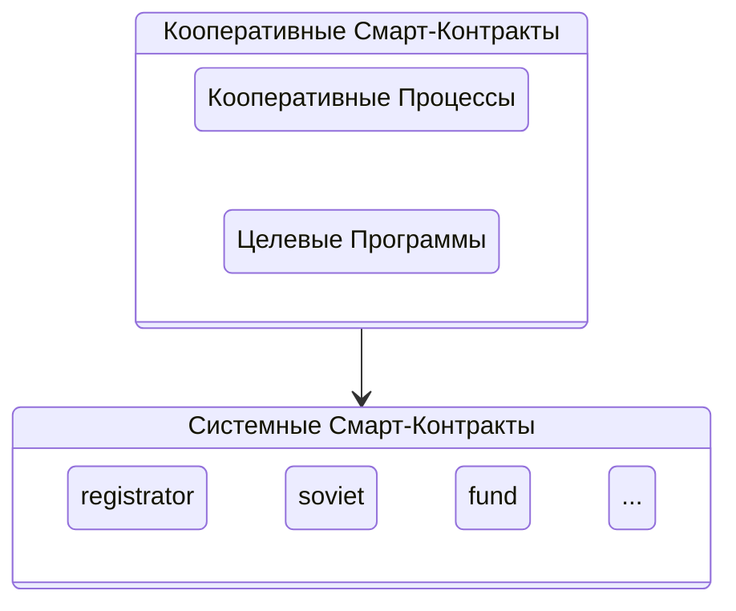

## Смарт-контракты

Каждое действие, которое вызывается на платформе, всегда принадлежит к одному из смарт-контрактов, который отвечает за его исполнение. 

!!!note "Смарт-контракт - это программа, которая прозрачно исполняется на платформе"

Программный код смарт-контрактов для платформы пишется на языке программирования C/C++ и исполняется в WebAssembly (WASM) в специально-подготовленной для этого распределенной среде. Платформа является хранилищем для смарт-контрактов, которые представляют из себя программный код, который реагирует на внешние действия по API, которое сами и реализуют.

Каждый смарт-контракт содержит в себе строгое описание структур принимаемых и хранимых данных, а также наименования действий и требуемых авторизаций для их выполнения. Каждое действие может содержать в себе операции по изменению внутренней базы данных смарт-контракта, которая описывается в самом смарт-контракте. 

Платформа оперирует двумя типами смарт-контрактов: системные и кооперативные. Если системные смарт-контракты - это конкретные действия, реализующие бизнес-логику в программном коде, то кооперативые смарт-контракты соединяют простые действия в сценарии кооперации. 

### Системные смарт-контракты
Как было ранее сказано, системные смарт-контракты - это программный код, написанный на языке C/C++ и исполняющийся в распределенной цифровой среде. Каждый системный смарт-контракт реализует програмный интерфейс (API) и выполняет действия с собственной базой данных. 

На платформе существует и поддерживаются следующие системные смарт-контракты:

- eosio.bios: Базовый контракт, отвечающий за инициализацию и управление параметрами блокчейн-сети при ёё запуске. 

- eosio.system: Контракт управления жизненным циклом аккаунтов и другими общими функциями блокчейн-сети, такими как: аренда вычислительных ресурсов, правила эмиссии системного токена AXON, учёт участия делегатов в производстве блоков, и т.д. 

- eosio.token: Контракт, обеспечивающий управление системным токеном AXON. Этот контракт отвечает за операцию эмиссии токена и его учёта.

- eosio.msig: Контракт многосигнатурных транзакций, который позволяет участникам сети создавать транзакции, требующие подписи нескольких участников перед их выполнением. 

- eosio.sudo: Контракт, предоставляющий резервный механизм восстановления, и используется для выполнения административных функций с повышенными правами доступа, например, при замене утерянных ключей аккаунта.

- draft: Контракт управления шаблонами документов платформы. Этот контракт позволяет создавать, редактировать и хранить шаблоны юридически значимых документов, которые используются кооперативами для генерации документов.

- registrator: Контракт реестра пайщиков, который обеспечивает регистрацию новых аккаунтов и ведение обще-кооперативного реестра пайщиков.  

- soviet: Контракт совета кооперативов, который отвечает за работу совета: получает повестку заседаний из других контрактов, обеспечивает голосование членов совета и фиксирует принятые решения в протоколах, созданных на основе шаблонов из контракта draft. Здесь же хранятся таблицы цифровых кошельков пайщиков, их целевых программ, а также, информация о кооперативных участнках и их Уполномоченных. 

- fund: Контракт управления фондами кооператива, который отвечает за учет и распределение средств, находящихся в фондах. Этот контракт обеспечивает учёт движения средств по всем фондам кооператива.

- gateway: Контракт шлюза финансовых потоков, который управляет процессами взносов и возврата взносов. Этот контракт обеспечивает обработку финансовых операций при взносе и возврате взноса из кооператива.

Все эти системные смарт-контракты совместно обеспечивают работу атомарных действий платформы кооперативной экономики. Простые действия системных смарт-контрактов объединяются в кооперативные сценарии использования. 

### Кооперативные смарт-контракты

!!!note "Кооперативные смарт-контракты - это стандартизированная последовательность действий в кооперации"

Кооперативные смарт-контракты представляют из себя последовательности действий, которые необходимо вызвать в системных смарт-контрактах в правильном порядке и при правильных условиях, для того, чтобы исполнить сценарий кооперации. 

На текущий момент реализуются следующие базовые кооперативные сценарии:

- Регистрация пайщика

- Паевый взнос 

- Возврат паевого взноса

- Возврат паевого взноса с новацией

- Использование членских взносов из фондов 

Которые объединяются в целевые кооперативые смарт-контракты:

- целевая потребительская программа "СОСЕДИ" - реализация сценария "кооперативный маркетплейс", где пайщики совершают взносы и получают возвраты взносов имуществом и деньгами. 

Количество целевых кооперативных смарт-контрактов не ограничено. Смарт-контракты являются основой функционирования платформы кооперативной экономики, обеспечивая выполнение ключевых системных процессов, связанных с управлением кооперативами, их финансовыми потоками и юридически значимыми действиями. 

Смарт-контракты работают на уровне технологии блокчейн и обслуживают базовые потребности сети кооперативов. Они определяют основные правила взаимодействия, проверяют права доступа и обеспечивают выполнение всех системных операций в рамках платформы.

