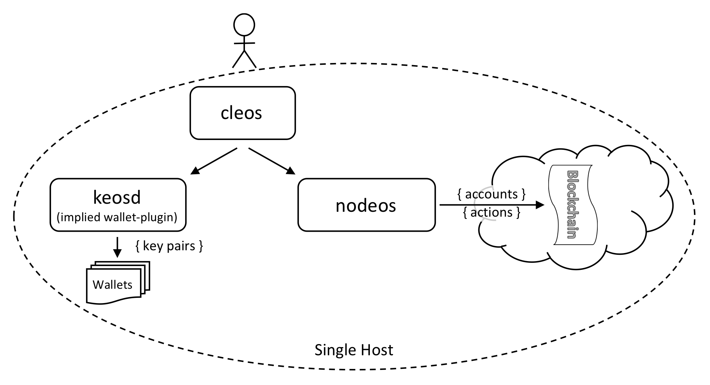

На одной машине поднимается один производящий **nodeos** COOPOS (**single host, single-node testnet**). `cleos` вызывает действия в цепи и при необходимости сам поднимает `keosd`; отдельный `keosd` нужен, если держите кошелёк на фиксированном URL.



## Перед началом

* [Установка COOPOS](../../../00_install/index.md); в `PATH` — `nodeos`, `cleos`, `keosd`.

[//]: # (THIS IS A COMMENT, NEXT LINK HAS BROKEN LINK)  
[//]: # (If you built COOPOS using shell scripts, make sure to run the Install Script ../../../00_install/01_build-from-source/01_shell-scripts/03_install-COOPOS-binaries.md .)  

* [Опции nodeos](../../02_usage/00_nodeos-options.md) — по необходимости.

## Шаги

Откройте одно окно терминала:

1. [Запустить производящий узел](#1-start-the-producer-node)
2. [Получить информацию об узле](#2-get-node-info)

### 1. Запуск производящего узла {#1-start-the-producer-node}

Одна команда для одноузлового блокчейна:

```sh
nodeos -e -p eosio --plugin eosio::chain_api_plugin --plugin eosio::history_api_plugin
```

!!! note "Минимальная конфигурация nodeos"
    Минимально для выпуска блоков нужны `chain_api_plugin` и `history_api_plugin`, флаги `-e` (stale production) и `-p eosio` (имя продюсера `eosio`). Альтернатива — свой аккаунт в роли продюсера.

После запуска `nodeos` в логе должны появиться сообщения о выпуске блоков.

```console
1575001ms thread-0   chain_controller.cpp:235      _push_block          ] initm #1 @2017-09-04T04:26:15  | 0 trx, 0 pending, exectime_ms=0
1575001ms thread-0   producer_plugin.cpp:207       block_production_loo ] initm generated block #1 @ 2017-09-04T04:26:15 with 0 trxs  0 pending
1578001ms thread-0   chain_controller.cpp:235      _push_block          ] initc #2 @2017-09-04T04:26:18  | 0 trx, 0 pending, exectime_ms=0
1578001ms thread-0   producer_plugin.cpp:207       block_production_loo ] initc generated block #2 @ 2017-09-04T04:26:18 with 0 trxs  0 pending
...
eosio generated block 046b9984... #101527 @ 2018-04-01T14:24:58.000 with 0 trxs
eosio generated block 5e527ee2... #101528 @ 2018-04-01T14:24:58.500 with 0 trxs
...
```
На этом этапе `nodeos` работает с одним продюсером — `eosio`.

### 2. Информация об узле {#2-get-node-info}

```sh
cleos get info
```

Пример ответа:

```json
{
  "server_version": "0f9df63e",
  "chain_id": "cf057bbfb72640471fd910bcb67639c22df9f92470936cddc1ade0e2f2e7dc4f",
  "head_block_num": 134,
  "last_irreversible_block_num": 133,
  "last_irreversible_block_id": "00000085060e9872849ef87bef3b19ab07de9faaed71154510c7f0aeeaddae2c",
  "head_block_id": "000000861e3222dce1c7c2cfb938940d8aac22c816cc8b0b89f6bf65a8ad5bdc",
  "head_block_time": "2019-11-18T22:13:10.500",
  "head_block_producer": "eosio",
  "virtual_block_cpu_limit": 228396,
  "virtual_block_net_limit": 1197744,
  "block_cpu_limit": 199900,
  "block_net_limit": 1048576,
  "server_version_string": "v2.0.0-rc2",
  "fork_db_head_block_num": 134,
  "fork_db_head_block_id": "000000861e3222dce1c7c2cfb938940d8aac22c816cc8b0b89f6bf65a8ad5bdc",
  "server_full_version_string": "v2.0.0-rc2-0f9df63e1eca4dda4cb7df30683f4a1220599444"
}
```

## Дополнительные шаги

Продвинутым пользователям часто нужна своя конфигурация. У `nodeos` отдельный каталог конфигурации; путь зависит от ОС.

* macOS: `~/Library/Application\ Support/eosio/nodeos/config`
* Linux: `~/.local/share/eosio/nodeos/config`

При сборке в каталог кладётся типовой `genesis.json`. Свой каталог конфигурации задаётся `--config-dir`; при его использовании `genesis.json` нужно скопировать вручную.

Для осмысленной работы нужен корректный `config.ini`. При старте `nodeos` ищет `config.ini` в каталоге конфигурации; если файла нет, создаётся по умолчанию. Если готового `config.ini` нет, запустите `nodeos` и сразу остановите <kbd>Ctrl-C</kbd> — появится файл по умолчанию. Отредактируйте `config.ini`, добавив или изменив:

```console
# config.ini:

    # Enable production on a stale chain, since a single-node test chain is pretty much always stale
    enable-stale-production = true
    # Enable block production with the testnet producers
    producer-name = eosio
    # Load the block producer plugin, so you can produce blocks
    plugin = eosio::producer_plugin
    # As well as API and HTTP plugins
    plugin = eosio::chain_api_plugin
    plugin = eosio::http_plugin
    plugin = eosio::history_api_plugin
```

Затем снова запустите `nodeos`:

```sh
nodeos
```

Данные времени выполнения (shared memory, логи и т.д.) лежат в каталоге данных:

* macOS: `~/Library/Application\ Support/eosio/nodeos/data`
* Linux: `~/.local/share/eosio/nodeos/data`

Каталог данных задаётся `--data-dir`.

!!! note "Дальше"
    Далее — [локальная многоузловая тестовая сеть на одном хосте](01_local-multi-node-testnet.md).
