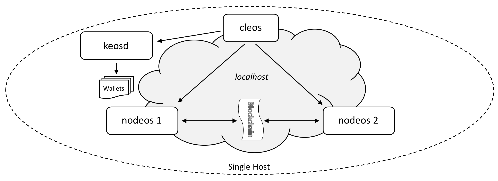

Два производящих **nodeos** на одном хосте (**single host, multi-node testnet**): отдельные порты HTTP/P2P и каталоги `config`/`data`, связь через `cleos` и при необходимости `keosd`. Схема ниже.



## Перед началом

* [Установка COOPOS](../../../00_install/index.md); в `PATH` — `nodeos`, `cleos`, `keosd`.
* [Опции nodeos](../../02_usage/00_nodeos-options.md) — по необходимости.

## Шаги

Откройте четыре окна терминала.

1. [Запустить менеджер кошельков](#1-start-the-wallet-manager)
2. [Создать кошелёк по умолчанию](#2-create-a-default-wallet)
3. [Импортировать ключ COOPOS](#3-loading-the-COOPOS-key)
4. [Запустить первый производящий узел](#4-start-the-first-producer-node)
5. [Запустить второй производящий узел](#5-start-the-second-producer-node)
6. [Получить информацию об узлах](#6-get-nodes-info)

### 1. Менеджер кошельков {#1-start-the-wallet-manager}

В первом терминале запустите `keosd`:

```sh
keosd --http-server-address 127.0.0.1:8899
```

При успехе в начале вывода будут строки вроде:

```console
2493323ms thread-0   wallet_plugin.cpp:39          plugin_initialize    ] initializing wallet plugin
2493323ms thread-0   http_plugin.cpp:141           plugin_initialize    ] host: 127.0.0.1 port: 8899
2493323ms thread-0   http_plugin.cpp:144           plugin_initialize    ] configured http to listen on 127.0.0.1:8899
2493323ms thread-0   http_plugin.cpp:213           plugin_startup       ] start listening for http requests
2493324ms thread-0   wallet_api_plugin.cpp:70      plugin_startup       ] starting wallet_api_plugin
```

В логе должна появиться строка про `127.0.0.1:8899`; иначе смотрите ошибку и перезапустите `keosd`. Окно с `keosd` не закрывайте — переходите ко второму терминалу.

### 2. Кошелёк по умолчанию {#2-create-a-default-wallet}

Во втором терминале создайте кошелёк через `cleos`:

```sh
cleos --wallet-url http://127.0.0.1:8899  wallet create --to-console
```

`cleos` сообщит о создании кошелька `default` и выдаст пароль — сохраните его. Пример вывода:

```console
Creating wallet: default
Save password to use in the future to unlock this wallet.
Without password imported keys will not be retrievable.
"PW5JsmfYz2wrdUEotTzBamUCAunAA8TeRZGT57Ce6PkvM12tre8Sm"
```

В окне `keosd` появятся служебные сообщения. Дальнейшие команды `cleos` выполняйте во втором терминале.

### 3. Ключ COOPOS {#3-loading-the-COOPOS-key}

Приватная тестовая цепочка создаётся с типовым начальным ключом — его нужно импортировать в кошелёк.

```sh
cleos --wallet-url http://127.0.0.1:8899 wallet import --private-key 5KQwrPbwdL6PhXujxW37FSSQZ1JiwsST4cqQzDeyXtP79zkvFD3
```

```console
imported private key for: EOS6MRyAjQq8ud7hVNYcfnVPJqcVpscN5So8BhtHuGYqET5GDW5CV
```

### 4. Первый производящий узел {#4-start-the-first-producer-node}

В третьем терминале:

```sh
nodeos --enable-stale-production --producer-name eosio --plugin eosio::chain_api_plugin --plugin eosio::net_api_plugin
```

Получается специальный «bios»-продюсер. При успехе в логе `nodeos` виден выпуск блоков.

### 5. Второй производящий узел {#5-start-the-second-producer-node}

[//]: # (don't render for now)
[//]: # (The following commands assume that you are running this tutorial from the `eos\build` directory, from which you ran `./eosio_build.sh` to build the COOPOS binaries.)

Загрузите на `eosio` контракт `eosio.bios` (ресурсы аккаунтов и привилегированные вызовы). Во втором терминале:

```sh
cleos --wallet-url http://127.0.0.1:8899 set contract eosio build/contracts/eosio.bios
```

Создайте аккаунт-продюсер `inita`: сгенерируйте ключи и импортируйте закрытый в кошелёк.

```sh
cleos create key
```

!!! warning "Внимание"
    Дальнейшие команды используют пары ключей из примера ниже. Чтобы копировать команды без правок, возьмите именно эти ключи, а не результат своей команды `cleos create key`. Если используете свои ключи — подставьте их во все следующие команды.

Типичный вывод `cleos create key`:

```console
Private key: 5JgbL2ZnoEAhTudReWH1RnMuQS6DBeLZt4ucV6t8aymVEuYg7sr
Public key: EOS6hMjoWRF2L8x9YpeqtUEcsDKAyxSuM1APicxgRU1E3oyV5sDEg
```

Импорт закрытого ключа:

```sh
cleos --wallet-url http://127.0.0.1:8899 wallet import 5JgbL2ZnoEAhTudReWH1RnMuQS6DBeLZt4ucV6t8aymVEuYg7sr
```

```console
imported private key for: EOS6hMjoWRF2L8x9YpeqtUEcsDKAyxSuM1APicxgRU1E3oyV5sDEg
```

Создание аккаунта `inita`: для `create account` нужны два открытых ключа — owner и active; здесь один и тот же ключ используется дважды.

```sh
cleos --wallet-url http://127.0.0.1:8899 create account eosio inita EOS6hMjoWRF2L8x9YpeqtUEcsDKAyxSuM1APicxgRU1E3oyV5sDEg EOS6hMjoWRF2L8x9YpeqtUEcsDKAyxSuM1APicxgRU1E3oyV5sDEg
```

```console
executed transaction: d1ea511977803d2d88f46deb554f5b6cce355b9cc3174bec0da45fc16fe9d5f3  352 bytes  102400 cycles
#         eosio <= eosio::newaccount            {"creator":"eosio","name":"inita","owner":{"threshold":1,"keys":[{"key":"EOS6hMjoWRF2L8x9YpeqtUEcsDKA...
```

Аккаунт готов; в других руководствах на него вешают контракты — здесь он станет продюсером блоков.

В четвёртом терминале запустите второй экземпляр `nodeos`. Командная строка длиннее, чтобы не конфликтовать с первым узлом. Можно скопировать команду и при необходимости поправить ключи:

```sh
nodeos --producer-name inita --plugin eosio::chain_api_plugin --plugin eosio::net_api_plugin --http-server-address 127.0.0.1:8889 --p2p-listen-endpoint 127.0.0.1:9877 --p2p-peer-address 127.0.0.1:9876 --config-dir node2 --data-dir node2 --signature-provider EOS6hMjoWRF2L8x9YpeqtUEcsDKAyxSuM1APicxgRU1E3oyV5sDEg=KEY:5JgbL2ZnoEAhTudReWH1RnMuQS6DBeLZt4ucV6t8aymVEuYg7sr
```

У нового узла в логе будет немного активности, затем тишина до последнего шага — пока `inita` не зарегистрирован как продюсер. Ниже пример хвоста лога (у вас могут отличаться времена):

```console
2393147ms thread-0   producer_plugin.cpp:176       plugin_startup       ] producer plugin:  plugin_startup() end
2393157ms thread-0   net_plugin.cpp:1271           start_sync           ] Catching up with chain, our last req is 0, theirs is 8249 peer dhcp15.ociweb.com:9876 - 295f5fd
2393158ms thread-0   chain_controller.cpp:1402     validate_block_heade ] head_block_time 2018-03-01T12:00:00.000, next_block 2018-04-05T22:31:08.500, block_interval 500
2393158ms thread-0   chain_controller.cpp:1404     validate_block_heade ] Did not produce block within block_interval 500ms, took 3061868500ms)
2393512ms thread-0   producer_plugin.cpp:241       block_production_loo ] Not producing block because production is disabled until we receive a recent block (see: --enable-stale-production)
2395680ms thread-0   net_plugin.cpp:1385           recv_notice          ] sync_manager got last irreversible block notice
2395680ms thread-0   net_plugin.cpp:1271           start_sync           ] Catching up with chain, our last req is 8248, theirs is 8255 peer dhcp15.ociweb.com:9876 - 295f5fd
2396002ms thread-0   producer_plugin.cpp:226       block_production_loo ] Previous result occurred 5 times
2396002ms thread-0   producer_plugin.cpp:244       block_production_loo ] Not producing block because it isn't my turn, its eosio
```

Сейчас второй `nodeos` — «простаивающий» продюсер. Чтобы он стал активным, зарегистрируйте `inita` у bios-узла и обновите расписание продюсеров:

```sh
cleos --wallet-url http://127.0.0.1:8899 push action eosio setprods "{ \"schedule\": [{\"producer_name\": \"inita\",\"block_signing_key\": \"EOS6hMjoWRF2L8x9YpeqtUEcsDKAyxSuM1APicxgRU1E3oyV5sDEg\"}]}" -p eosio@active
```

```console
executed transaction: 2cff4d96814752aefaf9908a7650e867dab74af02253ae7d34672abb9c58235a  272 bytes  105472 cycles
#         eosio <= eosio::setprods              {"version":1,"producers":[{"producer_name":"inita","block_signing_key":"EOS6hMjoWRF2L8x9YpeqtUEcsDKA...
```

Двухузловая тестовая сеть готова. Исходный узел перестаёт выпускать блоки, но продолжает их получать. Проверьте `get info` на каждом узле.

### 6. Информация об узлах {#6-get-nodes-info}

Первый узел:

```sh
cleos get info
```

Пример ответа:

```json
{
  "server_version": "223565e8",
  "head_block_num": 11412,
  "last_irreversible_block_num": 11411,
  "head_block_id": "00002c94daf7dff456cd940bd585c4d9b38e520e356d295d3531144329c8b6c3",
  "head_block_time": "2018-04-06T00:06:14",
  "head_block_producer": "inita"
}
```

Второй узел:

```sh
cleos --url http://127.0.0.1:8889 get info
```

Пример ответа:

```json
{
  "server_version": "223565e8",
  "head_block_num": 11438,
  "last_irreversible_block_num": 11437,
  "head_block_id": "00002cae32697444fa9a2964e4db85b5e8fd4c8b51529a0c13e38587c1bf3c6f",
  "head_block_time": "2018-04-06T00:06:27",
  "head_block_producer": "inita"
}
```

Сеть на нескольких физических хостах настраивается отдельно.
