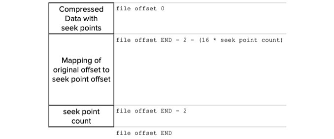

## Обзор

Плагин `trace_api_plugin` даёт долговременное API «для потребителей» данных: завершённые (retired) действия и связанные метаданные по заданному блоку. Сериализованные трассировки блоков пишутся на диск и затем отдаются по HTTP RPC. Формальное описание интерфейса — в [справочнике Trace API](api-reference/index.md).

## Назначение

При интеграции обозревателей блоков, бирж и других приложений с блокчейном COOPOS часто нужна полная лента действий, обработанных цепочкой, включая порождённые смарт-контрактами и отложенные транзакции. Эту задачу закрывает `trace_api_plugin`:

* полная лента завершённых действий и метаданных
* долговременное API для выборки блоков
* управляемые затраты ресурсов на узлах COOPOS

Важная цель — упростить обслуживание ресурсов узла (ФС, диск, память). Это отличается от `history_plugin` с гибкой фильтрацией и запросами и от `state_history_plugin` с бинарным потоковым доступом к структурным данным цепочки, действиям и дельтам состояния.

## Использование

```console
# config.ini
plugin = eosio::trace_api_plugin
[options]
```
```sh
# командная строка
nodeos ... --plugin eosio::trace_api_plugin [options]
```

## Параметры конфигурации

Задаются в командной строке `nodeos` и в `config.ini`:

```console
Config Options for eosio::trace_api_plugin:

  --trace-dir arg (="traces")           the location of the trace directory 
                                        (absolute path or relative to 
                                        application data dir)
  --trace-slice-stride arg (=10000)     the number of blocks each "slice" of 
                                        trace data will contain on the 
                                        filesystem
  --trace-minimum-irreversible-history-blocks arg (=-1)
                                        Number of blocks to ensure are kept 
                                        past LIB for retrieval before "slice" 
                                        files can be automatically removed.
                                        A value of -1 indicates that automatic 
                                        removal of "slice" files will be turned
                                        off.
  --trace-minimum-uncompressed-irreversible-history-blocks arg (=-1)
                                        Number of blocks to ensure are 
                                        uncompressed past LIB. Compressed 
                                        "slice" files are still accessible but 
                                        may carry a performance loss on 
                                        retrieval
                                        A value of -1 indicates that automatic 
                                        compression of "slice" files will be 
                                        turned off.
  --trace-rpc-abi arg                   ABIs used when decoding trace RPC 
                                        responses.
                                        There must be at least one ABI 
                                        specified OR the flag trace-no-abis 
                                        must be used.
                                        ABIs are specified as "Key=Value" pairs
                                        in the form <account-name>=<abi-def>
                                        Where <abi-def> can be:
                                           an absolute path to a file 
                                        containing a valid JSON-encoded ABI
                                           a relative path from `data-dir` to a
                                        file containing a valid JSON-encoded 
                                        ABI
                                        
  --trace-no-abis                       Use to indicate that the RPC responses 
                                        will not use ABIs.
                                        Failure to specify this option when 
                                        there are no trace-rpc-abi 
                                        configuations will result in an Error.
                                        This option is mutually exclusive with 
                                        trace-rpc-api
```

## Зависимости

* [`chain_plugin`](../chain_plugin/index.md)
* [`http_plugin`](../http_plugin/index.md)

### Примеры загрузки зависимостей

Если плагины не указаны в CLI или `config.ini`, подключаются со значениями по умолчанию:

```console
# config.ini
plugin = eosio::chain_plugin
[options]
plugin = eosio::http_plugin 
[options]
```
```sh
# командная строка
nodeos ... --plugin eosio::chain_plugin [options]  \
           --plugin eosio::http_plugin [options]
```

## Пример конфигурации

Пример запуска `nodeos` с `trace_api_plugin` для трассировки эталонных контрактов COOPOS:

```sh
nodeos --data-dir data_dir --config-dir config_dir --trace-dir traces_dir
--plugin eosio::trace_api_plugin 
--trace-rpc-abi=eosio=abis/eosio.abi 
--trace-rpc-abi=eosio.token=abis/eosio.token.abi 
--trace-rpc-abi=eosio.msig=abis/eosio.msig.abi 
--trace-rpc-abi=eosio.wrap=abis/eosio.wrap.abi
```

## Определения

Кратко о *слайсах* (slices), содержимом *trace log* и формате *clog*. Это помогает эффективно настраивать опции `trace_api_plugin`.

### Слайсы

Для `trace_api_plugin` *slice* — это все релевантные данные трассировки между начальной высотой блока (включительно) и конечной (не включая). Например, слайс 0–10 000 — блоки с номерами ≥ 0 и &lt; 10 000. В каталоге трассировок лежит набор слайсов. Каждый слайс состоит из журнала *trace data* и журнала метаданных *trace index*:

  *  `trace_<S>-<E>.log`
  *  `trace_index_<S>-<E>.log`

`<S>` и `<E>` — начальный и конечный номер блока слайса, дополненные ведущими нулями до ширины stride. Если старт — 5, конец — 15, stride — 10, то `<S>` = `0000000005`, `<E>` = `0000000015`.

#### trace_&lt;S&gt;-&lt;E&gt;.log

Журнал данных трассировки только дописывается; в нём бинарные сериализованные данные блока. Содержимое включает трассировки транзакций и действий для ответов RPC с учётом ABI по действиям. Поддерживаются типы блоков:
  
  * `block_trace_v0`
  * `block_trace_v1`

В начале — заголовок с версией формата. `block_trace_v0`: ID блока, номер, ID предыдущего, время производства, подписавший продюсер, данные трассировки. `block_trace_v1` добавляет корни Меркла для списков транзакций и действий и счётчик расписания продюсеров с генезиса.

В журнал могут попадать блоки, вытесненные форком — это нормально. Следующая запись имеет номер на 1 больше предыдущей или тот же/меньше из‑за форка. Каждой записи трассировки соответствует запись в индексном файле слайса. Блоки с форков можно уменьшить, запуская **nodeos** в `read-mode=irreversible`.

#### trace_index&#95;&lt;S&gt;-&lt;E&gt;.log

Индексный (метаданные) журнал только дописывается; в нём последовательность бинарно сериализованных типов. Сейчас поддерживаются:

  * `block_entry_v0`
  * `lib_entry_v0`

В начале — заголовок с версией. `block_entry_v0`: ID и номер блока и смещение к записи в журнале данных; по нему находят смещения `block_trace_v0` и `block_trace_v1`. `lib_entry_v0`: последний известный LIB. Модуль чтения использует LIB, чтобы сообщать пользователю статус необратимости.

### Формат clog

Сжатые журналы трассировок имеют расширение `.clog` (см. [сжатие журналов](#compression-of-log-files)). Это обобщённый сжатый файл с индексом точек распаковки в конце. Схема:



Данные сжимаются raw zlib с полными flush *seek points* через равные интервалы. Распаковщик может начать с любой *seek point* без чтения предыдущих данных; проход через seek point внутри потока тоже допустим.

!!! note "Экономия места под трассировки"
    Сжатие может сократить рост каталога трассировок примерно в 20 раз. Например, при 512 seek points на тестовых данных публичной сети EOS рост каталога с полными данными падает с ~50 ГиБ/сут до ~2.5 ГиБ/сут. Из‑за избыточности содержимого сжатие сопоставимо с `gzip -9`. Распакованные данные сразу доступны через [Trace RPC API](api-reference/index.md) без деградации сервиса.

#### Роль seek points

При сжатии индекс точек запоминает соответствие смещений в несжатом и сжатом виде, чтобы по несжатому смещению найти ближайшую предшествующую seek point. Это сильно ускоряет позиционирование в конце длинного потока.

## Автообслуживание

Цель `trace_api_plugin` — уменьшить ручное обслуживание ФС: автоматически удалять старые журналы трассировок и сжимать их.

### Удаление журналов

Для автоматического удаления старых файлов, созданных `trace_api_plugin`:

```sh
  --trace-minimum-irreversible-history-blocks N (=-1) 
```

Если `N` ≥ 0, на диске остаются только `N` блоков до текущего LIB; файлы соответствующих более старых диапазонов помечаются на удаление.

### Сжатие журналов {#compression-of-log-files}

Оптимизация места — отдельная опция:

```sh
  --trace-minimum-uncompressed-irreversible-history-blocks N (=-1)
```

При `N` ≥ 0 фоновый поток сжимает необратимые участки журналов; последние `N` необратимых блоков после LIB остаются несжатыми.

!!! note "Утилита Trace API"
    Журналы можно сжимать вручную утилитой [trace_api_util](../../../10_utilities/trace_api_util.md).

Если опций `trace-minimum-irreversible-history-blocks` и `trace-minimum-uncompressed-irreversible-history-blocks` недостаточно, может понадобиться периодическое ручное обслуживание или внешний планировщик.

## Ручное обслуживание

Опция `trace-dir` задаёт каталог файлов трассировки `trace_api_plugin`. После прохождения LIB за пределы слайса файлы стабильны и их можно удалять для освобождения места. Развёрнутая система COOPOS переносит внепроцессное удаление любых файлов в этом каталоге — независимо от того, обращается ли к ним запущенный **nodeos**. Данные, которые формально должны быть доступны, но удалены вручную, дают HTTP 404 на соответствующих endpoint’ах.

!!! note "Для операторов узлов"
    Срок хранения истории на узле можно полностью контролировать через `trace-api-plugin`, опции `trace-minimum-irreversible-history-blocks` и `trace-minimum-uncompressed-irreversible-history-blocks` и внешние менеджеры дискового пространства.
