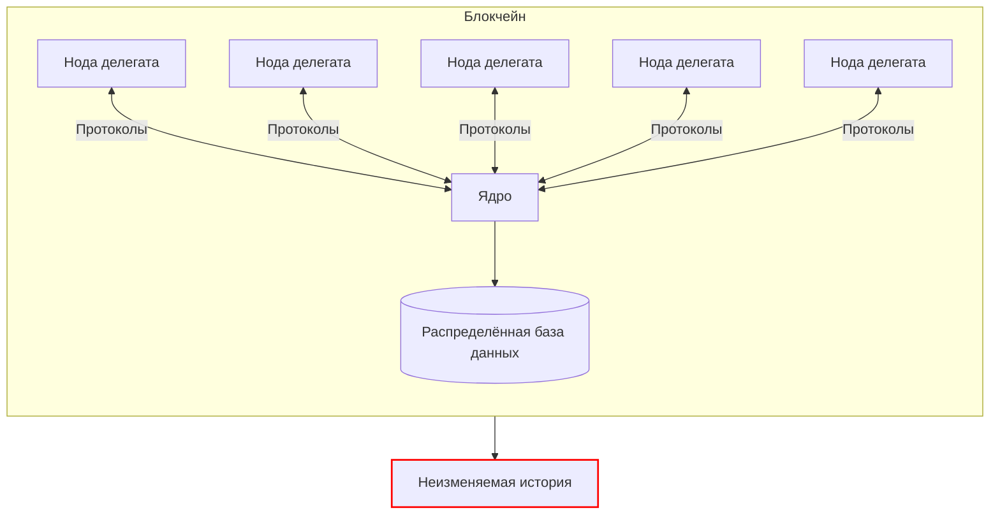
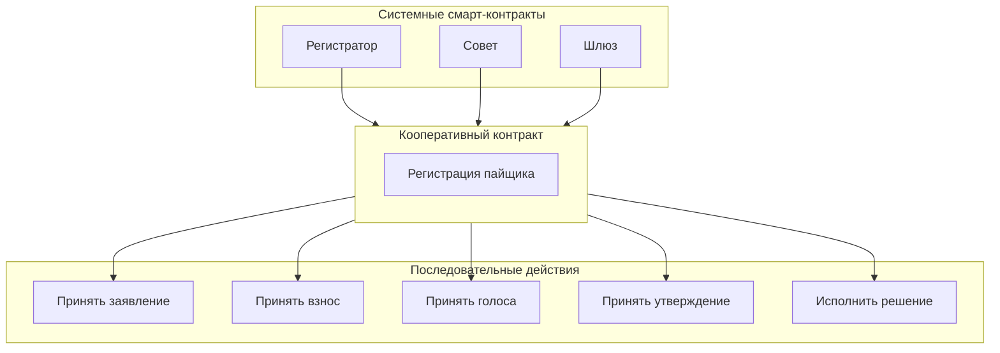

Блокчейн-платформа кооперативной экономики представляет собой программное обеспечение, которое исполняется на серверах делегатов, автоматически следует своим программным протоколам и формирует неизменяемую историю действий. 

!!! note "Платформа кооперативной экономики производит неизменяемую историю юридически-значимых действий."

Каждое действие пайщиков по программным протоколам отправляется в ноды к делегатам. Нода - это копия программного обеспечения платформы кооперативной экономики, которая обрабатывает транзакции действий пайщиков и включает их в распределенную базу данных после достижения консенсуса об этом с другими нодами делегатов по алгоритму делегированного доказательства долей (dPoS). 

В результате распределенная база данных содержит анонимизированную информацию, которая необходима для исполнения кооперативных смарт-контрактов между пайщиками и кооперативами. Для того, чтобы кооперативный смарт-контракт был исполнен, нодам делегатам обычно требуется принять еще как минимум несколько действий после его инициализации, таких как: голосование членов совета и утверждение председателем совета, и это как минимум.

После того, как все необходимые транзакции с действиями получены делегатами, кооперативный смарт-контракт считается исполненным, а информация, которая требовалась для его исполнения, удаляется из распределенной базы данных, но при этом, она навсегда остается в цепочке неизменяемой истории действий блокчейна. 

Блокчейн не хранит и не получает приватную информацию о пайщиках, которые его применяют для заключения и исполнения кооперативных смарт-контрактов. Каждый аккаунт пайщика в блокчейне представляется в виде уникального 12-символьного идентификатора латинского алфавита (буквы a-z), по которым невозможно определить, кто конкретно совершает действие, но при этом, возможно программно требовать достижения всех условий для исполнения контракта. 

Например, никак невозможно забрать имущество из пункта выдачи заказа до момента поступления оплаты, или, нельзя принять пайщика в кооператив до решения совета, и так далее и тому подобное. И блокчейну в данном случае абсолютно не важно как зовут пайщика или в каком кооперативе это происходит - все должны соблюдать программные правила всех смарт-контрактов. Что и формирует необходимые условия для создания системы стандартов кооперации. 

<!-- Деанонимизированная информация о пайщиках кооперативов находится в базах данных кооперативов за пределами блокчейна и никогда в него не попадает.  -->