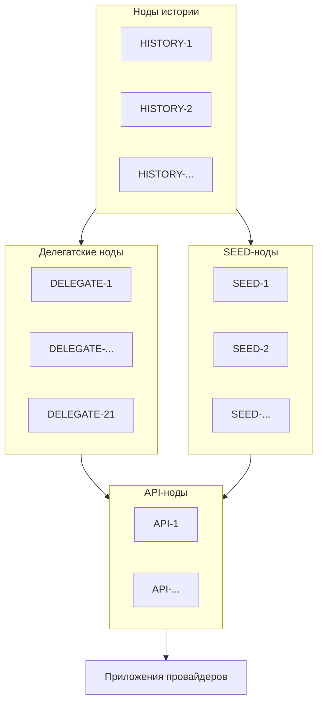
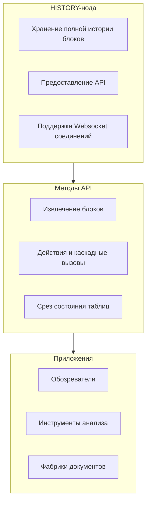
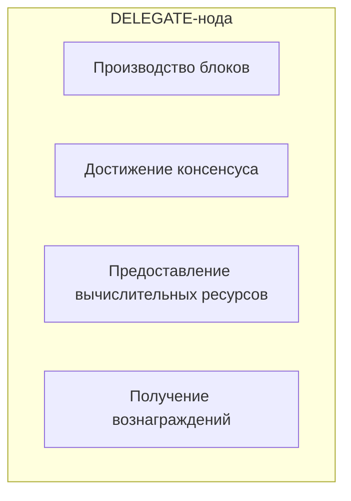
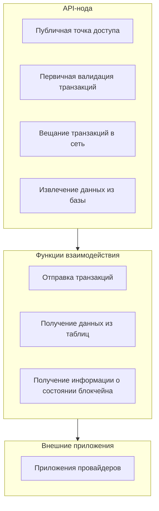
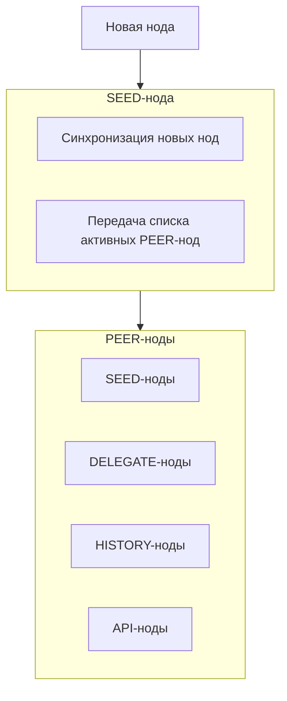

Все транзакции, которые отправляются в блокчейн - принимаются нодами. Полная копия всей  цепочки содержится на каждой ноде и передаётся другим нодам по внутренним протоколам связи с регулярностью дважды в секунду (2 блока в секунду).

!!!note "Нода - экземпляр серверного программного обеспечения блокчейна" 
    На нодах исполняется программное обеспечение блокчейна. Ноду блокчейна может запустить и синхронизировать из открытых источников любой желающий на своём сервере. 

История транзакций образует публичную последовательность вызова действий всех смарт-контрактов от момента запуска платформы. И эта содержится одновременно на всех нодах сети и она абсолютно идентичная. 

Однако, то, как ноды работают с этой историей, зависит от их назначения. Всего в сети можно выделить 4 основных функциональных назначения нод: HISTORY-ноды, DELEGATE-ноды, SEED-ноды и API-ноды. 

Все эти ноды по своей сути являются PEER-нодами, т.е. нодами, которые равны друг другу. 

!!!note "PEER-нода - это любая нода блокчейна"

Все PEER-ноды функционально одинаковы. Они позволяют принимать и передавать новые блоки истории от подключенных пиров, и делают автоматически. Все представленные ниже ноды - это PEER-ноды в своей основе. Мы же будем рассматривать только практически-полезные ноды на прикладном уровне. 

## HISTORY-нода
Несмотря на то, что все PEER-ноды обычно содержат полную цепочку истории событий, это не предоставляет им прямой возможности обращения к ней. История содержится на всех PEER-нодах, воспроизводится при запуске, и синхронизируется, но в этом процессе используются только данные из текущего блока. После проверки блока - данные уходят в историю, сохраняются на жестком диске в цепочке истории, и активно в PEER-ноде не используются. 

Чтобы их использовать активно, каждый желающий может запустить HISTORY-ноду, включив дополнительный плагин, который сделает все исторические данные доступными по протоколу Websocket. В сети существуют программные решения (в том числе в наших репозиториях), которые используют HISTORY-ноды для извлечения данных из цепочки истории ноды - в обычную базу данных MONGO или POSTGRES. 

Именно HISTORY-ноды используются фабриками документов при кооперативах для восстановления истории подписанных документов. Это позволяет хранить большие массивы неизменяемых данных, но не использовать для этого дорогие ресурсы оперативной памяти. HISTORY-нода конфигурируется при запуске с помощью дополнительных настроек плагина истории. Без этого плагина, история транзакций по-прежнему будет содержаться в каждой ноде, но без возможности быстрого извлечения для прикладного применения. 

HISTORY-нода позволяет извлекать не только данные о действиях, которые вызывались пользователями, но и о каскадных действиях, которые вызывались автоматически смарт-контрактами в других смарт-контрактах согласно заложенной в них бизнес-логике кооперации. 

Например, все действия с цифровыми кошельками пользователей - автомарны, и вызываются только каскадными действиями других смарт-контрактов. Таким образом, HISTORY-нода позволит при необходимости извлечь все действия, которые влияли на кошелёк пользователя. Также, HISTORY-нода позволяет не только извлекать действия, но и все изменения в таблицах контрактов. 

Используя HISTORY-ноду можно получить "срез" состояния блокчейна в любой момент времени. Выяснить, какие действие исполнялись тогда, и какое состояние таблиц блокчейна было. Всё это позволяет делать HISTORY-нода, и по сути, они являются основанием для подробных обозревателей истории транзакций блокчейна. 

## DELEGATE-нода
Все принятые нодами транзакции образуют неизменяемую цепочку истории событий и приходят процесс утверждения каждым делегатом. Для того, чтобы новая транзакция была принята, необходимо, чтобы по-крайней мере 2/3 нод делегатов были согласны с тем, что транзакция удовлетворяет всем математическим правилам валидации, включая проверки на аудентификацию, целостность и доступность. Процесс достижения консенсуса подробнее описан в другом разделе. 

!!!note "Делегаты - это участники, которые предоставляют вычислительные ресурсы своих серверов для работы платформы."

Делегаты выполняют ключевую роль по обработке транзакций и включению их в цепочку блоков, которая фактически производится на их серверах. Т.е. именно делегатские ноды являются производителями блокчейна, и именно они ставят свои подписи на каждом новом блоке истории событий, утверждая ее и делая тем самым неизменной. 

На платформе действует система выборов делегатов, где 21 основная команда и 150 резервных команд получают право предоставлять свои ресурсы и получать за это вознаграждение. Подробнее о системе ресурсов и токеномике вознаграждений в соответствующих разделах. 

Запуск делегатской ноды осуществляется путём добавления плагина и ключа производителя в конфигурацию ноды при её синхронизации. Однако, для того, чтобы участвовать в производстве блокчейна, делегату необходимо стать пайщиком кооператива-оператора и присоединиться к соответствующей целевой потребительской программе. Кроме того, делегату необходимо собрать достаточное количество голосов, чтобы войти в топ-21 самых надежных и доверенных делегатов платформы. Подробнее о процессе выборов в соответствующем разделе. 

Здесь же следует сказать, что ключевым для делегата является его скорость и надежность в производстве транзакций. Это значит, что никаких других операций на той же ноде совершать нежелательно. Поэтому ноды делегатов рекомендуется отделять от всех других нод в производственных средах. Более того, существует программная возможность соединения нод делегатов исключительно с доверенными SEED-нодами, что позволяет делегатам построить внутреннюю, изолированную топологию для надежной обработки транзакций. 

## API-нода

!!!note "API-нода - программный интерфейс для связи с приложениями провайдеров"

Все ноды обладают API - например, у HISTORY - это API для извлечения истории, а у делегата - это API делегата. Однако, для регулярной работы с платформой необходим доступ к методам, которые позволяют отправлять транзакции, получать информацию из таблиц распределенной базы данных, и другую, прочую информацию о состоянии блокчейна. 

Для этого нужны API-ноды. Они конфигурируются таким образом, что предоставляют публичные конечные точки доступа для взаимодействия с внешним программным обеспечением. Они предоставляют RPC-интерфейсы, позволяющие отправлять POST и GET запросы для отправки транзакций и извлечения данных. 

API-ноды при получении новой транзакции немедленно производят валидацию её и действий внутри неё. И только в случае если транзакция признана этой нодой достоверной - она отправляется всем другим нодам сети (вещается). Ноды делегатов получают эти транзакции и точно также проверяют их. И только в том случае, если 2/3 из основных делегатов согласятся с тем, что новая транзакция не содержит ошибок - тогда и только тогда она будет включена в цепочку. А до этого времени она считается всеми нодами - обратимой. 

Но API-нода не беспокоится об этом. Её задачи - первичная валидация, вещание транзакции в сеть, а также, извлечение информации из собственной базы данных по запросам. База данных API-ноды формируется в процессе синхронизации и обновляется дважды в секунду автоматизированным и заверенным решением делегатов. 

## SEED-нода
Для того, чтобы все ноды сети могли получить информацию о её состоянии - необходимы специальные ноды, которые будут предоставлять эту информацию большими пачками блоков транзакций. Такие ноды называются SEED, или, семя.

!!!note "SEED-нода - это публичная точка для синхронизации блокчейна"

Любой ноде для того, чтобы подключиться к блокчейн-сети, необходимо указать SEED-ноду, с которой будет произведена полная синхронизация цепочки блоков истории транзакций. SEED-ноды предоставляют такую возможность. Их главная задача - подключать другие ноды, делиться актуальной информацией о состоянии блоков, а также, наличии других нод в сети. 

Подключившись к любой активной SEED-ноде, нода немедленно начинает синхронизацию, а также, получает с неё список всех активных PEER-нод, с которыми начнётся взаимодействие после завершения синхронизации. Таким образом, SEED-нода -- это точка входа в блокчейн-сеть. Все доступные SEED-нодами публикуются делегатами на своих ресурсах, распределенно.

## Синхронизация
Все принятые блокчейном транзакции образуют цепочку истории действий. Полная копия этой цепочки содержится на каждой PEER-ноде и передаётся другим нодам по внутренним сетевым каналам связи платформы при синхронизации.

Синхронизация - процесс скачивания и криптографической проверки истории транзакций блокчейна.

При подключении новой PEER-ноды к платформе, она скачивает всю историю, криптографически проверяет взаимосвязь между блоками, и полностью воссоздаёт состояние своей базы данных таким, какое оно у всех других нод в сети. 

Синхронизация выполняется между всеми PEER-нодами дважды в секунду. Именно такая скорость производства новых блоков истории транзакций на платформе. Блоки могут быть и пустыми, но процесс производства и синхронизации не останавливается ни на секунду.

Синхронизация истории между нодами сопровождается синхронизацией текущего состояния распределенной базы данных, которая хранится одновременно на всех серверах нод в их оперативной памяти. 
