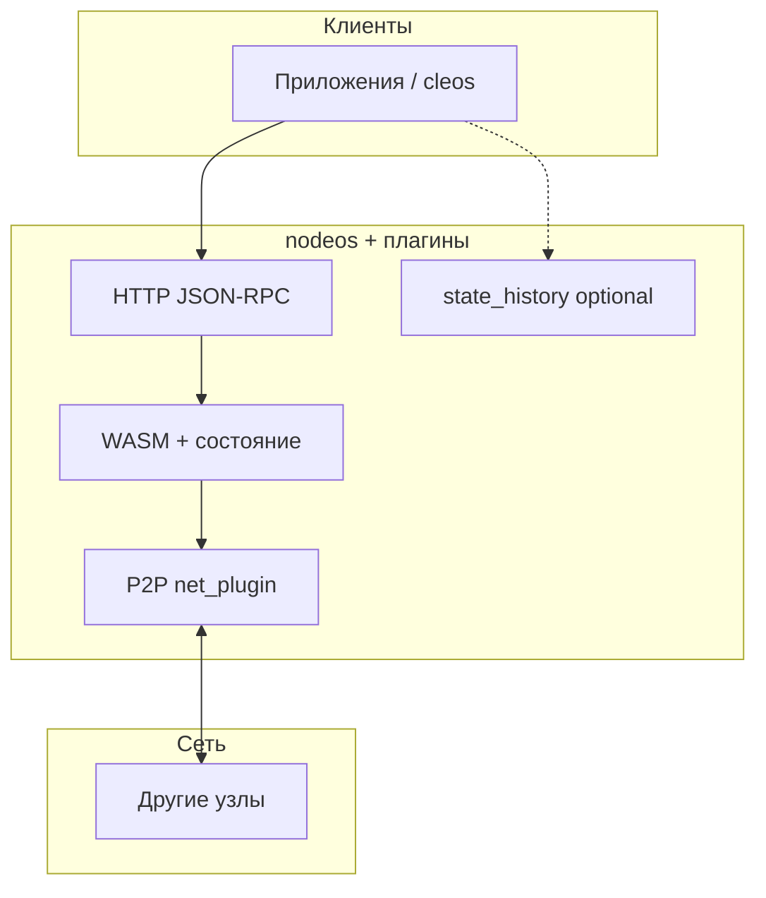

# Сетевые слои и интерфейсы

Согласованность цепи в COOPOS достигается **набором уровней**: бинарный P2P, правила консенсуса и блока, HTTP JSON-RPC поверх плагинов, бинарный поток истории. Ниже — карта; детали портов и эндпоинтов см. в разделах [nodeos](coopos/01_nodeos/index.md) и [Узлы сети и история](nodes.md).

## 1. Сетевой обмен узлов (P2P)

Плагин **`net_plugin`** поддерживает соединения между экземплярами **nodeos**: обмен блоками и распространение транзакций. Это не «прикладной REST», а внутренняя топология цепи (пиры, синхронизация, форки на уровне веток). Поведение задаётся конфигурацией узла (`peers`, лимиты, режимы).

**Смысл для читателя:** пока узлы связаны P2P и следуют одной сети, они получают один и тот же поток блоков при отсутствии разделения сети.

## 2. Консенсус и структура блока

Механизм делегированного производства блоков (в терминологии платформы — **делегаты**, см. [Делегаты и консенсус](witnesses.md)) определяет, **кто** предлагает блок в данный слот и как фиксируется **необратимость** после достаточного числа подтверждений. Правила включения транзакций (дедупликация, лимиты блока, проверка подписей и WASM) едины для всех честных узлов.

**Смысл для читателя:** «Принято сетью» = прошло проверки узла и оказалось в ветке, которую консенсус признал канонической на данной высоте.

## 3. Прикладной доступ: HTTP API

Плагины **`http_plugin`**, **`chain_api_plugin`**, **`net_api_plugin`**, **`producer_api_plugin`**, **`trace_api_plugin`**, **`db_size_api_plugin`** открывают **JSON-RPC** (POST с телом `{"method":...}`) для чтения состояния, отправки транзакций, сведений о сети и т.д. Это основной контур интеграции **cleos** и серверов приложений.

Ссылки на опубликованные спеки: в оглавлении раздела **API** (Chain API, Producer API, …). Оглавление RPC внутри документации: [RPC (обзор)](coopos/01_nodeos/05_rpc_apis/index.md).

## 4. Формат транзакции и ABI

Транзакция и действия сериализуются в двоичный вид по типам, согласованным с **ABI** контракта. Подпись строится над каноническим представлением с учётом **chain ID**. Это «протокол данных» между кошельком, SDK и узлом; см. [Действия и транзакции](transactions.md) и [Ключи и подписи](keys-signatures.md).

## 5. Поток истории: State History (SHiP)

**`state_history_plugin`** отдаёт последовательность изменений состояния и связанных данных по **отдельному бинарному протоколу** (обычно WebSocket). Канал для индексаторов и архивов; актуальное состояние и простые запросы чаще берут через Chain API. См. [State History](state-history-ship.md), [подписка на поток](../reactive-ship-reader.md).

## 6. Исполнение контрактов (WASM)

Виртуальная машина исполняет **WebAssembly** контрактов в детерминированной среде с учётом лимитов **CPU** и использования **NET** при включении в блок. С точки зрения «протокола» это правило перехода состояния: действие → вызов WASM → возможные изменения RAM/таблиц. Базовые понятия хранения: [Состояние и хранение данных](state.md).

## Управление сетью и экономика

**Системные контракты** хранят в состоянии цепи параметры ресурсов (NET, CPU, RAM), расписание и состав производителей блоков, а также обрабатывают системные действия, на которые опирается политика сети. Как устроены ресурсы и операции с аккаунтами на практике: [Ресурсы сети, регистрация и контракты](system-resources.md). Кто производит блоки и как согласуется это с правилами платформы: [Делегаты и консенсус](witnesses.md).

Экономика токена, в том числе **эмиссия при расширении** сети и кооперативов, задаётся прикладными и системными контрактами; подробности см. в разделе **[Контракты](https://coopenomics.world/contracts)**.

## Краткая схема

