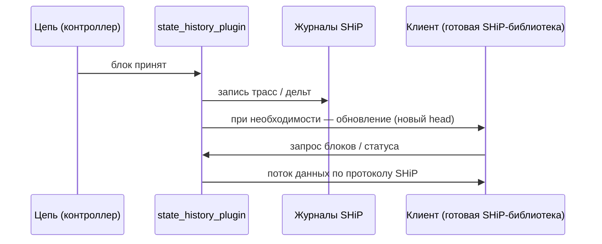

# State History (SHiP)

**State History (SHiP)** — плагин `state_history` в узле COOPOS. Он нужен, чтобы **индексаторы и сервисы** получали **историю цепи потоком**: блоки, при необходимости **трассировки транзакций** и **изменения таблиц состояния** (дельты), а не только точечные ответы по HTTP.

**Зачем отдельный механизм.** Обычный **Chain API** удобен для текущего состояния и разовых запросов. **Trace API** отдаёт данные из **файлов** трасс на диске. **SHiP** даёт **подписку и догон синхронизации** по одному каналу с контролем нагрузки на узел — это типичный способ строить проводники, аналитику и кошельки, которым нужна полная история.

**Важно:** это **не REST и не OpenAPI**. Транспорт — **WebSocket** (или Unix-socket с тем же протоколом), сообщения после рукопожатия — **бинарные**. Для интеграции используйте **готовые реализации протокола SHiP** под COOPOS: укажите адрес вашего `state-history-endpoint` и при необходимости сверьте `chain_id` из статуса узла.

В комплекте экосистемы COOPOS для подписки на поток SHiP в Node.js-приложениях используется **[подписка на поток данных (SHiP)](../reactive-ship-reader.md)** — библиотека [coopos-ship-reader](https://github.com/coopenomics/coopos-ship-reader) на GitHub.

---

## Устройство на узле

Узел при применении блока пишет в **журналы** state history (трассы и/или дельты состояния — в зависимости от настроек) и может **уведомлять** уже подключённых клиентов о новой голове цепи. Клиент по WebSocket запрашивает диапазон блоков и получает поток результатов.

Детали сериализации и очередей сообщений реализованы в узле; **писать свой парсер с нуля не обязательно** — опирайтесь на существующие SHiP-клиенты, в т.ч. на [подписку на поток данных](../reactive-ship-reader.md).

---

## Что включить на узле

Основные опции (в `config.ini` или аргументах командной строки):

| Опция | Зачем |
|--------|--------|
| `trace-history = true` | Писать журнал **трассировок** транзакций. |
| `chain-state-history = true` | Писать журнал **дельт состояния** таблиц. С этим режимом на узле действуют ограничения на replay (целостность журнала). |
| `state-history-endpoint` | Адрес и порт для **входящих** WebSocket-подключений (по умолчанию в коде часто `127.0.0.1:8080`). **Не открывайте в интернет без защиты** — это полный поток истории. |
| `state-history-unix-socket-path` | Вместо TCP — **Unix socket** (удобно локально). |
| `state-history-dir` | Каталог данных SHiP (часто `state-history` рядом с data-dir). |

Дополнительно узел может **урезать или нарезать** журналы по блокам (`state-history-log-retain-blocks`, stride/archive и т.д.) — если узел не «архивный», это помогает не забить диск. В логах при старте обычно видно **с какого блока** доступна история — индексатор начинает синхронизацию оттуда.

---

## Краткий поток

- После подключения по WebSocket сервер первым делом шлёт **текстовый ABI** — по нему клиенты понимают бинарные типы.
- Дальше обмен **бинарными** сообщениями: запрос статуса узла, запрос диапазона блоков с флагами «что отдавать» (блок / трассы / дельты), при необходимости **подтверждения приёма**, чтобы узел не перегрузил клиента.
- Поведение при **смене ветки** (fork) учитывается протоколом — готовые клиенты это обрабатывают.

Низкоуровневые таблицы полей и порядок фреймов описаны в коде COOPOS (`libraries/state_history/.../types.hpp`, плагин `state_history_plugin`); для повседневной работы достаточно **готового SHiP-клиента**.

---

## Эксплуатация

- Журналы могут занимать **много места** — продумайте retain/partition или отдельный архивный узел.
- Первый прогон с `chain-state-history` может долго **инициализировать** состояние в журнале — это ожидаемо.
- Доступ к endpoint — только **доверенной** сети (VPN, firewall, Unix socket).

---

## Где это в документации API

| Механизм | Как ходить | Роль |
|----------|------------|------|
| Chain API | HTTP, JSON | Состояние, таблицы, push транзакций. |
| Trace API | HTTP, JSON | Чтение файлов трасс на диске. |
| **State History (SHiP)** | **WebSocket, бинарный протокол** | **Потоковая** история блоков, трасс и дельт для индексаторов. |

Исходники плагина и тесты сценария подключения: `coopos/plugins/state_history_plugin/` (в т.ч. `state_history_plugin.cpp`, каталог `tests/`).
