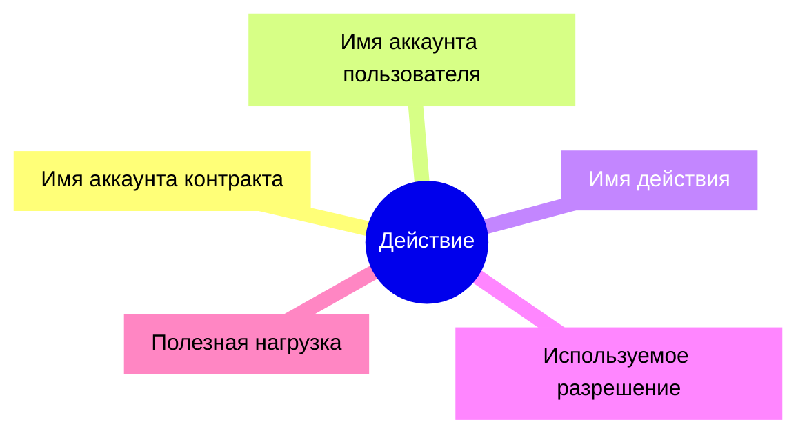
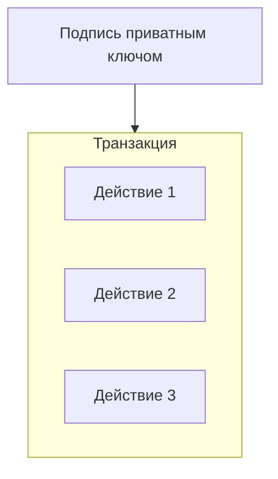
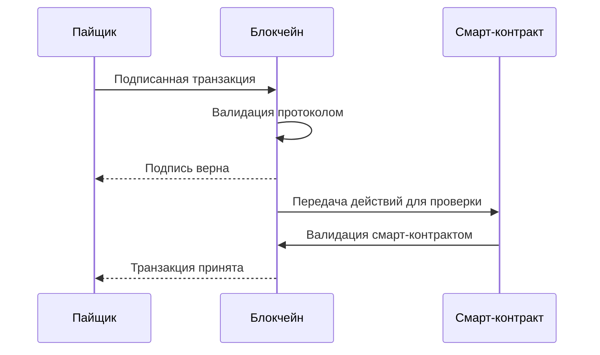
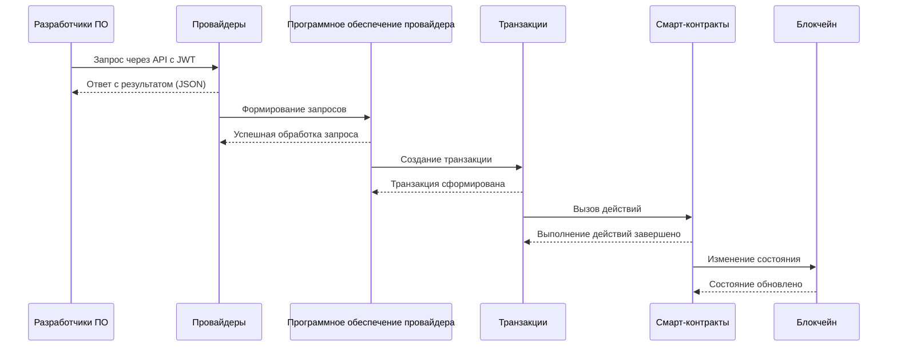

## Действия

Для изменения состояния блокчейна в EOSIO используются действия. Действие — это атомарная операция, выполняемая в контексте определённого аккаунта и смарт-контракта. Она представляет минимальную единицу изменения состояния блокчейна. Все действия передаются и исполняются строго в порядке их указания в транзакции.

!!!note "Действие - это атомарная операция по изменению состояния блокчейна"

Каждое действие всегда связано с аккаунтом, который его выполняет, и системным смарт-контрактом, в котором действие выполняется. Действия при своём выполнении могут передавать данные в контракт.  

Основные свойства действия:

- Имя аккаунта контракта: Указывает, в рамках какого контракта выполняется действие.

- Имя аккаунта пользователя: Указывает, какой аккаунт инициировал действие.

- Имя действия: Определяет, какую операцию необходимо выполнить в рамках контракта.

- Ипользуемое разрешение: Указывает уровень разрешения (например, active), необходимый для выполнения действия.

- Параметры действия: содержит полезную нагрузку, на основании которой смарт-контракты изменяют состояние блокчейна;

Каждое действие может передавать данные в смарт-контракт в виде параметров. Эти данные часто включают идентификаторы пользователей, суммы транзакций, указания на файлы или другие метаданные, необходимые для выполнения операции.




## Транзакции
Транзакция представляет собой последовательность одного или нескольких действий, которые объединяются в одно целое и обрабатываются блокчейном как одна-единая атомарная операция. В случае, если хотя бы одно из действий в транзакции не проходит какой-либо проверки или вызывает ошибку при своём исполнении - то вся транзакция отклоняется. 

!!!note "Транзакция - последовательность одного или нескольких действий, которые группируются вместе и обрабатываются как единое целое."

Транзакциями изменяется состояние блокчейна. Для того, чтобы транзакция была принята блокчейном и смарт-контрактами, на ней должна быть цифровая подпись. На одной транзакции может быть одновременно несколько подписей, что делает возможным использование гибких мультисиг-сценариев авторизации.

Для того чтобы транзакция была принята блокчейном, она должна быть подписана приватным ключом, который связан с аккаунтом и обладает достаточными правами. После подписания транзакция проходит проверку протоколом и валидацию смарт-контракта перед записью изменений в блокчейн.



## Валидация 
Все транзакции проверяются блокчейном в два этапа:

1. Валидация протоколом - здесь блокчейн сверяет подпись на соответствие к публичному ключу и имени аккаунта, который совершает действие. Если подпись на транзакции криптографически верна, соответствует аккаунту, и указанному им разрешению доступа, то поток управления валидацией передается на уровень смарт-контракта. 

2. Валидация смарт-контрактом - здесь происходит сверка требований аудентификации на каждом действии в отдельности. Блокчейн применяет каждое действие, исполняя программный код и проверяя, что для каждой из представленных в нём строк есть достаточные права аудентификации. Требование аудентификации устанавливается и проверяется в программном коде системных смарт-контрактов. 



Таким образом, для изменения состояния блокчейна необходимо отправить подписанную транзакцию, которая содержит как минимум одно действие с информацией о том, какой аккаунт вызывает его, на каком аккаунте вызывает, как называется действие, которое вызывается, какие данные передаются. 

## Кооперативные транзакции
В текущей архитектуре пайщики самостоятельно транзакции по блокчейну не проводят. Во всех действиях, которые требуют изменения состояния блокчейна, подпись транзакции осуществляет сервисный приватный ключ кооператива, который хранится на сервере провайдера в зашифрованном виде. 

Это в первую очередь необходимо для разделения ответственности между компонентами программного обеспечения, где пайщик взаимодействует только с программным обеспечением провайдера, а провайдер организует цифровую подпись транзакций и действий со своего сервера от имени и по заданию кооператива. 




Так, разработчики прикладного программного обеспечения получают возможность использовать сервисы провайдеров и их API без избыточной сложности, связанной с организацией транзакций в блокчейн и извлечения информации из него. Эта зона остается ответственностью провайдеров на низком архитектурном уровне взаимодействия с платформой, т.к. разработчикам прикладного программного обеспечения в большинстве случаев будет достаточно обладать информацией и возможностями, которые предоставят ему провайдеры через свои API.


## Спецификация
Транзакции формируются с использованием библиотеки coopjs. В дальнейших разделах будут представлены инструкции как именно создавать транзакции и где брать информацию о параметрах действий. Ниже же представлена спецификация транзакции с действиями в десериализованном виде:

```json
{
  "expiration": "2023-11-25T23:59:59", // Время истечения транзакции. Транзакция должна быть обработана до этого момента.
  "ref_block_num": 12345,              // Номер блока, на который ссылается транзакция (облегчает поиск).
  "ref_block_prefix": 67890,           // Префикс блока для проверки транзакции.
  "max_net_usage_words": 0,            // Максимальное использование сетевого ресурса в "словах".
  "max_cpu_usage_ms": 0,               // Максимальное использование CPU в миллисекундах.
  "delay_sec": 0,                      // Задержка выполнения транзакции в секундах.
  "context_free_actions": [],          // Массив действий, не связанных с авторизацией. Обычно пуст.
  "actions": [                         // Массив действий, входящих в транзакцию.
    {
      "account": "eosio.token",        // Имя аккаунта контракта, в котором вызывается действие.
      "name": "transfer",             // Имя действия, которое вызывается (например, "transfer").
      "authorization": [              // Авторизация, необходимая для выполнения действия.
        {
          "actor": "useraccount1",    // Имя аккаунта, который авторизует действие.
          "permission": "active"      // Разрешение, используемое для авторизации (active, owner и т.д.).
        }
      ],
      "data": {                       // Данные, передаваемые в смарт-контракт.
        "from": "useraccount1",       // Отправитель средств.
        "to": "useraccount2",         // Получатель средств.
        "quantity": "10.0000 AXON",    // Сумма перевода в формате количества и символа токена.
        "memo": "Payment for services" // Заметка, описывающая транзакцию.
      }
    },
    {
      "account": "somecontract",      // Имя другого контракта, если транзакция включает несколько действий.
      "name": "someaction",           // Имя действия (например, вызов кастомного действия в контракте).
      "authorization": [
        {
          "actor": "useraccount3",
          "permission": "owner"
        }
      ],
      "data": {
        "key": "value"                // Поля, специфичные для конкретного контракта и действия.
      }
    }
  ],
  "transaction_extensions": [],       // Расширения транзакции. Пока всегда пустой массив.
  "signatures": [                     // Массив цифровых подписей, подтверждающих транзакцию.
    "SIG_K1_JyFhEj5f...etc"           // Пример одной из подписей.
  ],
  "context_free_data": []             // Дополнительные данные, не связанные с авторизацией (не используется).
}

```