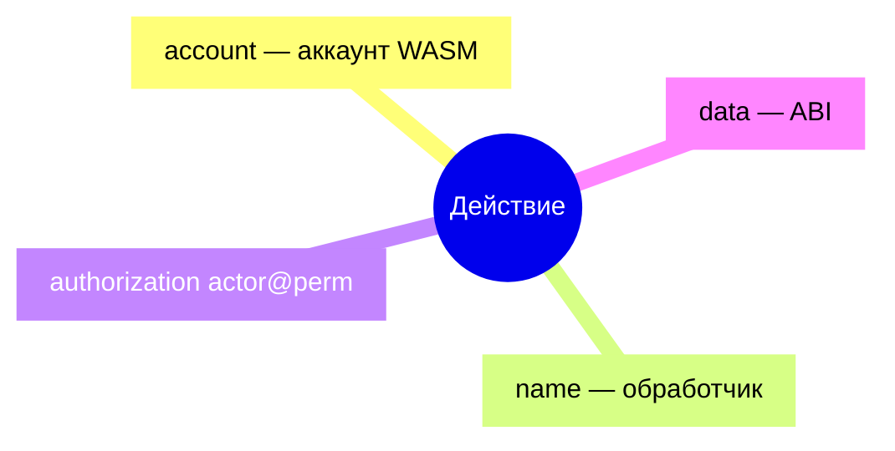
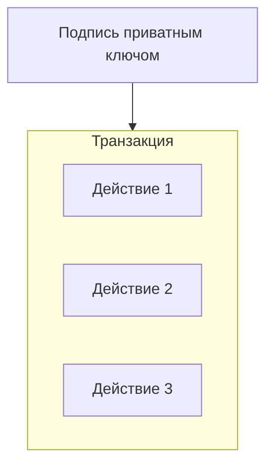
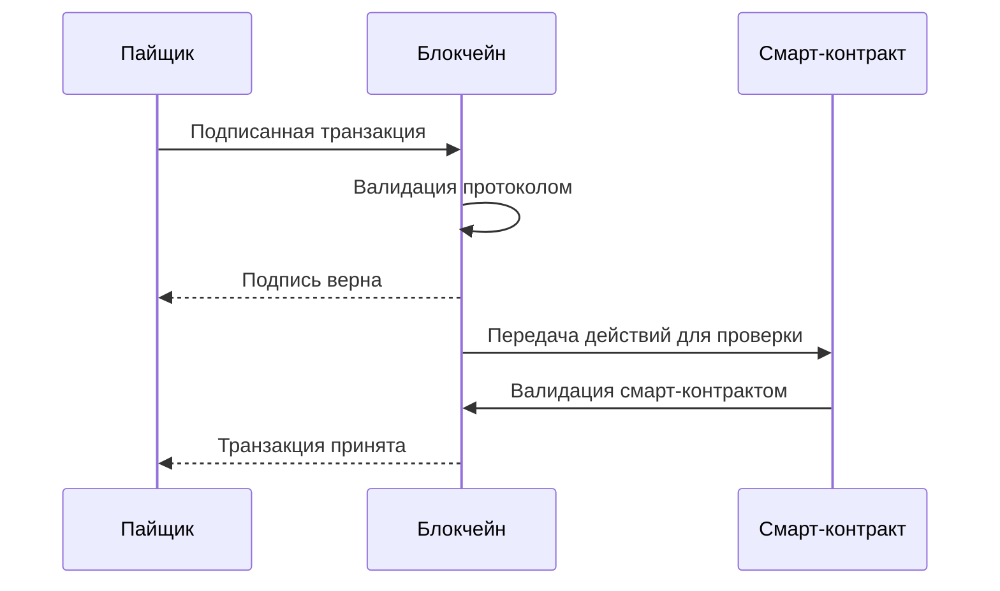
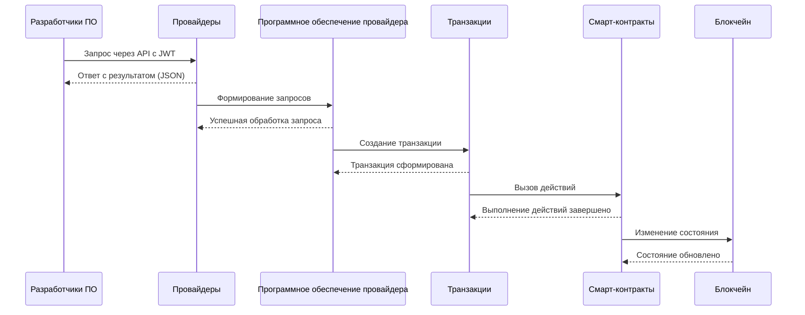

## Действия

Для изменения состояния блокчейна COOPOS используются действия. Действие — это атомарная операция, выполняемая в контексте определённого аккаунта и смарт-контракта. Она представляет минимальную единицу изменения состояния блокчейна. Все действия передаются и исполняются строго в порядке их указания в транзакции.

!!!note "Действие - это атомарная операция по изменению состояния блокчейна"

У **действия** есть **получатель** — аккаунт, чей WASM-код вызывается (часто это смарт-контракт; для встроенных примитивов — системные аккаунты вроде `eosio`). Отдельно задаётся **авторизация**: какие пары `actor@permission` должны быть закрыты подписями транзакции. Инициатор в смысле бизнес-логики и `actor` в `authorization` часто совпадают, но протокол различает **кого вызывают** и **от чьего имени подписано**.

Основные поля действия:

- **`account`** (получатель): на каком аккаунте исполняется обработчик действия.

- **`name`**: имя вызываемого метода (обработчика в контракте).

- **`authorization`**: список `actor` + `permission`, под которыми действие считается уполномоченным.

- **`data`**: двоичная полезная нагрузка (аргументы), соответствующая ABI контракта-получателя.

Каждое действие может передавать данные в смарт-контракт в виде параметров. Эти данные часто включают идентификаторы пользователей, суммы транзакций, указания на файлы или другие метаданные, необходимые для выполнения операции.



```mermaid
mindmap
  root((Действие))
    Получатель["account — аккаунт WASM"]
    ИмяМетода["name — обработчик"]
    Авторизация["authorization actor@perm"]
    Данные["data — ABI"]
```

## Транзакции
Транзакция — это **упорядоченный список действий** плюс служебные поля. Все действия в одной транзакции выполняются **атомарно**: ошибка или провал проверки на любом шаге откатывает **всю** транзакцию.

!!!note "Транзакция — единица атомарности в цепи EOSIO/COOPOS."

Кроме действий, в заголовке транзакции задаются, в частности:

- **`expiration`** — крайний момент принятия узлом (защита от повторного воспроизведения старых пакетов).
- **`ref_block_num`** и **`ref_block_prefix`** — привязка к недавнему блоку (**TAPOS**): снижает риск replay в долгоживущих форках и связывает транзакцию с контекстом цепи.
- Лимиты **`max_net_usage_words`**, **`max_cpu_usage_ms`**, **`delay_sec`** и расширения — управление ресурсом и отложенными сценариями (если включены в сети).

Подписи в массиве **`signatures`** должны покрыть все требуемые `authorization` по всем действиям (включая мультисиг с порогами весов). Как устроены ключи и проверка: [Ключи и подписи](keys-signatures.md).


```mermaid
flowchart TB
    subgraph Транзакция["Транзакция"]
        Действие1["Действие 1"]
        Действие2["Действие 2"]
        Действие3["Действие 3"]
    end

    Подпись["Подпись приватным ключом"] --> Транзакция

```

## Валидация 
Проверка идёт в логическом порядке:

1. **Узел (протокол цепи)** — формат, сроки, TAPOS, дедупликация, достаточность подписей для заявленных `actor@permission`, лимиты ресурсов.

2. **Исполнение действий** — для каждого действия вызывается обработчик на аккаунте-получателе; код контракта может дополнительно вызывать `require_auth` / проверки ролей и инвариантов бизнес-логики. Провал в WASM — откат всей транзакции. 


```mermaid
sequenceDiagram
    participant Пайщик as Пайщик
    participant Блокчейн as Блокчейн
    participant СмартКонтракт as Смарт-контракт

    Пайщик->>Блокчейн: Подписанная транзакция
    Блокчейн->>Блокчейн: Валидация протоколом
    Блокчейн-->>Пайщик: Подпись верна
    Блокчейн->>СмартКонтракт: Передача действий для проверки
    СмартКонтракт->>Блокчейн: Валидация смарт-контрактом
    Блокчейн-->>Пайщик: Транзакция принята

```

Итого: чтобы изменить состояние, нужна подписанная транзакция с хотя бы одним действием, где явно заданы получатель (`account`), имя метода (`name`), авторизации и аргументы (`data`). Общая модель: [Концептуальная модель COOPOS](system-model.md).

## Кооперативные транзакции
В текущей архитектуре пайщики самостоятельно транзакции по блокчейну не проводят. Во всех действиях, которые требуют изменения состояния блокчейна, подпись транзакции осуществляет сервисный приватный ключ кооператива, который хранится на сервере провайдера в зашифрованном виде. 

Это в первую очередь необходимо для разделения ответственности между компонентами программного обеспечения, где пайщик взаимодействует только с программным обеспечением провайдера, а провайдер организует цифровую подпись транзакций и действий со своего сервера от имени и по заданию кооператива. 


```mermaid
sequenceDiagram
    participant Разработчик as Разработчики ПО
    participant Провайдер as Провайдеры
    participant ПО as Программное обеспечение провайдера
    participant Транзакции as Транзакции
    participant Контракты as Смарт-контракты
    participant Блокчейн as Блокчейн

    Разработчик->>Провайдер: Запрос через API с JWT
    Провайдер-->>Разработчик: Ответ с результатом (JSON)
    Провайдер->>ПО: Формирование запросов
    ПО-->>Провайдер: Успешная обработка запроса
    ПО->>Транзакции: Создание транзакции
    Транзакции-->>ПО: Транзакция сформирована
    Транзакции->>Контракты: Вызов действий
    Контракты-->>Транзакции: Выполнение действий завершено
    Контракты->>Блокчейн: Изменение состояния
    Блокчейн-->>Контракты: Состояние обновлено

```


Так, разработчики прикладного программного обеспечения получают возможность использовать сервисы провайдеров и их API без избыточной сложности, связанной с организацией транзакций в блокчейн и извлечения информации из него. Эта зона остается ответственностью провайдеров на низком архитектурном уровне взаимодействия с платформой, т.к. разработчикам прикладного программного обеспечения в большинстве случаев будет достаточно обладать информацией и возможностями, которые предоставят ему провайдеры через свои API.


## Спецификация
Транзакции формируются с использованием библиотеки coopjs. В дальнейших разделах будут представлены инструкции как именно создавать транзакции и где брать информацию о параметрах действий. Ниже же представлена спецификация транзакции с действиями в десериализованном виде:

```json
{
  "expiration": "2023-11-25T23:59:59", // Время истечения транзакции. Транзакция должна быть обработана до этого момента.
  "ref_block_num": 12345,              // Номер блока, на который ссылается транзакция (облегчает поиск).
  "ref_block_prefix": 67890,           // Префикс блока для проверки транзакции.
  "max_net_usage_words": 0,            // Максимальное использование сетевого ресурса в "словах".
  "max_cpu_usage_ms": 0,               // Максимальное использование CPU в миллисекундах.
  "delay_sec": 0,                      // Задержка выполнения транзакции в секундах.
  "context_free_actions": [],          // Массив действий, не связанных с авторизацией. Обычно пуст.
  "actions": [                         // Массив действий, входящих в транзакцию.
    {
      "account": "eosio.token",        // Имя аккаунта контракта, в котором вызывается действие.
      "name": "transfer",             // Имя действия, которое вызывается (например, "transfer").
      "authorization": [              // Авторизация, необходимая для выполнения действия.
        {
          "actor": "useraccount1",    // Имя аккаунта, который авторизует действие.
          "permission": "active"      // Разрешение, используемое для авторизации (active, owner и т.д.).
        }
      ],
      "data": {                       // Данные, передаваемые в смарт-контракт.
        "from": "useraccount1",       // Отправитель средств.
        "to": "useraccount2",         // Получатель средств.
        "quantity": "10.0000 AXON",    // Сумма перевода в формате количества и символа токена.
        "memo": "Payment for services" // Заметка, описывающая транзакцию.
      }
    },
    {
      "account": "somecontract",      // Имя другого контракта, если транзакция включает несколько действий.
      "name": "someaction",           // Имя действия (например, вызов кастомного действия в контракте).
      "authorization": [
        {
          "actor": "useraccount3",
          "permission": "owner"
        }
      ],
      "data": {
        "key": "value"                // Поля, специфичные для конкретного контракта и действия.
      }
    }
  ],
  "transaction_extensions": [],       // Расширения транзакции. Пока всегда пустой массив.
  "signatures": [                     // Массив цифровых подписей, подтверждающих транзакцию.
    "SIG_K1_JyFhEj5f...etc"           // Пример одной из подписей.
  ],
  "context_free_data": []             // Дополнительные данные, не связанные с авторизацией (не используется).
}

```