Традиционные формы капитала, характерные для индустриальной эпохи, такие как материальные активы и финансовые инструменты, постепенно утрачивают свою ценность. В условиях нового технологического уклада ключевым видом капитала становится __интеллектуальный продукт__, создать который возможно только на основании объединения идей, ресурсов и действий людей во времени. 

__Кооперативная экономика__, как доктрина развития в постиндустриальную эпоху, предоставляет инструменты для создания, капитализации и защиты результатов интеллектуальной деятельности, где идеи людей правят над процессами. 

## Линия Жизни

__Большинство__ саморазвивающихся __систем__ (биологических, экономических, технических, организационных и др.) __следуют__ динамике __логистической кривой__ (S-образной), также называемой Линией Жизни, проходя фазы зарождения, роста, затухания и возможного перехода на новый уровень.

__Линия Жизни__ описывает универсальную закономерность, характерную для самых разных процессов: от эволюции организмов и технологий до общественных институтов и экономических циклов. Независимо от сферы, она включает три ключевые стадии:

1. __Зарождение__ – появление идеи, технологии или структуры, ее адаптация к среде.

2. __Расширение__ (внедрение, рост, экспансия) – стремительное распространение, вовлечение новых участников, накопление ресурсов и влияния.

3. __Насыщение__ (затухание, стабилизация, трансформация) – система достигает предела, либо выходит на новый уровень, либо теряет актуальность.

Для наглядности это можно представить на __двумерном__ графике, где по оси __X__ расположено время, а по оси __Y__ – суммарный эффект существования системы. В зависимости от контекста это могут быть __стоимость, общественная польза, степень вовлеченности, технологический прогресс, социальная справедливость, качество жизни, устойчивость экосистемы, культурное влияние и др__. Несмотря на различие терминологии, физическая суть всех этих процессов едина: ускорение, насыщение, переход или угасание.

<figure markdown="span">
  
  <figcaption>Линия Жизни</figcaption>
</figure>

На __начальном этапе__ система постепенно привлекает внимание за счёт __новизны или уникальности своих полезных характеристик__. На __этапе насыщения__ она достигает пика своей общественной значимости, когда интерес и использование выходят на максимум. __Этап стабилизации__ сопровождается снижением темпов роста, переходом в устойчивое состояние или началом угасания, что может привести к __рождению новой Линии Жизни__.

Прекращение существования системы, то есть __завершение её Линии Жизни__, может быть вызвано как внутренними, так и внешними факторами. Среди них: появление более эффективных альтернатив, моральное устаревание, снижение актуальности из-за изменений в потребностях общества или технологическом ландшафте.

<figure markdown="span">
  
  <figcaption>Исторические Линии Жизни</figcaption>
</figure>

Выявление Линий Жизни, управление их переходами и предельно эффективное распределение ограниченных ресурсов является ключевым фактором роста общественной пользы без избыточных потрясений и с минимальными затратами. История даёт примеры: развитие каналов, железных дорог, телеграфа, трубопроводов и автомобильных дорог, и т.д. - каждая из этих технологий прошла свою Линию Жизни, достигла насыщения, уже уступила своё место новым решениям или уступит в будущем.

## Стоимость и Ценности

__Создание результатов интеллектуальной деятельности (РИД) требует__ одновременного и сбалансированного использования ключевых элементов: __идей, ресурсов, времени и действий__. Каждый из этих элементов равнозначен и важен для роста результатов линии жизни. 

<figure markdown="span">
  
  <figcaption>Состав линии жизни</figcaption>
</figure>

__Стоимость__ — это количественное выражение вклада в результат интеллектуальной деятельности, определяемое совокупностью ресурсов, идей и усилий, затраченных на его создание. Она отображается на графике по оси Y и служит стартовой объективной метрикой роста результатов линии жизни. Стоимость позволяет измерить экономический эффект и продолжает расти, пока система получает ресурсное и общественное подкрепление.

Ценности, напротив, представляют субъективное восприятие линии жизни. Они отражают личные ожидания участников процесса и включают такие аспекты, как удовлетворение, вдохновение, чувство прогресса, пользу, доверие и гармонию. Эти параметры многомерны и не сводятся к одной оси. На графике они представлены осью __Zn__, которая объединяет субъективные метрики в единую многомерную категорию, отражающую суммарное отношение людей к линии жизни.

Линия жизни системы растёт в сторону ценностей, которые вдохновляют участников на продолжение действий. Пока люди видят личную или общественную значимость в линии жизни, она продолжает развиваться. Когда ценность становится недостижимой или теряет актуальность, линия жизни затухает, уступая место новой версии, где обновлённые идеи и ценности запускают новый цикл развития.

Ценности являются фундаментальной основой линии жизни, определяя её долгосрочную значимость. Они вдохновляют на действия, задают вектор развития и поддерживают вовлечённость участников. Стоимость, в свою очередь, объективно фиксирует рост результатов, служа базовой метрикой линии жизни. Совокупность объективных и субъективных метрик позволяет системе адаптироваться, выходить на новые уровни развития и создавать пространство для новых линий жизни.

## Волновой план

Все линии жизни объекта интеллектуальной собственности, формируемые результатами интеллектуальной деятельности людей в прошлом, настоящем и будущем, объединяются в единую систему — волновой план.

<figure markdown="span">
  
  <figcaption>Волны линии жизни</figcaption>
</figure>

__Волновой план__ — это живая, гибкая и вероятностная карта роста результатов интеллектуальной деятельности. Она отражает взаимосвязи и эволюцию линий жизни через производственные циклы, объединяя предложения и усилия Сообщества. В отличие от статичных дорожных карт, волновой план динамически обновляется, реагируя на изменения в системе ценностей, технологических возможностях и степени вовлечённости участников.

Каждая линия жизни развивается в рамках волнового плана, соединяясь с другими линиями через периоды корректировок, технологических изменений и адаптаций в производственных циклах. Эти соединения позволяют системе оставаться гибкой, не разрушая уже накопленные результаты. Например, волновой план можно представить через простейшую метафору календарных недель: начало и конец недели характеризуются спадом продуктивности, а её середина — ростом. Аналогично в проектах возникают фазы активного роста, периоды рефлексии и переходы к новым этапам.

Информация о линиях жизни и ключевых событиях хранится в виде графов, где каждая вершина фиксирует события: внесение предложений, ресурсов или действий. Эти графы создают структурированное представление, позволяя сохранять взаимосвязи между событиями и линиями жизни.

Для анализа и интерпретации данных графы проецируются на графики и используются для формирования рекомендаций, которые предоставляют ИИ-агенты. Такие рекомендации позволят участникам системы увидеть текущую динамику, предсказывать будущие траектории развития и принимать оптимальные решения на основе комплексного анализа данных.

Искусственный интеллект должен изучать накопленные графовые данные, выявляет закономерности в линиях жизни и прогнозирует их дальнейшее развитие. Используя историю каждого проекта, ИИ обучится создавать гибкие сценарии, которые адаптируются к изменениям внешних и внутренних условий.

Волновой план станет инструментом согласованного управления результатами интеллектуальной деятельности. Он обеспечивает рациональное распределение ресурсов, прогнозирование будущих направлений развития и поддержку ценностей участников. Построенный на графовой структуре и обогащённый рекомендациями ИИ-агентов, волновой план направляет систему к достижению новых результатов, сохраняя её адаптивность и устойчивость.

## Идеи и Предложения

__Идея__ — это мысленный образ возможного решения, модели, метода или действия, которое, по мнению автора, может принести дополнительную ценность объекту интеллектуальной собственности (ОИС). В контексте Кооперативной Экономики идеи формируют основу для дальнейшего развития проектов и производства результатов интеллектуальной деятельности (РИД).

Чтобы идея обрела практическую ценность, она должна быть оформлена в виде __проектного предложения__. Только через оформление в проектное предложение идея становится частью волнового плана и получает возможность для реализации. В Сообществе существует три типа предложений каждое из которых выполняет свою роль в иерархии процесса  генерации РИД, а именно:

### Проектные предложения

Проектные предложения описывают Идеи, которые могут перерасти в полноценные проекты  и получить командный круг для реализации. Они фиксируют предполагаемый эффект и стратегическую ценность.

__Шаблон:__
> Если мы [действие/изменение], то [результат/эффект], потому что [обоснование - проблема, возможность, решение].

__Примеры:__

> - Если мы создадим цифровой алгоритм межотраслевого баланса в Кооперативной Экономике, то сможем планировать производство и услуги в кооперативном формате, таким образом решим проблему дисбаланса производства и услуг. 
> - Если мы разработаем алгоритм прогнозирования потребностей участников Кооперативной Экономики, то сможем предотвращать дефицит товаров и услуг, потому что это позволит заранее распределять ресурсы.
> - Если мы создадим платформу для коллективного проектирования экосистемных решений, то сможем объединять участников в проектные группы по их навыкам и ценностям, потому что это ускорит генерацию идей и повысит продуктивность.

Проектные предложения оцениваются Сообществом и Советом с участием ИИ-агентов. Если проектное предложение получает одобрение, для его проработки выделяются ресурсы и создаётся соответствующий проект с командным кругом.

### Рациональные предложения

Рациональные предложения —  это конкретные планы действий в командном круге, которые необходимо выполнить ответственному в заданный период. Они начинаются с инфинитива и соответствуют принципам SMART (Конкретность, Измеримость, Достижимость, Актуальность, Ограниченность во времени).

__Шаблон:__
> [Действие с окончанием ^ть] за [срок] [ресурс] [цель].

__Примеры:__
> - Установить датчики света в офисе за 15 тыс. рублей.
> - Настроить резервное копирование данных за 7 дней.

Рациональные предложения используются для формирования производственного/ хозяйственного плана реализации проектного предложения. Они определяют, какие задачи будут выполнены в ближайшие спринты (двухнедельные циклы) и какие ресурсы потребуются для их реализации.

### Ценностные предложения

Ценностные предложения отражают личные приоритеты участников командного круга по реализации проектного предложения, их ожидания от процесса такой реализации и общие ориентиры. Они не требуют немедленного исполнения, но помогают уточнить или определить стратегическое направление в реализации проектного предложения.

__Шаблон:__
> Мне важно [желаемое состояние].

__Примеры:__
> - Мне важно через 1 год обеспечить автоматизированное управление ресурсами, чтобы сократить время и ресурсы для администрирования.
> - Мне важно, чтобы Вася писал код без багов или чтобы кто-то тестировал код за Васю.
> - Мне важно хорошо отдохнуть в выходные.

Ценностные предложения фиксируются в волновом плане и служат ориентирами для оперативного планирования в командном круге по реализации проектного предложения. Они позволяют выявлять мотивацию участников Круга, а также учитывать как ближайшие, так и долгосрочные цели Сообщества в целом.

__Как предложения становятся частью волнового плана__

1. В Сообщество поступают идеи. Сообщество их регистрирует.

2. Совет и ИИ-агенты анализируют поступающие идеи. Одобренные идеи становятся проектными предложениями - на их реализацию формируется Командный Круг.

3. В Командном Круге могут возникать ценностные предложения. Они помогают учитывать приоритеты и ожидания участников Командного Круга от реализации проектного предложения.

4. Рациональные предложения участников Командного Круга формируют производственный план. В начале каждого спринта - короткого оперативного плана действий (раз в 2 недели) определяется перечень задач и ответственные.

Таким образом, система предложений обеспечивает баланс между стратегическим видением, индивидуальными приоритетами и оперативным выполнением задач.

## Сообщество

Представим, что у нас есть Сообщество (кооператив как формат его воплощения), представители которого рождают идеи. Но не просто отвлеченные идеи, а проектные, ценностные и рациональные предложения, которые, с учетом доступных ресурсов, и по мнению участников сообщества и их ИИ-агентов, смогут обеспечить для Сообщества благо. 

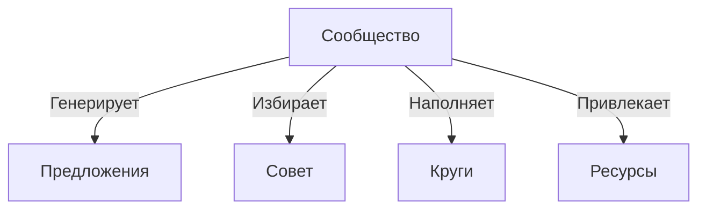

Деятельность по производству объекта интеллектуальной собственности основывается на Предложениях Сообщества, которые регистрируются в Кооперативе как паевые взносы авторским правом по номинальной стоимости, определенным Советом.   

Процесс генерации объекта интеллектуальной собственности опирается на взаимодействие между людьми и их ИИ-агентами, которые помогают анализировать возможные траектории развития, учитывать ограничения и прогнозировать наиболее эффективные пути реализации результатов интеллектуальной деятельности. В этом смысле Сообщество выступает как коллективный разум, где индивидуальные ценности пересекаются, усиливают друг друга и формируют новые линии жизни.

Каждое принятое предложение становится частью волнового плана, связываясь с существующими результатами и формируя основу для новых производственных циклов. Таким образом, Сообщество не только создает интеллектуальный продукт, но и активно управляет его жизненным циклом, прогнозируя и регулируя точки роста и коррекций его линий жизни. 

## Совет

__Совет__ — это стратегический управляющий орган Сообщества, который отвечает за долгосрочное планирование, координацию производственных процессов и согласование ценностных ориентиров.

Совет избирается общим собранием Сообщества на ограниченный срок и действует в рамках принципов кооперативного управления, сочетая коллективное принятие решений с алгоритмической поддержкой ИИ-агентов.

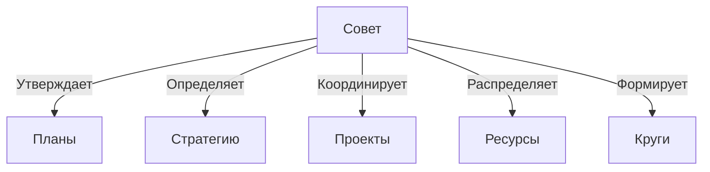

Основная роль Совета заключается в утверждении волновых планов проектов, выстраивании долгосрочных направлений развития и обеспечении эффективного распределения ресурсов. Совет принимает входящие рациональные предложения, интегрирует их в стратегические производственные циклы и формирует прогнозные производственные дорожные карты на 2 недели, 3 месяца, 1 год, 5 лет, 10 лет и более, начиная с дальних горизонтов и непрерывно адаптируя их с учетом новых данных, изменяющихся приоритетов и доступных ресурсов.

Совет также отвечает за инициирование и координацию проектов. На основании собственного видения, рекомендаций ИИ-агентов и накопленных ресурсов он открывает производство новых проектов, формирует командные круги и заключает договоры и смарт-контракты об Участии в Хозяйственной Деятельности. Это позволяет Сообществу эффективно структурировать интеллектуальную активность, обеспечивая согласованность линий жизни и максимальную капитализацию результатов интеллектуальной деятельности.

Таким образом, Совет является фундаментальным механизмом саморегуляции Сообщества, соединяя ценности участников, волновое планирование и производственные циклы в единую, эволюционирующую систему управления интеллектуальным капиталом.

## Авторы и Создатели

Авторы и создатели являются ключевыми участниками процесса генерации РИД в рамках Кооперативной Экономики. Они представляют две взаимодополняющие роли:

__1. Авторы__ — это инициаторы идей, которые формулируют проектные, ценностные и рациональные предложения. Их вклад заключается в создании концептуальных решений, направленных на развитие объекта интеллектуальной собственности (ОИС). Они регистрируют авторские права на свои предложения и вносят их в Сообщество в качестве паевого взноса. Авторские права фиксируются юридически и технологически (например, через NFT), обеспечивая защиту идей и их возможную капитализацию.

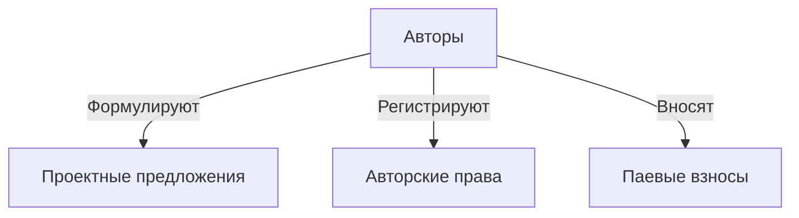

__2. Создатели__ — это участники, которые совершают конкретные действия во времени для воплощения предложений в реальность и используют ресурсы, предоставленные Сообществом. Создатели формируют между собой командные круги, берут на себя ответственность за выполнение задач и фиксируют прогресс в рамках волнового плана.

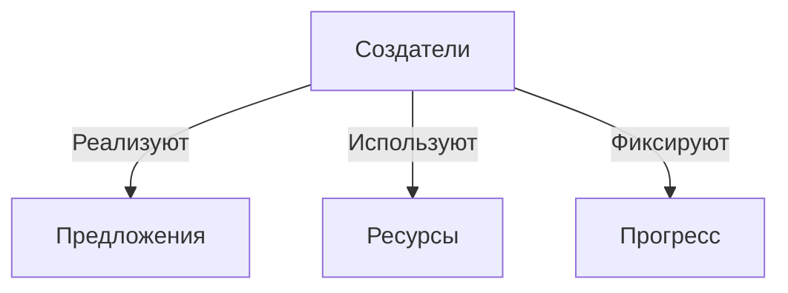

Хотя автор и создатель могут быть разными людьми, в ряде случаев один участник может совмещать обе роли — предложить идею и принять активное участие в её реализации. 

## Виды взносов
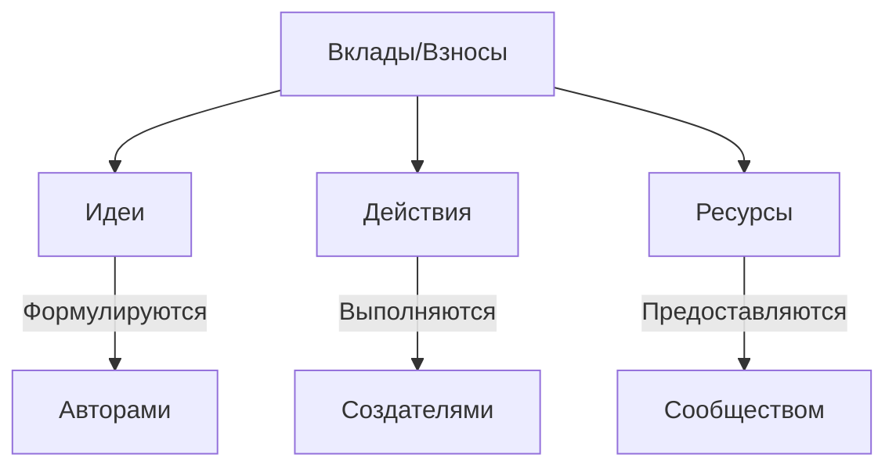

Производство РИД опирается на три равнозначных вида взносов: __идеи, действия и ресурсы__. Каждый из них представляет собой форму участия в создании интеллектуального продукта и вносит свой вклад в его генерацию.

__Идеи__ являются исходной точкой любого РИД. Авторы формируют проектные, ценностные и рациональные предложения, которые затем проходят процесс оценки и интеграции в волновой план. Идея сама по себе имеет номинальную стоимость при регистрации авторских прав, но фактическая её ценность определяется тем, насколько Сообщество готово осуществлять действия и вкладывать в неё своё время и ресурсы.

__Действия__ подтверждают ценность идей. Создатели тратят своё время на их реализацию, беря на себя ответственность за воплощение предложений в конкретный продукт. Время создателей — это основной измеримый актив, на который опирается модель по определению сгенерированной стоимости РИД.

__Ресурсы__ поддерживают процесс создания. Это могут быть финансовые средства, инфраструктура, оборудование, технологии или иные материальные активы, без которых невозможно воплощение идей в реальность. Вложенные ресурсы учитываются при расчёте совокупной стоимости сгенерированного РИД.

Каждый вклад не существует в изоляции. Только их синхронное сочетание позволяет обеспечить создание интеллектуального продукта, закрепить авторские права и перераспределить участие в сгенерированной стоимости РИД  среди всех участников процесса.

## Круги

__Круги__ — это гибкие, самоорганизующиеся команды, объединяющие создателей, авторов и приглашённых наблюдателей для реализации проектных предложений. Они формируются в ответ на принятие Сообществом проектных инициатив и действуют в рамках производственных циклов, согласованных с волновым планом.

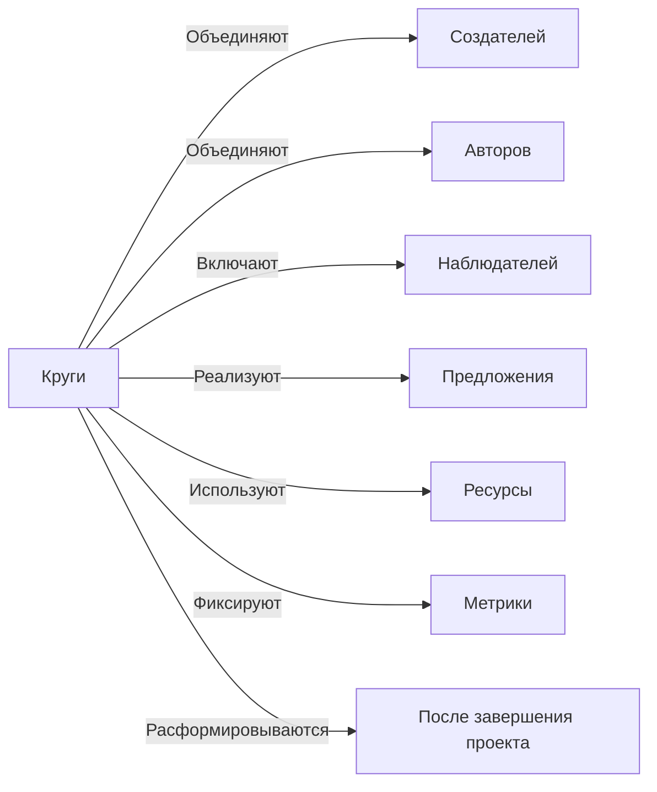

Создатели в круге берут на себя реализацию предложений, используя предоставленный Сообществом ресурс и вкладывая своё время и действия, а авторы сопровождают процесс, обеспечивая смысловую и концептуальную целостность идеи. Наблюдатели могут быть включены в круг в качестве экспертов, аналитиков или заинтересованных сторон, обеспечивающих стратегическую поддержку и контроль за ходом работ.

Каждый круг обладает собственной системой метрик, определяющей распределение премии среди его участников. Эти метрики могут учитывать сложность выполненной работы, её соответствие первоначальной концепции, степень вовлечённости или другие параметры, согласованные внутри круга. Это позволяет каждому участнику круга видеть прозрачную систему оценки своего вклада и справедливого распределения вознаграждения.

Круги не фиксированы во времени — они существуют, пока ведётся работа над соответствующими предложениями. Как только проектная инициатива завершается или переходит в новую фазу, круг может быть расформирован, изменён или переформатирован для новых задач. Такое динамическое управление командами позволяет максимально эффективно использовать потенциал Сообщества, распределяя усилия в соответствии с заданными приоритетами развития.

## Проекты

__Проекты__ — это структурно-функциональные единицы, в рамках которых осуществляется генерация РИД. Они представляют собой контейнеры для развития идей, объединяющие командные круги, техническую и организационную инфраструктуру, а также ресурсы, выделенные Сообществом для их реализации.

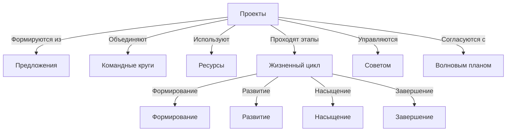

Каждый проект проходит через естественные этапы жизненного цикла: формирование, развитие, насыщение и завершение, что соответствует принципам волнового планирования. В начале проект может существовать как концепция в виде проектного предложения. После его утверждения Сообществом и выделения необходимых ресурсов создаётся соответствующий круг, который берёт на себя его реализацию.

Проекты управляются на основе производственного плана, формируемого из рациональных предложений. Этот план задаёт направления развития, этапы реализации и ключевые контрольные точки, согласованные с волновым планом.

Сообщество, через Совет и ИИ-агентов, координирует открытие и поддержку проектов, направляя ресурсы на наиболее перспективные инициативы. Это позволяет обеспечить стратегическое развитие интеллектуальной деятельности, избегая хаотичного распределения усилий.

Совет, на основании собственного видения, рекомендаций ИИ-агентов, и накопленных ресурсов своевременно открывает производство проектов и формирует командные круги личными приглашениями членов Сообщества, заключая с ними договор и смарт-контракт об Участии в Хозяйственной Деятельности. 

Договор представляет собой юридическое описание условий участия в создании результатов интеллектуальной деятельности, а смарт-контракт - реализует их в программном коде блокчейна Кооперативной Экономики, фиксируя авторские права на предложения и перераспределяя рост капитализации среди всех членов Сообщества.

Таким образом, проекты выступают в качестве основного механизма кооперативного производства, связывая ценностное целеполагание, командную работу и капитализацию интеллектуальной собственности в единую систему роста.

## Процесс планирования

Процесс планирования является основой организации деятельности Сообщества, соединяя стратегическое управление, производственные циклы и механизм капитализации интеллектуальной собственности. Он включает в себя последовательные этапы принятия предложений, выявления проектов, формирования командных кругов и детального проектирования производственного процесса.

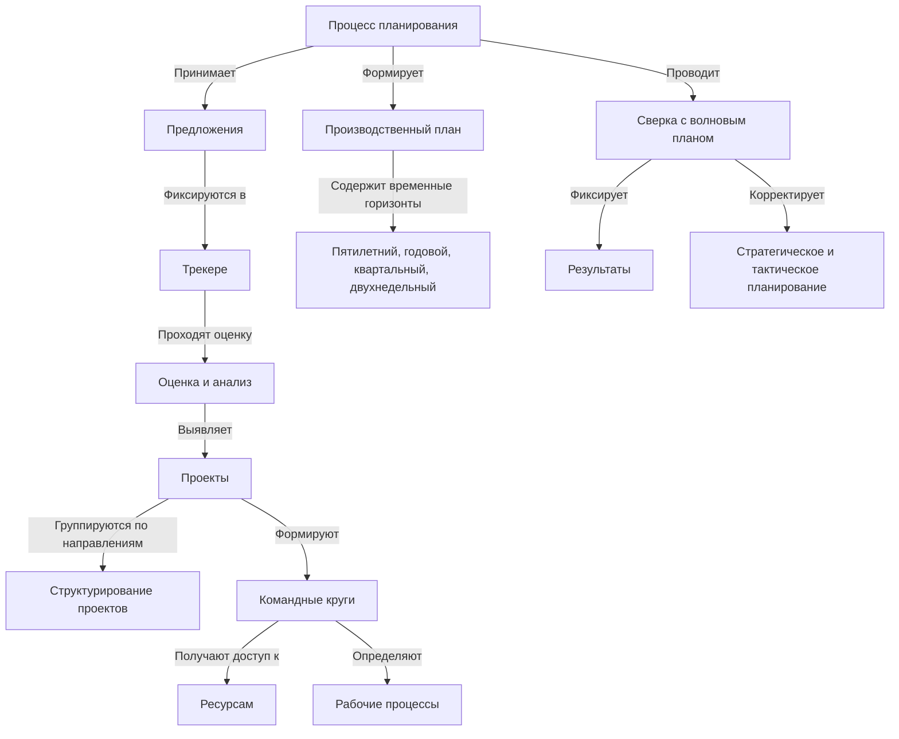

__1. Принятие предложений__

На первом этапе Сообщество принимает предложения всех типов: проектные, ценностные и рациональные. Эти предложения поступают от участников и фиксируются в трекере, где проходят предварительную оценку и анализ. На этом этапе Сообщество определяет потенциал каждого предложения, его соответствие стратегическим приоритетам и доступным ресурсам.

__2. Выявление проектов__

После фиксации предложений начинается процесс выявления проектов. Предложения, обладающие высоким потенциалом и поддержкой участников, формируют основу для создания новых проектов. Они группируются по направлениям, что позволяет структурировать работу и подготовить их к следующему этапу.

__3. Формирование командного круга__

Для каждого проекта формируется командный круг, состоящий из создателей, авторов и приглашённых участников. Круг получает доступ к необходимым ресурсам, определяет рабочие процессы и договаривается о системе распределения премии среди участников.

__4. Производственное планирование__

Командный круг разрабатывает производственный план, который включает предложения общего планирования на различные временные горизонты:

- Пятилетний цикл — стратегическое видение направления развития проекта.
- Годовой цикл — определение ключевых этапов работы на год.
- Квартальный цикл (3 месяца) — уточнение приоритетных задач на ближайшее время.
- Двухнедельный цикл (спринт) — конкретные шаги и задачи, которые предстоит выполнить в ближайшие 14 дней.

Этот процесс формирует основу волнового планирования, обеспечивая динамическую адаптацию проектов к изменяющимся условиям и стратегическим приоритетам.

__5. Сверка и регистрация результатов__

Каждые 2 недели проводится сверка производственного плана с волновым планом. В ходе сверки фиксируются фактические результаты, достигнутые командными кругами, а также пересматриваются приоритеты и корректируются планы на следующие циклы.

На этом этапе:
- Производится регистрация сгенерированных результатов интеллектуальной деятельности в Кооперативе.
- Фиксируется фактическое затраченное время участников.
- Распределяются вклады от стоимости сгенерированного РИД среди создателей и авторов.
- Определяются корректировки в стратегическом и тактическом планировании.

Этот механизм позволяет Сообществу управлять процессом создания интеллектуальной собственности в режиме реального времени, обеспечивая прозрачность, справедливое распределение участия в стоимости сгенерированного РИД и согласованность долгосрочных и краткосрочных целей.

Таким образом, планирование представляет собой непрерывный процесс, в котором ценности, идеи, ресурсы и действия формируют единую живую систему кооперативного управления.

## Генерация РИД

Сгенерированная стоимость РИД определяется суммарной стоимостью идей, действий и ресурсов, вложенных в процесс его создания. Её расчет основан на принципе __золотого сечения__, который определяет баланс между вложенным трудом создателей и ценностью авторских идей.

Единственный способ подтвердить ценность идеи — это вложить в неё действия. Если Сообщество принимает предложение и начинает его реализацию, каждый вложенный час работы увеличивает совокупную сгенерированную стоимость РИД втрое.

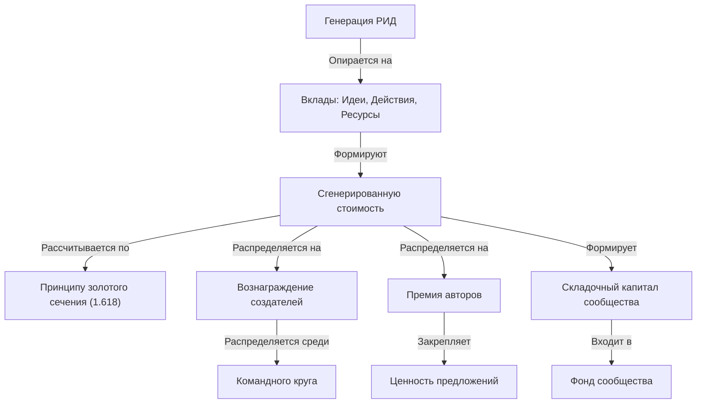

Допустим, создатель инвестирует 1 час времени, номинальная стоимость которого составляет 3000 рублей. В этот момент возникает сгенерированная стоимость 9000 рублей, распределяемая следующим образом:

- 3000 рублей — оплата труда создателя.
- 1146 рублей (3000 × 0,382) — “премия” создателей, которая распределяется среди членов командного круга.
- 4854 рублей (3000 × 1,618) — “премия” авторов, закрепляющая ценность предложения.

“Премия” выражается в дополнительном взносе участника в виде Имущества - РИД.

Такое распределение формирует устойчивую модель генерации РИД, в которой создатели получают вознаграждение за вложенное время, а авторы — “премию” за де-факто определенную ценность своих идей. При этом дополнительная “премия” создателей перераспределяется внутри командного круга, согласно установленным метрикам, определяемым самим кругом.

Чем больше времени и ресурсов вкладывается в реализацию идеи, тем выше её сгенерированная стоимость. Этот процесс не статичен — он напрямую зависит от вовлечённости участников и динамики волнового планирования. Каждое принятое предложение проходит через этапы проверки, реализации и роста стоимости, формируя живую систему, в которой ценность интеллектуальной деятельности объективно закрепляется в системе вкладов, действий и результатов.

## Капитализация РИД
В основе Кооперативной Экономики лежит принцип совместного роста интеллектуального капитала - его капитализацию. В отличие от традиционных моделей, где ценность создаётся и фиксируется локально, здесь каждый новый вклад не только оценивается сам по себе, но и увеличивает стоимость всех предыдущих вложений.

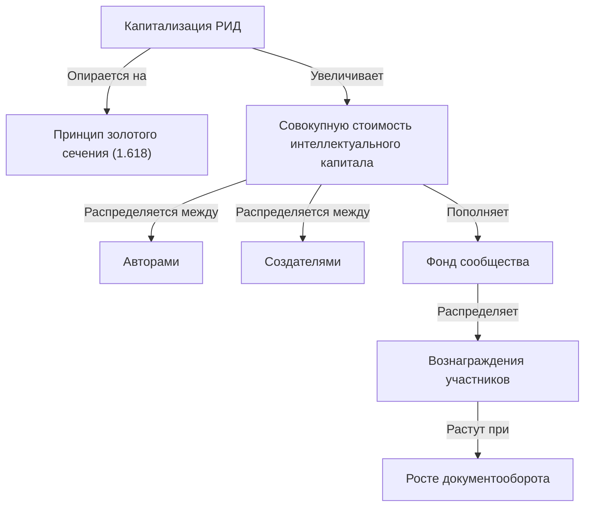

Этот механизм основан на принципе золотого сечения (1,618), который выполняет две ключевые функции:

1. Определяет баланс капитализации между авторами и создателями. Вложенное время подтверждает ценность идеи, а коэффициент золотого сечения задаёт соотношение между вкладом авторов и трудом создателей.

2. Обеспечивает экспоненциальный рост интеллектуального капитала в Сообществе. Каждый новый вклад приумножает стоимость всей экосистемы, усиливая значимость как текущих, так и прошлых достижений.

Если предложение принимается к реализации, его ценность увеличивается втрое. Допустим, создатель инвестирует 1 час работы стоимостью 3000 рублей. Это создаёт 9000 рублей интеллектуального капитала, распределяемых следующим образом:

- 3000 рублей — вознаграждение создателя за вложенное время.
- 1146 рублей (3000 × 0,382) — “премия” создателей, распределяемая внутри командного круга.
- 4854 рублей (3000 × 1,618) — “премия” авторов, закрепляющая ценность идеи.

Но на этом процесс не останавливается. 9000 рублей капитализации вносятся в Кооператив как  паевые взносы от участников круга, которые затем, также дополнительными имущественными паевыми взносами каждого члена Сообщества, увеличивает общий Складочный капитал Сообщества принципу золотого сечения:

- 9000 × 1,618 = 14 562 рублей дополнительно распределяются среди всех участников Сообщества, которые вносили взносы ранее — будь то идеи, ресурсы или действия.

Таким образом, каждый новый вклад не просто добавляет ценность в систему — он увеличивает капитализацию всех предыдущих интеллектуальных вложений.

В результате:
- Авторы получают “премию” за свои идеи, подтверждённые действиями.
- Создатели получают оплату за работу и дополнительную “премию” в рамках командного круга.
- Сообщество в целом и его участники видят, как их накопленные взносы постоянно растут за счёт механизма взаимного усиления.

Этот принцип обеспечивает непрерывное развитие интеллектуального капитала и создаёт эффект волнового роста, при котором не только у каждого нового предложения фиксируется стоимость, но и капитализирует все предыдущих результатов, связывая их в единую систему долгосрочного роста.

## Выгода

Генерация и Капитализация РИД создает фундамент для роста Сообщества, но сама по себе не является конечной выгодой. Для обретения практической ценности, она должна превратиться в экономический поток, который обеспечивается функционированием платформы Кооперативной Экономики. Этот поток формируется через документооборот, осуществляемый в рамках кооперативных контрактов, которые оплачиваются в AXON — утилитарном токене платформы.

Экономическая модель построена на механизме сеньоража, который активируется только при увеличении оборота токенов AXON в рамках одного цикла. Это означает, что выгода каждого участника зависит от роста документооборота, а не от статического владения токенами или интеллектуальными правами. При этом ключевым элементом является автоматическая эмиссия, которая запускается, когда платформа демонстрирует прирост объема произведенных документов.

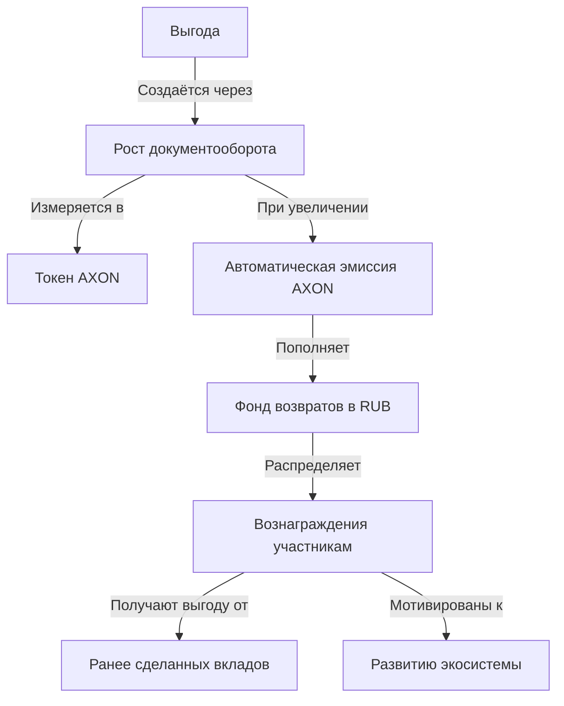

Чтобы понять, как работает эта система, рассмотрим простой пример.

Предположим, что в первую неделю на платформе было произведено 1000 документов, а на вторую — 1200 документов. Это означает, что за цикл платформа показала прирост документооборота на 200 документов. Если каждый документ оплачивается в 1 AXON, то финансовый прирост оборота за этот цикл составляет 200 AXON.

Система реагирует на этот прирост, умножая его на коэффициент 1.618. Это значит, что запускается эмиссия 200 × 1.618 = 323 AXON, которые поступают в фонд возвратов Сообщества. Эти токены распределяются среди участников, ранее внесших вклад в проекты, которые обеспечили рост документооборота.

Таким образом, каждое увеличение оборота приводит к автоматическому созданию новых ресурсов, которые затем перераспределяются в Сообществе. Это создает прямую связь между интеллектуальной деятельностью, ростом документооборота и выплатами участникам.

Важно понимать, что система работает только на приросте. Если объем документооборота не увеличивается, то эмиссия не производится, а выплаты сеньоража прекращаются. Это исключает возможность инфляционного разбавления стоимости токенов и стимулирует Сообщество постоянно развивать проекты, которые обеспечивают рост документооборота.

Выгода в этой модели формируется на нескольких уровнях.

__Во-первых__, создатели и авторы получают сгенерированную стоимость РИД как совершенные ими взносы. Каждый проект, запускаемый в Сообществе, не просто фиксирует интеллектуальную ценность, но и создает условия для дальнейшего роста. Чем больше документов порождает конкретный проект, тем больше эмиссия, и, следовательно, тем выше стоимость паевых взносов, сделанных ранее.

__Во-вторых__, все члены Сообщества, которые вносили вклад ранее, получают капитализацию своих взносов пропорционально доле в сеньораже. Например, если кто-то инвестировал ресурсы или внес интеллектуальный вклад в прошлом, их стоимость увеличивается за счет того, что каждый новый цикл документооборота приводит к автоматическому перераспределению части вновь созданных ресурсов.

__В-третьих__, это создает естественный механизм самофинансирования. В отличие от традиционных моделей, где финансовые поступления зависят от внешних инвестиций или одноразовых продаж, здесь весь процесс поддерживается за счет постоянного развития интеллектуальной деятельности и документооборота.

Благодаря этой модели Сообщество избегает дестабилизирующих факторов, таких как инфляция, стагнация или зависимость от ограниченного числа крупных инвесторов. Здесь каждый участник заинтересован в развитии платформы, потому что его выгода не ограничивается разовыми выплатами, а встроена в общий механизм роста экосистемы.

Таким образом, платформа Кооперативной Экономики представляет собой сбалансированную систему, в которой каждый вклад обеспечивает долгосрочную ценность. Чем активнее Сообщество, тем больше ресурсов возвращается участникам, формируя устойчивый экономический цикл и создавая прочный фундамент для дальнейшего роста и развития.

## Заключение

__Кооперативная Экономика__ — это система, в которой интеллектуальный труд капитализируется по объективным правилам, а ценность создаётся через непрерывный рост интеллектуального капитала. Вложенное время, идеи и действия фиксируются, усиливают стоимость всех предыдущих вкладов и формируют основу для дальнейшего развития.

Документооборот, возникающий в процессе работы проектов, подтверждает ценность созданных результатов и запускает экономический механизм возврата вложений. Рост документооборота увеличивает оборот токенов AXON, что обеспечивает выплаты по вложенным идеям, действиям и ресурсам.

При увеличении документооборота автоматически запускается эмиссия новых токенов, которые поступают в фонд возвратов Сообщества. Эти токены распределяются между участниками, внесшими вклад в предыдущих циклах, усиливая их участие в общем успехе. Этот механизм создаёт замкнутую, самоподдерживающуюся систему, в которой развитие зависит от активности участников и стратегических решений Сообщества.

Модель объединяет интеллектуальный капитал с ценностями людей. Каждый участник вносит свой вклад, двигаясь в сторону своих ценностных ориентиров, закреплённых в волновом плане. Это стимулирует создание новых идей и обеспечивает их осмысленное развитие в рамках общих целей Сообщества.

Кооперативная Экономика формирует устойчивую систему роста, в которой интеллектуальный труд капитализируется, проекты формируют экономический поток, а Сообщество развивается на основе долгосрочной ценности. Активное участие и совместная деятельность увеличивают капитализацию идей, расширяют ресурсы участников и создают прочный фундамент для будущего роста.