# Техническое задание: Платформа CARD.COOP

## Описание системы

CARD.COOP - это платформа для безопасного хранения и обмена персональными данными пайщиков кооперативов. Система состоит из трех основных компонентов:

- **id.card.coop** - сервис аутентификации и управления доступом к данным
- **card.coop (пользовательская часть)** - общая платформа для всех пайщиков (физических лиц, юридических лиц и ИП)
- **card.coop (бизнес-часть)** - административная панель для кооперативов-эмитентов карт

Каждый пайщик при вступлении в кооператив получает цифровое удостоверение - карту пайщика, которая содержит зашифрованную информацию: ФИО, дату рождения, email, паспортные данные (опционально), а также приватный ключ для подписи документов в одном кооперативе. Одна карта может содержать приватные данные только об одном пайщике, и обладать множеством пар имен аккаунтов (счетов) и ключей доступа от них во многих кооперативах. 

### Архитектура карты пайщика

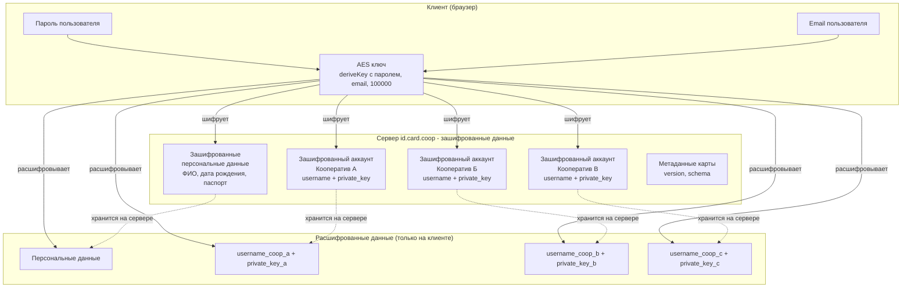

**Ключевые принципы:**
- **Одна карта = один пайщик** - персональные данные принадлежат только одному физическому/юридическому лицу
- **Множество аккаунтов** - каждый кооператив создает свою пару username-privatekey для пайщика
- **Единое шифрование** - все данные карты шифруются одним AES ключом, производным от пароля пользователя
- **Независимые ключи** - приватные ключи для разных кооперативов независимы друг от друга

Кооперативы получают доступ к данным пайщиков через платформу id.card.coop, которая работает как независимое хранилище зашифрованных персональных данных. Для выпуска карт Aifory требуется дополнительная регистрация в кооперативе-операторе платежной системы через бизнес-платформу card.coop.

**Уровни доступа:**
- **Базовый уровень** - свободный доступ к id.card.coop для создания карт и получения данных (доступен всем)
- **Расширенный уровень** - выпуск карт Aifory через регистрацию в кооперативе-операторе платежной системы

Система использует протокол с нулевым разглашением (zero-knowledge) - сервер никогда не знает реального пароля пользователя, его ключей подписи или приватных данных. Вся чувствительная информация шифруется на стороне клиента.

**Принцип работы:**
- Любой пользователь может создать карту на id.card.coop с email-валидацией
- Карта содержит только зашифрованные персональные данные (без счетов - аккаунтов)
- Кооперативы получают данные и создают счета (аккаунты) в своих системах
- ПК ВОСХОД или кооператив-оператор плажетной системы выступает оператором персональных данных
- Обязательное согласие с политикой конфиденциальности при регистрации

---

## ЗАДАНИЕ 1: Сервис аутентификации (id.card.coop)

### Цель
Создать безопасный сервис аутентификации с протоколом нулевого разглашения для управления доступом к персональным данным пайщиков.

### Компоненты для разработки

#### 1.1 Бэкенд API (id.card.coop)
**Технологии:** NestJS, TypeScript, PostgreSQL, Redis, JWT, Swagger, Docker, NOVU

**Основные эндпоинты:**

*Базовые (доступны всем без ограничений):*
- `POST /auth/initiate-registration` - начало регистрации с email
- `POST /auth/verify-email` - подтверждение email кодом
- `POST /auth/complete-registration` - завершение регистрации  
- `POST /auth/initiate-login` - начало входа
- `POST /auth/complete-login` - завершение входа
- `POST /auth/refresh-token` - обновление токенов
- `POST /auth/logout` - выход из системы
- `GET /privacy-policy` - получение политики конфиденциальности
- `POST /card/issue` - выпуск карты пайщика (только персональные данные)
- `POST /card/add-account` - добавление аккаунта в новый кооператив к существующей карте
- `GET /card/accounts` - получение списка аккаунтов пайщика во всех кооперативах
- `GET /card/schema` - получение схемы карты
- `POST /access/prepare-share-data` - подготовка к предоставлению доступа
- `POST /access/share-data` - предоставление доступа кооперативу
- `POST /access/exchange-ticket` - обмен тикета на токен доступа
- `GET /access/get-encrypted-data/{username}/{coopname}` - получение данных кооперативом
- `GET /cooperatives` - получение списка кооперативов, где пайщик является членом (проверка через ПК ВОСХОД)

*Расширенные (для кооперативов-операторов платежной системы):*
- `POST /aifory/issue-card` - выпуск карты Aifory
- `GET /aifory/card-details/{card_id}` - получение деталей карты Aifory
- `POST /aifory/top-up` - пополнение карты Aifory
- `GET /aifory/transactions/{card_id}` - история транзакций

**Система уведомлений (NOVU):**
- Email уведомления о регистрации и входе
- Уведомления о предоставлении доступа к данным
- Алерты о подозрительной активности
- Уведомления об изменении паролей и ключей

**Криптографические требования:**
- Хэширование паролей: 1000 итераций с серверной солью
- Генерация AES ключей: 100000 итераций деривации ключа
- JWT токены для аутентификации (access_token, refresh_token)
- Поддержка асимметричного шифрования для кооперативов
- Метаданные карты с версионированием и миграцией данных (meta.version)
- Поддержка схемы валидации данных карты

#### 1.2 Типо-безопасный клиент (SDK)
**Технология:** TypeScript
**Назначение:** Библиотека для безопасного взаимодействия с API

**Функции:**
- Email-валидация при регистрации
- Генерация и управление криптографическими ключами
- Генерация пар username-privatekey для разных кооперативов
- Шифрование/дешифрование персональных данных и аккаунтов на клиенте
- Управление токенами и сессиями
- Получение и валидация схемы карты
- Управление множественными аккаунтами в разных кооперативах
- Типизированные интерфейсы для всех API вызовов

#### 1.3 Фронтенд приложение (id.card.coop)
**Технологии:** React/Vue.js + TypeScript
**Дизайн:** Современный, минималистичный UI

**Экраны:**
- Регистрация пользователя с email-валидацией и согласием с политикой конфиденциальности
- Вход в систему  
- Создание карты пайщика (ввод персональных данных)
- Экран разрешения на доступ к персональным данным
- Управление предоставленными доступами
- Настройки безопасности

### Алгоритм работы

#### Регистрация/Вход с email-валидацией
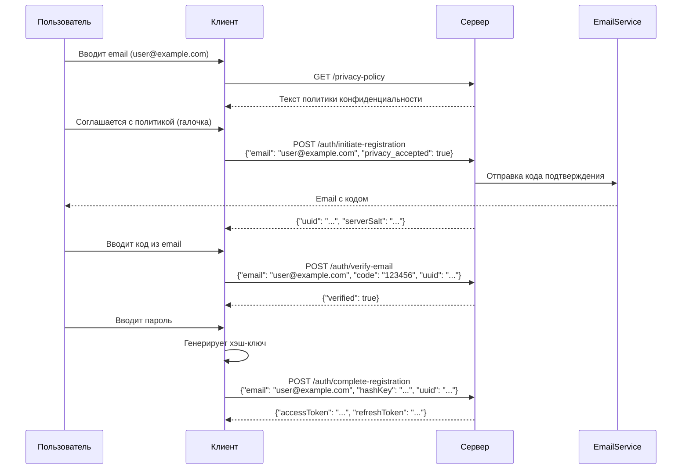

#### Выпуск карты пайщика (независимо от кооперативов)
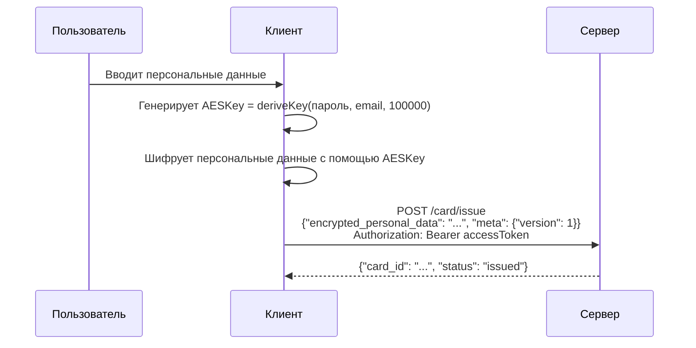

#### Создание аккаунта в кооперативе
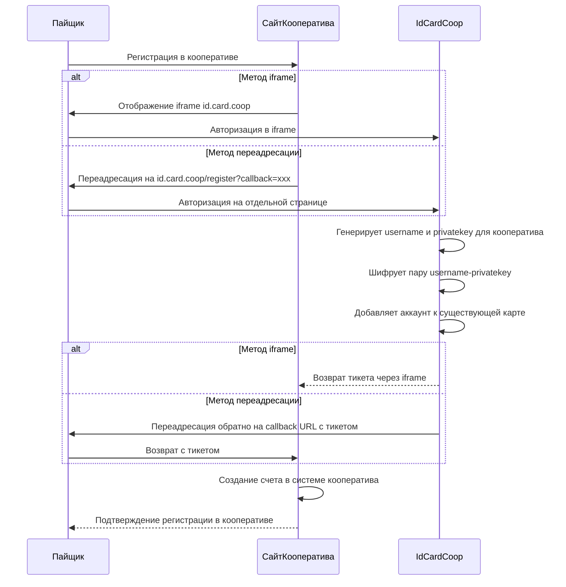

#### Предоставление доступа кооперативу
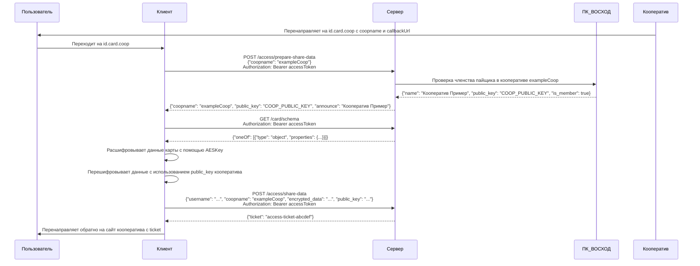

#### Получение данных кооперативом
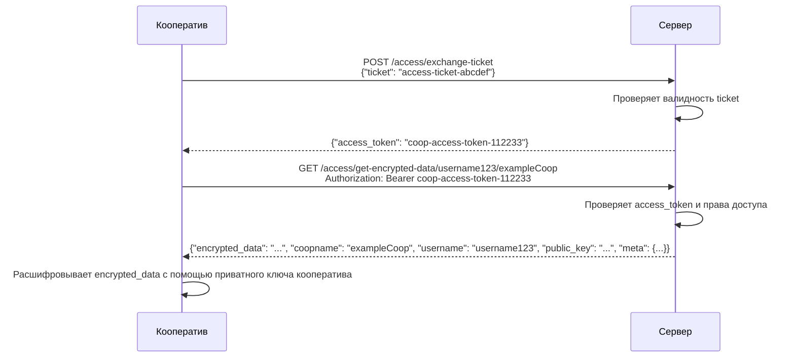

#### Управление доступом
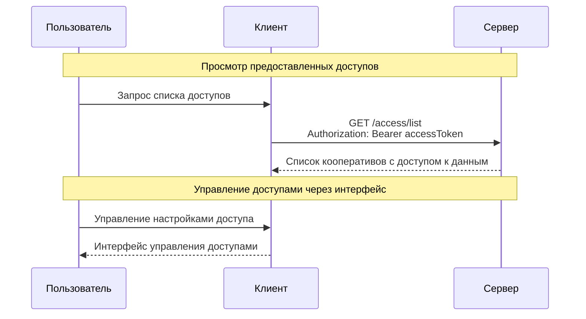

### Критерии готовности
- [ ] Работающий API со всеми эндпоинтами
- [ ] Интеграция с ПК ВОСХОД для получения данных о кооперативах
- [ ] Email-валидация и система согласия с политикой конфиденциальности
- [ ] Поддержка двух методов интеграции (iframe и переадресация)
- [ ] Типо-безопасный SDK с документацией
- [ ] Фронтенд с полным функционалом аутентификации
- [ ] Система уведомлений через NOVU
- [ ] Покрытие тестами минимум 80%
- [ ] Документация API (OpenAPI/Swagger)

---

## ЗАДАНИЕ 2: Пользовательская платформа (card.coop)

### Цель
Создать общую пользовательскую платформу для всех пайщиков (физических лиц, юридических лиц и ИП) с функциями управления картами, мониторинга активности и взаимодействия с кооперативами. 

### Компоненты для разработки

#### 2.1 Бэкенд API (card.coop - пользовательская часть)
**Технологии:** NestJS / MONO / NOVU
**База данных:** PostgreSQL + MongoDB

**Основные функции:**
- Интеграция с id.card.coop для регистрации/входа пайщиков
- Управление картами пайщика-пользователя
- Мониторинг активности и сессий
- Интеграция с кооперативами через API
- Интеграция с ПК ВОСХОД для получения данных о кооперативах
- Система уведомлений

**Система уведомлений (NOVU):**
- Уведомления о новых картах, платежах и изменениях данных
- Напоминания о важных событиях кооперативов
- Push-уведомления в браузере
- Персонализированные рекомендации

#### 2.2 Фронтенд приложение (card.coop - пользовательская часть)
**Технологии:** React/Vue.js + TypeScript
**Дизайн:** Современный dashboard с удобной навигацией

### Функциональные требования

#### 2.1 Управление картами и данными
- **Обзор карты пайщика** - отображение персональных данных и списка всех аккаунтов в кооперативах
- **Управление аккаунтами в кооперативах** - просмотр и управление username и ключами для каждого кооператива
- **Отображение названий кооперативов** - получение наименований только тех кооперативов, где пайщик является членом (проверка через ПК ВОСХОД)
- **Управление персональными данными** - редактирование и обновление персональных данных карты
- **Добавление новых аккаунтов** - создание аккаунтов в новых кооперативах
- **Сводные балансы** - отображение балансов только в тех кооперативах, где пайщик является членом (проверка через ПК ВОСХОД)

#### 2.2 Управление доступами и безопасность
- **Управление сессиями доступа** - контроль того, какие кооперативы имеют доступ к данным
- **Управление устройствами** - список авторизованных устройств с возможностью отзыва доступа
- **Лог сессий** - история входов с указанием времени, IP и устройства
- **Настройки уведомлений** - управление типами и частотой уведомлений
- **Центр уведомлений** - история всех уведомлений с возможностью фильтрации

#### 2.3 Интеграция с кооперативами
- **Переходы на кооперативы** - быстрый доступ к сайтам кооперативов с автоматической аутентификацией
- **Список общих собраний** - календарь и уведомления о собраниях кооперативов
- **Управление пополнениями** - интерфейс для внесения паевых и членских взносов
- **Календарь событий** - интеграция с календарными системами кооперативов
- **Автоматические напоминания** - о взносах, собраниях и важных датах

### Архитектура интеграции
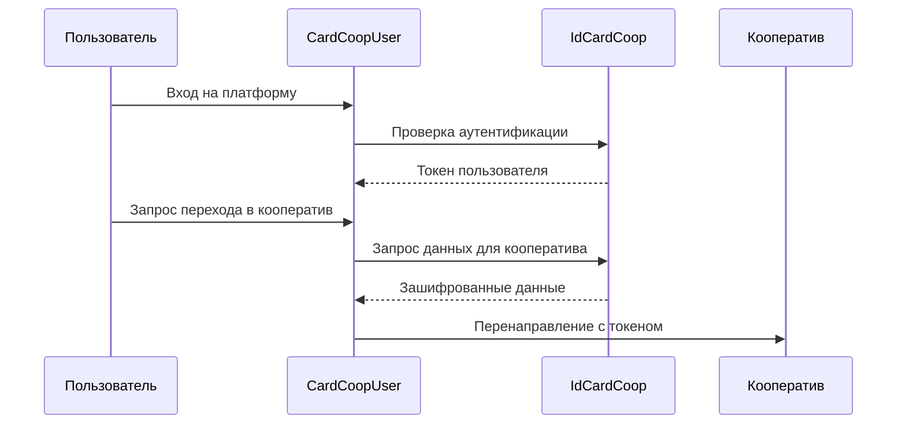

### Критерии готовности
- [ ] Полнофункциональная пользовательская платформа с dashboard
- [ ] Интеграция с сервисом аутентификации
- [ ] Система уведомлений и календарных интеграций
- [ ] Мобильная адаптация интерфейса
- [ ] Интеграция с API кооперативов
- [ ] Аналитика и мониторинг активности пользователей

---

## ЗАДАНИЕ 3: Бизнес-платформа для кооперативов (card.coop)

### Цель
Создать административную панель для кооперативов с двумя уровнями доступа:
- **Базовый уровень** - управление iframe интеграциями с id.card.coop (доступен всем)
- **Расширенный уровень** - регистрация в кооперативе-операторе платежной системы для выпуска карт Aifory

### Компоненты для разработки

#### 3.1 Бэкенд API (card.coop - бизнес-часть)
**Технологии:** NestJS / MONO / NOVU
**База данных:** PostgreSQL + MongoDB

**Основные функции:**
- Управление iframe интеграциями с id.card.coop (базовый уровень)
- Регистрация кооперативов в платежной системе (расширенный уровень)
- API для интеграции с сайтами кооперативов
- Мониторинг активности и статистика
- Система уведомлений

#### 3.2 Фронтенд приложение (card.coop - бизнес-панель)
**Технологии:** React/Vue.js + TypeScript
**Дизайн:** Профессиональная административная панель

### Функциональные требования

#### 3.1 Базовый уровень (свободный доступ для всех кооперативов)
- **Настройка iframe интеграций** - конфигурация встраивания id.card.coop на сайт кооператива
- **Настройка переадресации** - конфигурация redirect-интеграции с callback URL
- **Выбор метода интеграции** - iframe или переадресация (определяется наличием callback параметра)
- **Мониторинг регистраций** - статистика создания аккаунтов пайщиков
- **Управление доступами** - настройка iframe для управления доступами пайщиков
- **Документация интеграции** - руководства по встраиванию iframe и настройке переадресации

#### 3.2 Расширенный уровень (регистрация в кооперативе-операторе)
- **Регистрация в платежной системе** - подача заявки на выпуск карт Aifory
- **Управление лимитами Aifory** - настройка лимитов и условий выпуска
- **Мониторинг карт Aifory** - статистика и управление выпущенными картами
- **Финансовая отчетность** - комиссии, обороты, балансы по картам Aifory

### Архитектура iframe интеграции (базовый уровень)
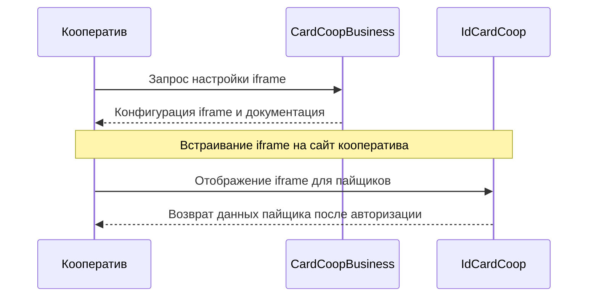

### Архитектура регистрации в платежной системе (расширенный уровень)
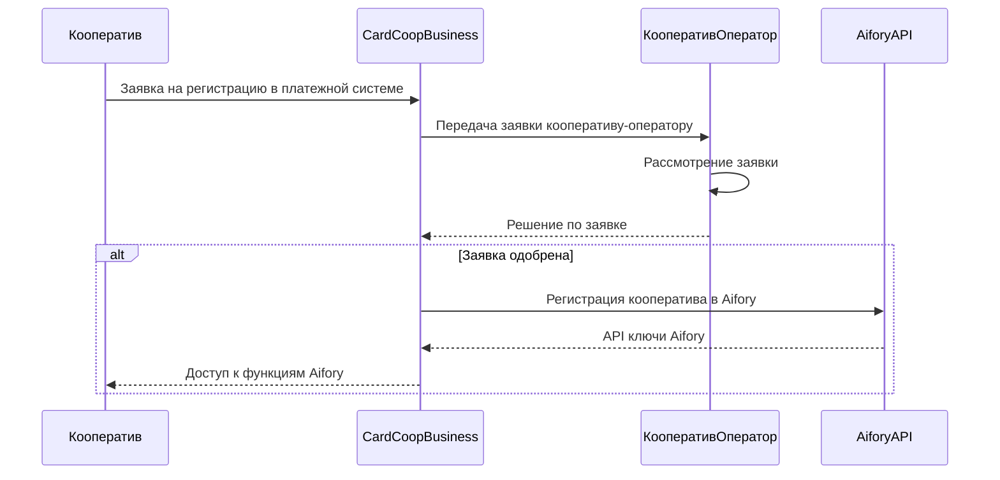

### Критерии готовности

**Базовый уровень:**
- [ ] Система настройки iframe интеграций с id.card.coop
- [ ] Документация по встраиванию iframe
- [ ] Мониторинг активности iframe интеграций
- [ ] Открытый доступ для всех кооперативов без ограничений

**Расширенный уровень:**
- [ ] Система регистрации в кооперативе-операторе платежной системы
- [ ] Интеграция с API Aifory для выпуска карт
- [ ] Административная панель для управления картами Aifory
- [ ] Система мониторинга, аналитики и уведомлений
- [ ] Автоматические отчеты по картам Aifory

---

## ЗАДАНИЕ 4: Интеграция с платежной системой Aifory

### Цель
Добавить возможность выпуска виртуальных карт Aifory для международных платежей и управления ими через платформу card.coop.

### Компоненты для разработки

#### 4.1 API интеграция с Aifory
**Функции:**
- Выпуск виртуальных карт через API Aifory
- Получение данных карт (номер, срок действия, CVC, имя, фамилия, адрес)
- Управление лимитами и блокировками
- Пополнение карт
- История транзакций

**Система уведомлений (NOVU):**
- Уведомления о выпуске новых карт Aifory
- Алерты о транзакциях и изменениях баланса
- Уведомления о блокировках и разблокировках
- Отчеты о расходах и лимитах

#### 4.2 Расширение платформы card.coop

**Новые функции:**
- **Выпуск виртуальных карт** - интерфейс для создания карт Aifory
- **Управление картами** - просмотр баланса, лимитов, истории операций
- **Раскрытие деталей карты** - безопасное отображение полных данных карты
- **Экран администратора** - управление мастер-счетом в Aifory для пополнений
- **Управление пополнениями** - интерфейс для пополнения карт
- **Центр уведомлений** - специальные уведомления по картам Aifory

### Архитектура интеграции
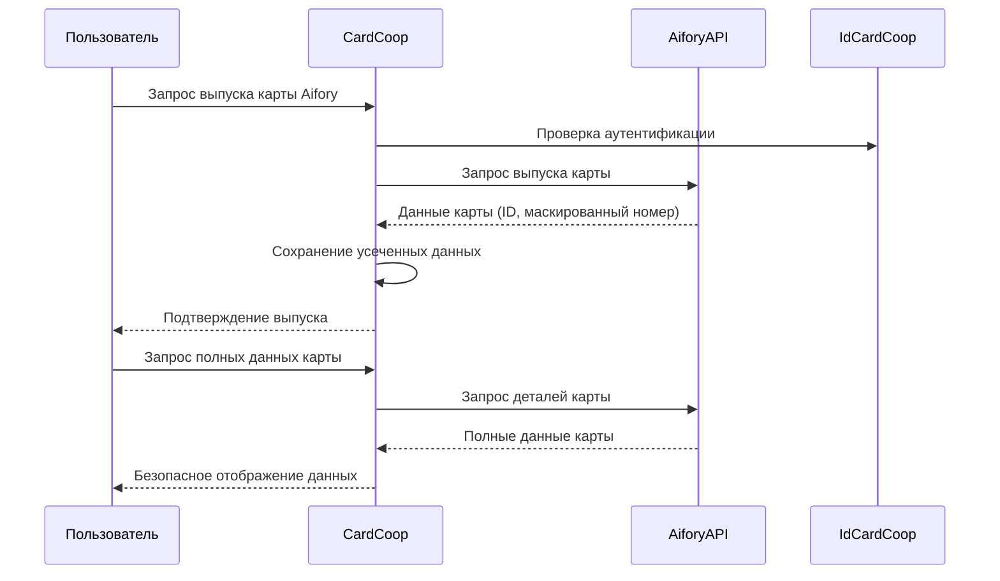

### Безопасность
- Хранение только ID карты и последних 4 цифр номера
- Получение полных данных карты только по запросу через API Aifory
- Логирование всех операций с картами
- Двухфакторная аутентификация для критических операций

### Критерии готовности
- [ ] Полная интеграция с API Aifory
- [ ] Безопасное управление данными карт
- [ ] Интерфейс для всех операций с картами
- [ ] Система мониторинга транзакций и уведомлений
- [ ] Административная панель для управления мастер-счетом
- [ ] Интеграция уведомлений Aifory с общей системой NOVU

---

## Общие технические требования

### Безопасность
- Протокол нулевого разглашения (zero-knowledge)
- Шифрование всех персональных данных на клиенте
- Регулярная ротация токенов доступа
- Аудит всех операций с данными
- Соответствие GDPR и российскому законодательству

### Производительность
- Время отклика API < 200ms для 95% запросов
- Поддержка до 10,000 одновременных пользователей
- Горизонтальное масштабирование
- CDN для статических ресурсов

### Мониторинг и логирование
- Централизованное логирование (ELK Stack)
- Мониторинг метрик (Prometheus + Grafana)
- Алерты при критических ошибках
- Backup и disaster recovery

### Документация
- API документация (OpenAPI/Swagger)
- Руководство разработчика
- Руководство пользователя
- Документация по безопасности

---

