Каждый пайщик при вступлении в любой кооператив платформы получают цифровое удостоверение - карту пайщика. 

Карта пайщика (CARD.COOP) - это цифровое удостоверение пайщика

Каждая карта пайщика содержит зашифрованную информацию: ФИО, дату рождения, адрес электронной почты, по желанию пайщика - паспортные данные. Кроме информации о пайщике, каждая карта содержит приватный ключ, которым пайщик подписывает документы на платформе, а также информацию о том, какой кооператив выпустил карту, и о тех кооперативах, кто подтвердил корректность персональных данных на этой карте.

Карты пайщика выпускаются кооперативами с использованием сервиса CARD.COOP. Для выпуска карт кооперативы используют программное обеспечение провайдеров, которые обеспечивают реализацию стандартизированных сценариев, описанных в этом разделе посредством официальных SDK или публичных точек доступа API.


## Краткое описание
Система представляет собой стандарт для безопасной регистрации, аутентификации и обмена конфиденциальными данными между пользователями и кооперативами. Она использует протокол с нулевым разглашением (zero-knowledge), что означает, что сервер никогда не знает реального пароля пользователя, его ключей подписи или приватных данных. Вся чувствительная информация шифруется на стороне клиента, и сервер хранит только зашифрованные данные.


## Основные компоненты системы
Пользователь при регистрации или входе в любой кооператив платформы взаимодействует только с клиентским сервисом id.card.coop, который обеспечивает безопасное предоставление зашифрованных данных кооперативу и обеспечивает цифровую подпись документов без передачи приватного ключа за пределы клиентского приложения.  

__Пользователь__: Человек, который хочет зарегистрироваться и использовать систему для хранения и обмена конфиденциальными данными с кооперативами.

__Клиентское приложение__: Веб-сайт стандарта CARD.COOP, который пользователь использует в браузере для взаимодействия с системой.

__Сервер__: Бэкенд стандарта CARD.COOP, который обрабатывает запросы от клиентского приложения, хранит зашифрованные данные и управляет аутентификацией и авторизацией.

__Кооператив__: Организация или сервис, которому пользователь может предоставить доступ к своим конфиденциальным данным. Обычно это кооператив, который использует программное обеспечение своего провайдера. 

## Как работает система
Работу системы CARD.COOP можно разделить для пользователя на 5 этапов: регистрация, сохранение данных, предоставление доступа, подпись документов и отзыв доступа. 


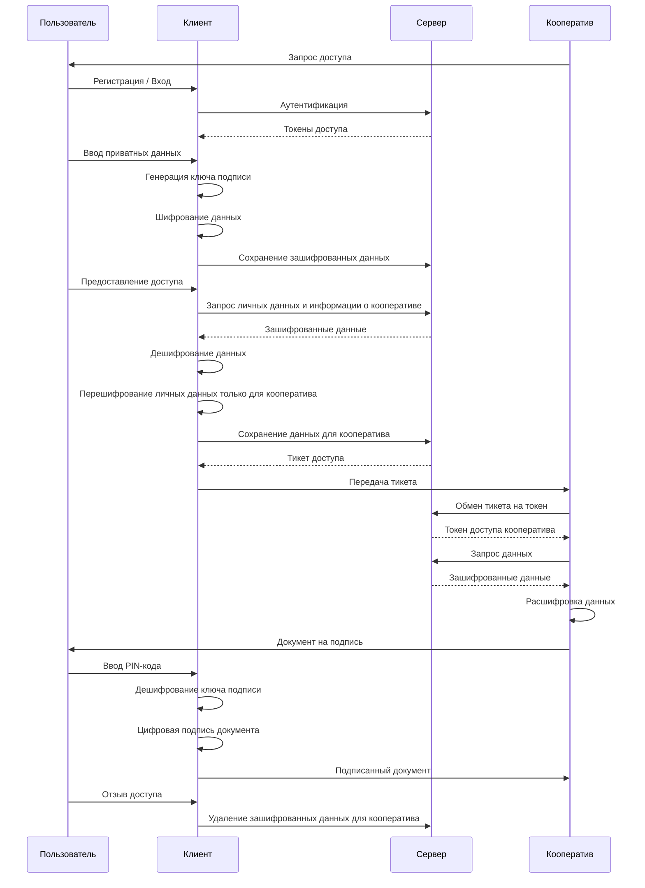

### Вход / регистрация
При регистрации пользователь вводит email, пароль. Из пароля генерируется мастер-ключ для шифрования данных, и хэш-ключ, который используется на сервере в качестве пароля. 

После ввода почты, пароля, сервер предоставляет клиенту токены доступа, которые клиент пользователя теперь будет прикладывать к каждому запросу, подтверждая собственную авторизацию. 

Пользователь попадает на этап регистрации при вступлении в любой кооператив. После вступления в любой кооператив, вступление в любой другой кооператив происходит по принципам "быстрого входа" - без повторного личных ввода данных. 

Ввод email: Пользователь начинает процесс регистрации, вводя свой адрес электронной почты в клиентском приложении.

Получение серверной соли и UUID: Клиентское приложение отправляет email на сервер, и сервер отвечает, предоставляя уникальный идентификатор (UUID) и серверную соль (server_salt).

Серверная соль - это случайная строка, которая используется для защиты от атак с использованием заготовленных таблиц. 


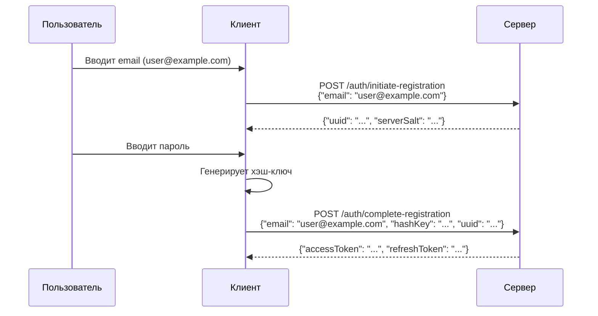

Генерация хэш-ключа: Клиентское приложение использует введенный пользователем пароль и полученную серверную соль для создания хэш-ключа (hashKey). Это делается с помощью криптографической функции хэширования, которая повторяется 1000 итераций.

```
hashKey = hash(пароль + server_salt + 1000)
```

Отправка hashKey на сервер: Клиентское приложение отправляет на сервер email, hashKey и UUID.

Сохранение пользователя: Сервер сохраняет информацию о пользователе, включая email, hashKey и серверную соль. Поскольку сервер знает только хэшированную версию пароля, он не может узнать сам пароль.

Выдача токенов: Сервер генерирует пару токенов — accessToken и refreshToken — и отправляет их клиентскому приложению.

Сохранение токенов: Клиентское приложение сохраняет полученные токены для последующего использования.


### Сохранение данных

пользователь вводит персональные данные. Данные зашифровываются и сохраняются на сервере с использованием мастер-ключа и пинкода пользователя. Сервер никогда не получает пароль или мастер-ключ пользователя, и не может расшифровать данные без пользователя. Все криптографические операции по работе с данными пользователь выполняет у себя на клиенте. 

и устанавливает пин-кодПин-код же используется для дополнительного шифрования ключа подписи карты в локальном хранилище клиента пользователя, откуда ключ извлекаются для подписи любого документа в дальнейшем. 


2. Выпуск карты пользователя
Ввод приватных данных: Пользователь вводит свои личные данные, которые он хочет сохранить (например, паспортные данные, личные заметки и т.д.).


2. Выпуск карты пользователя
Ввод приватных данных: Пользователь вводит свои личные данные, которые он хочет сохранить (например, паспортные данные, личные заметки и т.д.).

Генерация AES-ключа: Клиентское приложение создает симметричный ключ шифрования (AESKey) на основе пароля пользователя и его email (используется в качестве соли). Это делается с помощью функции деривации ключа с большим количеством итераций (например, 100000), чтобы усложнить перебор ключей.

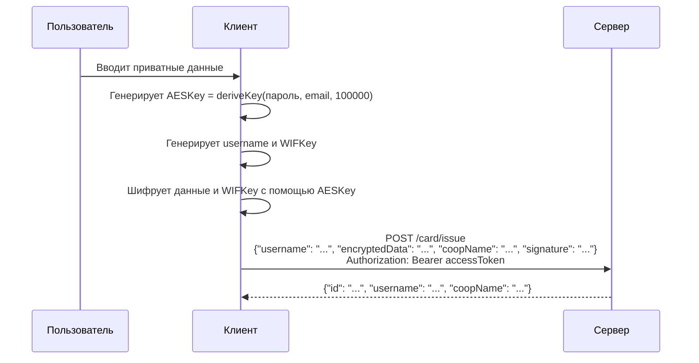


```
AESKey = deriveKey(пароль, email, 100000)
```

Шифрование данных: Приватные данные и, возможно, приватный ключ пользователя (например, WIFKey) шифруются с использованием AESKey. Это гарантирует, что данные могут быть расшифрованы только с правильным паролем.

Отправка зашифрованных данных на сервер: Клиентское приложение отправляет на сервер username, зашифрованные данные (encryptedData), название кооператива (coopName) и цифровую подпись (signature).

Сохранение карты: Сервер сохраняет информацию о карте пользователя, включая username, encryptedData, coopName, signature и идентификатор пользователя.

3. Аутентификация пользователя (Вход)
Ввод email и пароля: Пользователь вводит свой email и пароль для входа в систему.

Получение серверной соли и UUID: Клиентское приложение отправляет email на сервер, и сервер отвечает, предоставляя server_salt и UUID.

Генерация hashKey: Клиентское приложение снова генерирует hashKey с использованием введенного пароля и полученной серверной соли.

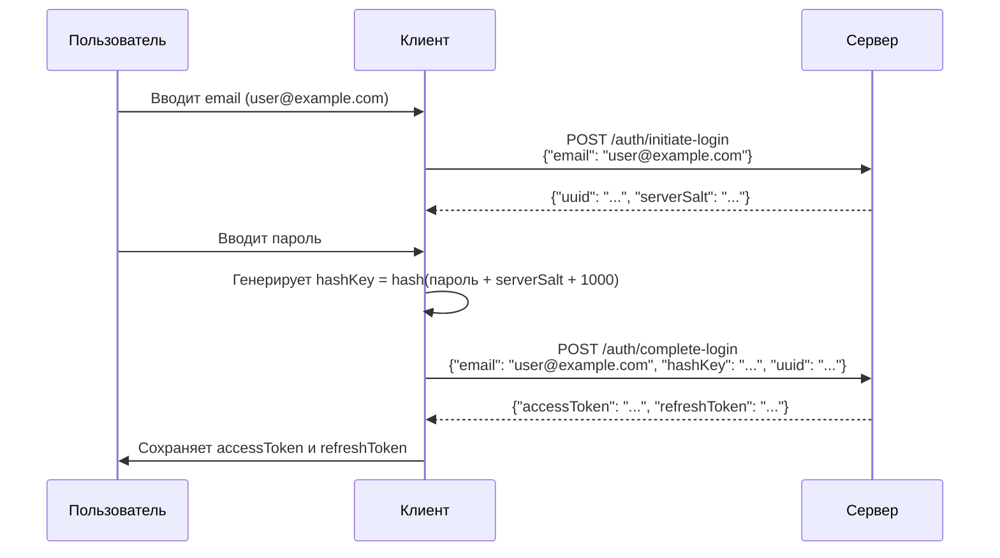

```
hashKey = hash(пароль + server_salt + 1000)
```

Отправка hashKey на сервер: Клиентское приложение отправляет на сервер email, hashKey и UUID.

Проверка на сервере: Сервер сравнивает полученный hashKey с тем, который хранится в базе данных для этого email.

Выдача токенов: Если hashKey совпадает, сервер генерирует новый accessToken и refreshToken и отправляет их клиентскому приложению.

4. Предоставление доступа кооперативу
Переход по ссылке кооператива: Кооператив направляет пользователя на сайт системы с параметрами coopName и callbackUrl.

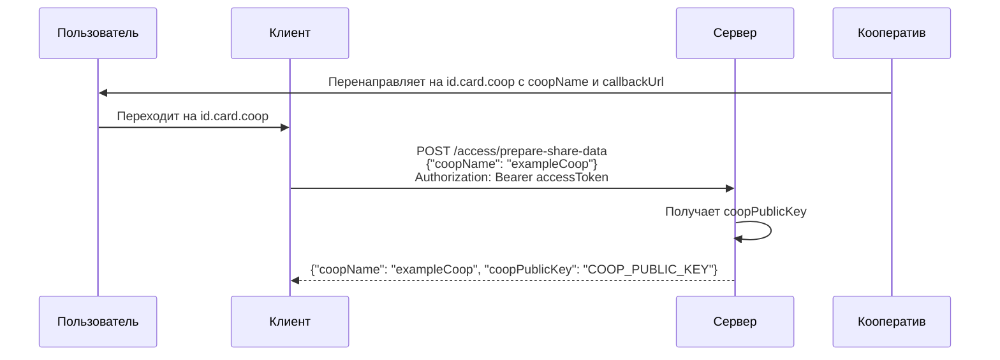

Получение информации о кооперативе: Клиентское приложение отправляет запрос на сервер, чтобы получить информацию о кооперативе, включая его публичный ключ (coopPublicKey).

Получение и расшифровка данных: Клиентское приложение запрашивает зашифрованные данные пользователя с сервера и расшифровывает их с использованием AESKey.

Перешифровка данных для кооператива: Расшифрованные данные затем шифруются на клиенте с использованием публичного ключа кооператива (coopPublicKey). Это гарантирует, что только кооператив сможет расшифровать эти данные своим приватным ключом.

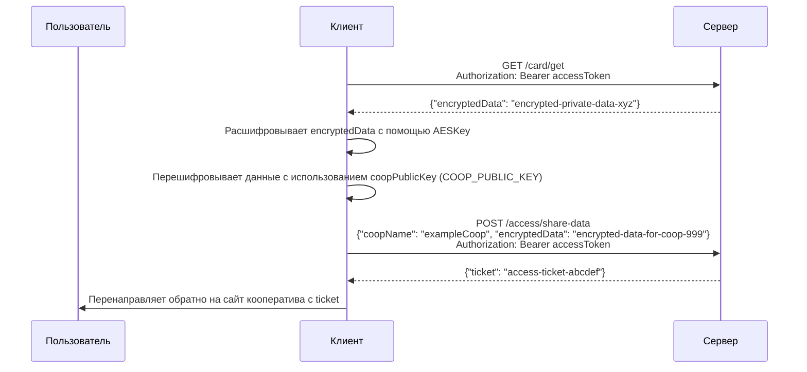

Отправка перешифрованных данных на сервер: Клиентское приложение отправляет зашифрованные для кооператива данные на сервер вместе с coopName.

Получение тикета: Сервер сохраняет зашифрованные данные и возвращает уникальный тикет (accessId), который будет использоваться кооперативом для доступа к данным.

Перенаправление на кооператив: Клиентское приложение перенаправляет пользователя обратно на сайт кооператива, передавая ему полученный тикет.

5. Получение данных кооперативом
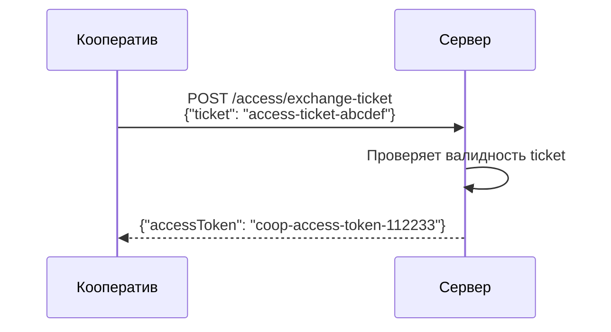

Обмен тикета на токен: Кооператив отправляет тикет на сервер и обменивает его на специальный accessToken, который предоставляет ограниченный доступ к данным пользователя.

Запрос зашифрованных данных: Кооператив использует полученный accessToken для запроса зашифрованных данных пользователя с сервера.

Расшифровка данных: Кооператив получает зашифрованные данные и расшифровывает их с помощью своего приватного ключа. Теперь он имеет доступ к информации, которую пользователь решил ему предоставить.

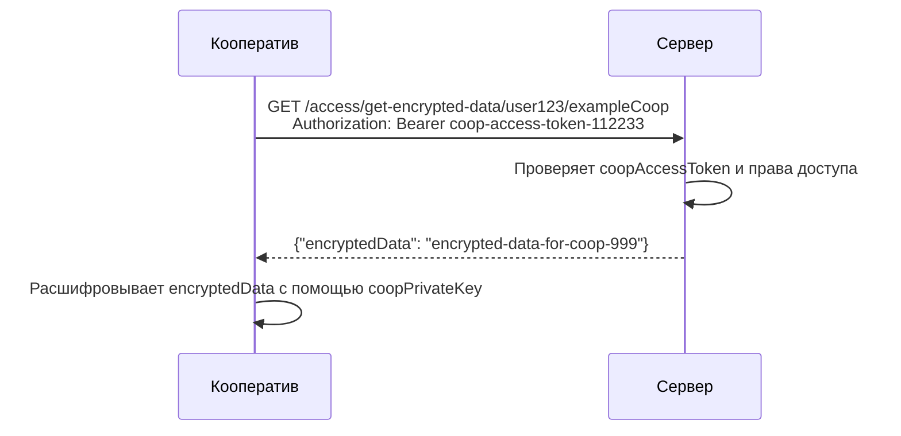

6. Управление доступом
Отзыв доступа: Пользователь может в любой момент отозвать доступ кооператива к своим данным. Для этого он отправляет соответствующий запрос на сервер, и сервер удаляет зашифрованные данные для этого кооператива.

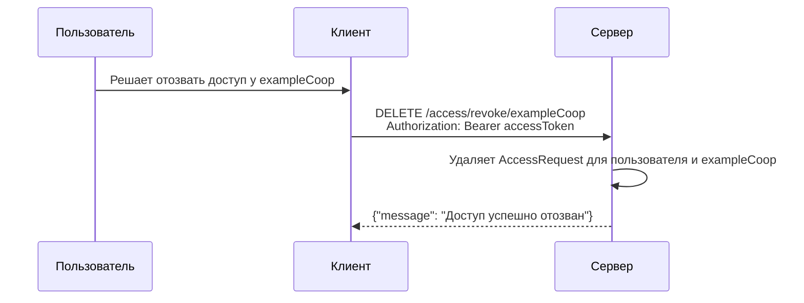

Просмотр списка доступов: Пользователь может запросить список кооперативов, которым он предоставил доступ, и управлять ими.

7. Обновление токенов и выход из системы
Обновление accessToken: Когда срок действия accessToken истекает, клиентское приложение может использовать refreshToken для получения нового accessToken, отправив соответствующий запрос на сервер.

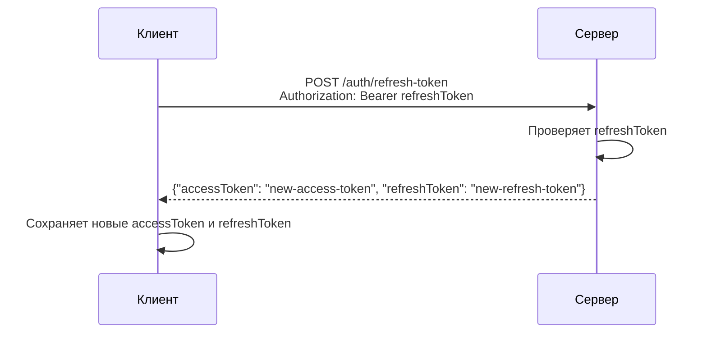

Выход из системы: Пользователь может выйти из системы, и сервер аннулирует его refreshToken, что предотвращает дальнейшее использование токенов для доступа к системе.

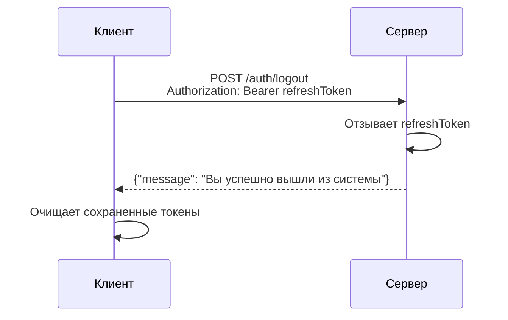

## Примечания
### Участники:

Пользователь: Конечный пользователь, взаимодействующий с системой.
Клиент: Клиентское приложение (например, веб-браузер или мобильное приложение).
Сервер: Бэкенд-сервер, обрабатывающий API-запросы.
Кооператив: Кооператив, запрашивающий доступ к данным пользователя.

Заголовки авторизации:
accessToken пользователя используется для аутентификации запросов от клиента к серверу.
coopAccessToken кооператива используется кооперативом для доступа к данным пользователя после обмена тикета.
Шифрование данных:

AESKey: Получен путем деривации пароля пользователя и email, используется для шифрования/дешифрования приватных данных на стороне клиента.

coopPublicKey: Публичный ключ кооператива, используется клиентом для перешифровки данных для кооператива.

coopPrivateKey: Приватный ключ кооператива, используется для расшифровки полученных от сервера данных.


Токены и тикеты:
accessToken: Краткосрочный JWT для аутентификации запросов.
refreshToken: Долгосрочный токен для получения новых accessToken.
ticket: Уникальный идентификатор, используемый кооперативом для обмена на accessToken.
Процессы:


## Алгоритм и методы


## Преимущества системы
Регистрация и вход реализуют протокол нулевого разглашения (zero-knowledge), при котором сервер никогда не видит реальный пароль пользователя. Предоставление доступа требует согласия пользователя и включает перешифровку данных специально для кооператива. Отзыв доступа удаляет возможность кооператива получать данные пользователя. Обновление токенов и выход обеспечивают непрерывность сессии и безопасность.

Безопасность: Поскольку сервер никогда не видит пароли или приватные данные пользователя в открытом виде, риск компрометации информации значительно снижается.

Контроль пользователя: Пользователь полностью контролирует, кому и какие данные он предоставляет. Он может в любой момент отозвать доступ или предоставить его повторно.

Гибкость: Система поддерживает множественные кооперативы, и пользователь может взаимодействовать с разными организациями, предоставляя им доступ к своим данным по мере необходимости.

Приватность: Использование асимметричного шифрования гарантирует, что только кооператив, которому предназначены данные, сможет их расшифровать.

Пример сценария использования
Регистрация: Ирина регистрируется в системе, используя свой email и пароль. Ее пароль никогда не отправляется на сервер в открытом виде.

Сохранение данных: Она вводит свои персональные данные и сохраняет их в зашифрованном виде на сервере.

Предоставление доступа: Кооператив "Здоровье" запрашивает у Ирины доступ к ее медицинским данным. Ирина соглашается и предоставляет доступ, перешифровывая свои данные на публичный ключ кооператива.

Получение данных кооперативом: Кооператив "Здоровье" получает зашифрованные данные и расшифровывает их своим приватным ключом.

Отзыв доступа: Позже Ирина решает отозвать доступ кооператива к ее данным и делает это через клиентское приложение.

## Заключение
Система обеспечивает безопасное хранение и обмен конфиденциальными данными, предоставляя пользователю полный контроль над своими данными и тем, кто к ним имеет доступ. Использование протокола с нулевым разглашением и асимметричного шифрования делает систему надежной и устойчивой к компрометации данных.


CARD.COOP - это стандарт, и его код опубликован. Клиентов и серверов CARD.COOP может быть много - как личных, пользовательских, так и кооперативных. Исполнение стандарта CARD.COOP возможно в физических (пластиковых) картах и мобильных приложениях. 


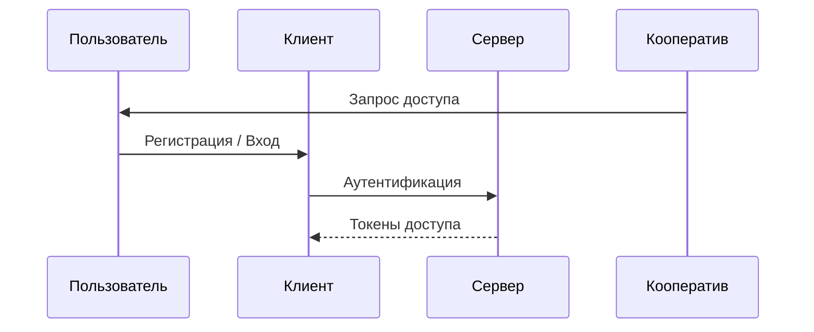
