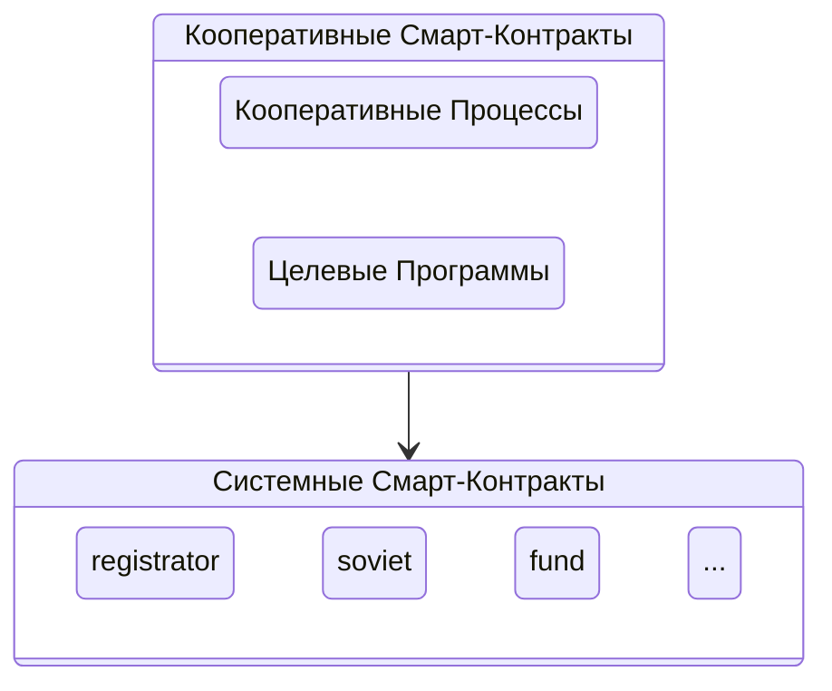

Каждое действие, которое вызывается на платформе, всегда принадлежит к одному из смарт-контрактов, который отвечает за его исполнение. 

!!!note "Смарт-контракт - это программа, которая прозрачно исполняется на платформе"

Программный код смарт-контрактов для платформы пишется на языке программирования C/C++ и исполняется в WebAssembly (WASM) в специально-подготовленной для этого распределенной среде. Платформа является хранилищем для смарт-контрактов, которые представляют из себя программный код, который реагирует на внешние действия по API, которое сами и реализуют.

Каждый смарт-контракт содержит в себе строгое описание структур принимаемых и хранимых данных, а также наименования действий и требуемых авторизаций для их выполнения. Каждое действие может содержать в себе операции по изменению внутренней базы данных смарт-контракта, которая описывается в самом смарт-контракте. 

Платформа оперирует двумя типами смарт-контрактов: системные и кооперативные. Если системные смарт-контракты - это конкретные действия, реализующие бизнес-логику в программном коде, то кооперативые смарт-контракты соединяют простые действия в сценарии кооперации. 

