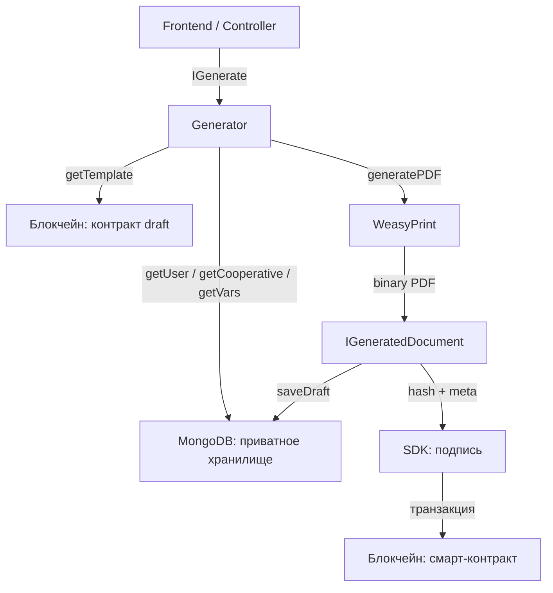

# Архитектура и принципы

## Ключевые понятия

### Action

`Action` — минимально необходимый набор данных для генерации документа. Он специфичен для каждого типа документа и включает:

- `registry_id` — номер шаблона в реестре
- `coopname` — аккаунт кооператива (scope в блокчейне)
- `username` — аккаунт участника
- `block_num` _(опционально)_ — если не передан, фабрика возьмёт текущий
- специфические поля по типу документа (`decision_id`, `braname`, `program_id` и др.; часть полей обрабатывается отдельно — см. ниже)

Если передан только Action без `block_num`, фабрика **создаёт новый документ**: берёт текущий блок и собирает все данные на его момент.

### Meta

`Meta` — полный набор мета-данных документа, который формируется фабрикой в процессе генерации и затем публикуется в блокчейн:

```typescript
interface IMetaDocument {
  registry_id: number      // номер шаблона
  coopname: string         // аккаунт кооператива
  username: string         // аккаунт участника
  title: string            // заголовок документа
  lang: string             // язык ('ru')
  block_num: number        // номер блока — корень версии
  created_at: string       // дата и время генерации
  generator: string        // 'coopjs'
  version: string          // версия пакета
  timezone: string         // часовой пояс ('Europe/Moscow')
  links: string[]          // ссылки на связанные документы
}
```

Если Meta с `block_num` передана в фабрику — документ **восстанавливается** в точности таким, каким был сгенерирован в прошлом.

### Данные Action, которые не публикуются в блокчейн

Некоторые поля приходят только во входном Action, **исключаются из `Meta`** и хранятся в приватном хранилище. Типичный случай — **`signature`** в заявлении на вступление: графический оттиск сохраняется в коллекции `signatures` с `username` и `block_num` генерации; в цепочку не записывается. Такое же версионирование по `block_num` позволяет при регенерации «старого» документа подтянуть тот же оттиск, что был на момент первой генерации.

### Правило: Action есть, Meta нет → новый документ

```
Action (без block_num) → фабрика берёт текущий block_num → генерирует Meta → создаёт документ
```

### Правило: Meta есть с block_num → восстановление документа

```
Meta (с block_num) → фабрика загружает все данные на тот блок → воспроизводит документ
```

---

## Версионирование по `block_num`

`block_num` — это **временная метка в терминах блокчейна**. Она однозначно определяет момент, на который должны быть собраны данные для генерации документа.

Все данные в MongoDB хранятся с полем `block_num`. При сохранении новой версии данных (например, пайщик изменил адрес) старая запись остаётся — добавляется новая с новым `block_num`.

При запросе с фильтром `block_num: { $lte: N }` и сортировкой по убыванию `block_num` — возвращается **актуальная запись на момент блока N**.

```
Блок 1000: сохранены данные пайщика (v1)
Блок 2000: пайщик обновил адрес → сохранены данные (v2)
Блок 3000: ещё одно обновление → данные (v3)

Запрос с block_num=1500 → вернёт v1
Запрос с block_num=2500 → вернёт v2
Запрос без block_num → вернёт v3 (последняя версия)
```

Это позволяет **безопасно изменять данные** участников и кооператива, не теряя способности восстанавливать исторические документы.

---

## Источник шаблонов

Фабрика поддерживает два режима загрузки шаблонов:

| Режим | Переменная окружения | Откуда шаблоны |
|-------|---------------------|----------------|
| Production | `SOURCE` не задан | Блокчейн (контракт `draft`) через Explorer API |
| Разработка | `SOURCE=local` | Локальные файлы в `src/Templates/` |

В production-режиме шаблон загружается из таблицы `drafts` контракта `draft` с учётом `block_num`, что обеспечивает корректное воспроизведение исторических версий шаблонов.

---

## Реестр документов (registry_id)

Каждый тип документа идентифицируется числовым `registry_id`. Реестр организован по смысловым группам:

| Диапазон | Группа |
|----------|--------|
| 1–4 | Базовые соглашения (кошелёк, ЭЦП, политика конфиденциальности, пользовательское) |
| 50–51 | Соглашение Coopenomics, конвертация |
| 100–101 | Вступление (заявление, выбор участка) |
| 300–304 | Общее собрание (повестка, решение совета, уведомление, бюллетень, протокол) |
| 501 | Решение по заявлению на вступление |
| 599–600 | Свободные решения |
| 699 | Соглашение программы «Соседи» |
| 700–702 | Имущественный взнос (заявление, решение, акт) |
| 800–802 | Возврат имуществом (заявление, решение, акт) |
| 900–901 | Возврат деньгами |
| 994–999 | Шаблоны программ ЦПП «Генератор» |
| 1000–1007 | Программа «Благорост» и соглашения |
| 1010–1011 | Расходы (заявление, решение) |
| 1020–1030 | Денежные взносы в генерацию/капитализацию |
| 1040–1042 | Взнос результатом труда |
| 1050–1051 | Займ |
| 1060–1072 | Имущественные инвестиции (генерация/капитализация) |
| 1080–1090 | Конвертация между кошельками |

Таблица всех `registry_id` со ссылками на файлы в `Templates/` — в разделе [Реестр документов](registry.md).

---

## Хранилище данных (MongoDB)

Фабрика использует следующие коллекции MongoDB:

| Коллекция | Назначение |
|-----------|------------|
| `individuals` | Данные физических лиц |
| `organizations` | Данные юридических лиц |
| `entrepreneurs` | Данные ИП |
| `paymentMethods` | Платёжные реквизиты (банковский счёт, СБП) |
| `vars` | Переменные кооператива (реквизиты протоколов и т.д.) |
| `projects` | Данные проектов |
| `udata` | Дополнительные пользовательские данные |
| `documents` | Сгенерированные документы (HTML, binary PDF, hash, meta) |
| `signatures` | Графические оттиски подписи (изображения) для документов вроде заявления на вступление; запись с `username`, `block_num`, строкой изображения; **не** публикуются в блокчейн |
| `sync` | Состояние синхронизации с блокчейном |

Все коллекции (кроме `documents`) хранят версии записей с `block_num`. Документы хранятся по хэшу (upsert по полю `hash`).

---

## Связь с другими компонентами



- **Блокчейн (COOPOS)** — источник шаблонов и контроль бизнес-логики
- **MongoDB** — приватное хранилище версионированных данных
- **WeasyPrint** — рендеринг HTML в PDF
- **SDK** (`@coopenomics/sdk`) — формирование транзакций и подпись
- **Explorer API** (`SIMPLE_EXPLORER_API`) — запросы к состоянию блокчейна по block_num
