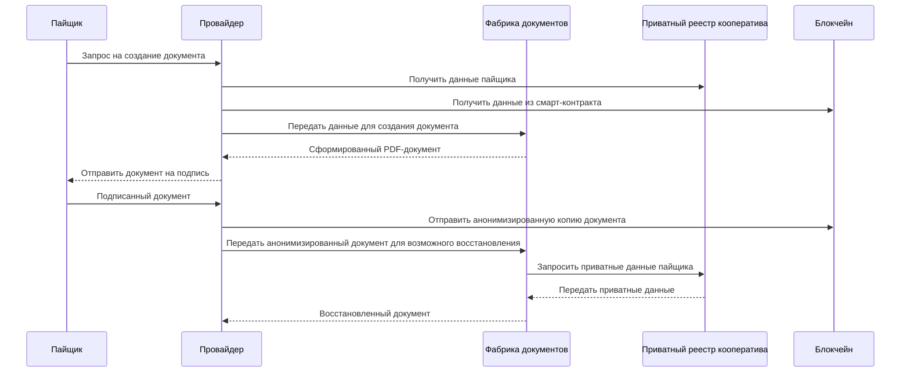
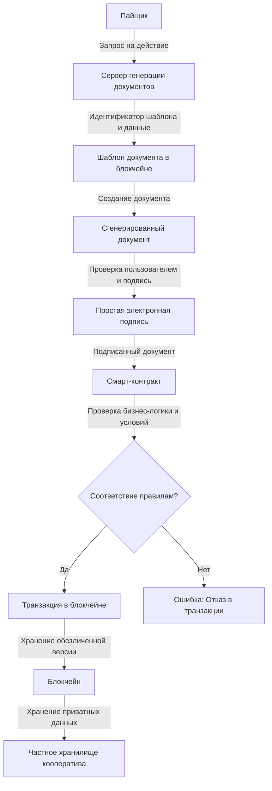

## Фабрика документов

### Как это работает 
- Пайщик: Начинает процесс, отправляя запрос на выполнение действия (например, заказ поставки).

- Сервер генерации документов: Получает запрос, идентификатор шаблона и данные, необходимые для создания документа.

- Шаблон документа в блокчейне: Используется для генерации документа на основе шаблона и переданных данных.

- Сгенерированный документ: Возвращается пользователю для проверки и подписания.

- Простая электронная подпись: Пайщик подписывает документ с использованием приватного ключа.

- Смарт-контракт: Проверяет документ на соответствие бизнес-логике кооператива, включая авторизацию, права доступа и соблюдение условий.

- Соответствие правилам?: Если проверка успешна, транзакция записывается в блокчейн.

- Транзакция в блокчейне: Подтвержденная и записанная транзакция хранится в блокчейне.

- Блокчейн: Содержит обезличенную версию документа.

- Частное хранилище кооператива: Хранит приватные данные, необходимые для восстановления документации.

Система электронного документооборота кооперативной экономики представляет собой комплексный механизм, обеспечивающий создание, управление и хранение документов в цифровой форме. Эта система построена на основе блокчейн-технологий, обеспечивающих прозрачность, неизменность и безопасность всех действий. Ключевую роль в системе играют шаблоны документов, цифровые подписи пайщиков и смарт-контракты, контролирующие выполнение бизнес-логики и соблюдение правил кооператива.

Основные элементы системы включают:

- Шаблоны документов — хранятся в блокчейне и используются для создания документов на основе заданных переменных.

- Переменные и переводы — используются для динамической генерации документов на различных языках и для заполнения данных, специфичных для каждого пользователя и кооператива.

- Цифровые подписи — обеспечивают юридическую силу документов.

- Смарт-контракты — контролируют соответствие бизнес-логике, проверяют авторизацию, права доступа и другие аспекты документооборота.

- Реестры кооперативов — содержат приватные данные, необходимые для полного восстановления документации.

Далее рассмотрим основные компоненты и процессы системы более подробно.

### Шаблоны документов в блокчейне
Шаблон документа представляет собой текстовый файл, написанный с использованием технологии Jinja. Шаблон содержит статический текст и области, где должны быть вставлены переменные данные. Эти переменные включают в себя как конкретные данные пользователей (например, имена, суммы, даты), так и текстовые переводы на различные языки.

Пример структуры шаблона:

- Статический текст: Фиксированные фразы и абзацы, которые остаются неизменными в любом сгенерированном документе.

- Переменные: Специфические данные, такие как имя пайщика, дата подписания, сумма паевого взноса и т.д.

- Переводы: Языковые переменные, которые заменяются на соответствующий текст в зависимости от выбранного языка.

Каждый шаблон документа имеет уникальный идентификатор в блокчейне, который позволяет однозначно определить шаблон. Это обеспечивает возможность точно восстановить документ на основе шаблона и данных, даже спустя долгое время.

### Генерация документа по шаблону
Когда пайщик инициирует действие, например, заказ поставки, система автоматически отправляет запрос на сервер генерации документов кооператива. В этом запросе указываются данные, которые должны быть включены в документ, а также идентификатор соответствующего шаблона.

Сервер использует шаблон, извлекает необходимые переменные и генерирует документ, который полностью готов к подписанию. Этот документ возвращается пайщику для подписи.

### Простая электронная подпись
После генерации документа, пайщик подписывает его цифровой подписью. Подпись осуществляется автоматически сразу после того, как документ создан и проверен пользователем. Цифровая подпись обеспечивает юридическую силу документа и подтверждает, что пайщик действительно согласен с его содержанием.

Цифровая подпись обеспечивает юридическую силу документов и подтверждает, что пользователь (пайщик) действительно согласен с их содержанием. Процесс подписания документа цифровой подписью происходит автоматически и не требует дополнительных действий со стороны пользователя после генерации документа. 

Простая электронная подпись — это вид электронной подписи, который соответствует требованиям законодательства РФ и используется в кооперативной экономике на основе соглашения между пайщиком и кооперативом. Согласно этому соглашению, пайщик при подключении к цифровой среде подтверждает, что согласен с использованием простой электронной подписи для подписания документов. Это означает, что все документы, подписанные простой электронной подписью, обладают такой же юридической силой, как если бы они были подписаны собственноручной подписью пользователя.

Простая электронная подпись формируется с использованием приватного ключа пользователя, который генерируется и выдается ему при регистрации в системе кооператива. Приватный ключ является уникальным для каждого пользователя и служит не только средством создания цифровой подписи, но и средством аутентификации и доступа в систему. Использование приватного ключа позволяет гарантировать, что только авторизованный пользователь может подписывать документы от своего имени.

Приватный ключ может храниться различными способами в зависимости от предпочтений пользователя и уровня требуемой безопасности:

- В браузере: Приватный ключ может быть сохранен в зашифрованном виде в веб-браузере, что обеспечивает удобный доступ к системе с любого устройства.

- В мобильных приложениях: Пользователи могут хранить свои приватные ключи в мобильных приложениях, что позволяет подписывать документы с мобильных устройств.

- Физические устройства: Для повышения уровня безопасности приватный ключ может быть сохранен на физических устройствах, таких как защищенные USB-токены, смарт-карты и т.д.

### Контроль смарт-контрактов
После подписания, документ не просто отправляется в блокчейн, а вкладывается в действие, формирующее транзакцию. Каждый документ, связанный с транзакцией, проходит проверку смарт-контрактом, который контролирует выполнение всей бизнес-логики кооперативного смарт-контракта в соответстветствии с методологией кооперации СПО "РУСЬ":

- Авторизация: Проверка прав доступа пайщика, подтверждение его членства в кооперативе и соблюдение всех условий участия.

- Контроль прав доступа: Смарт-контракт проверяет, имеет ли пайщик право на выполнение конкретного действия (например, инициирование заказа или внесение взноса в кооперативе).

- Проверка платежей: Смарт-контракт может подтвердить наличие оплаты или других финансовых обязательств, необходимых для выполнения действия.

- Проверка порядка: Смарт-контракт проверяет порядок исполнения кооперативного смарт-контракта, и, например, не позволяет поставщику получить возврат деньгами до момента завершения гарантийного срока, и так далее, и тому подобное.

Таким образом, блокчейн не только хранит документ, но и обеспечивает соответствие всех действий установленным правилам и условиям кооператива. В случае успешного выполнения всех проверок документ, подписанный пайщиком, отправляется в блокчейн, где сохраняется его обезличенная версия.

### Хранение приватных данных
Приватные данные, такие как личные данные пайщика и специфические для кооператива данные, никогда не публикуются в блокчейне. Они хранятся в частных хранилищах кооперативов, что обеспечивает их защиту и конфиденциальность.

Все данные, которые публикуются в блокчейне, обезличены. Это значит, что они не содержат прямой публичной привязки к конкретным пользователям, а лишь включают информацию, необходимую кооперативам подтверждения юридических фактов действий. Приватные данные включают в себя информацию, которая необходима для восстановления и верификации документов, хранящихся в блокчейне.

Связь документов с пользователями могут установить только кооперативы, в которых пользователи являются пайщиками, т.к. приватные данные хранятся исключительно в хранилищах кооперативов. Эти хранилища изолированы друг от друга, что исключает возможность утечки данных между различными кооперативами. 

### Восстановление реестра документов

В случае необходимости кооператив может восстановить полный реестр своих документов, используя обезличенные данные из блокчейна и приватные данные, хранящиеся в его хранилищах. Это позволяет в любое время восстановить точное содержание документов, подписанных пайщиками, и провести аудит всех выполненных действий.

Процесс восстановления данных осуществляется с учетом всех мер безопасности, исключающих несанкционированный доступ. Публичные данные обезличены, что исключает идентификацию конкретных пайщиков, в то время как приватные данные защищены в хранилищах кооператива.

## Заключение

Система электронного документооборота кооперативной экономики основана на передовых технологиях, обеспечивающих прозрачность, безопасность и конфиденциальность всех операций. Использование блокчейна для хранения шаблонов документов и обезличенной информации, смарт-контрактов для контроля соответствия бизнес-логике, а также изолированных хранилищ для приватных данных гарантирует, что все действия пайщиков и кооперативов остаются защищенными и подотчетными. Эта система является ключевым элементом в создании доверия и устойчивости в кооперативной экономике.

Для более глубокого понимания технических деталей работы системы, включая реализацию смарт-контрактов, механизм управления шаблонами документов, процесс генерации и проверки цифровых подписей, а также структурирование и хранение данных в блокчейне и приватных хранилищах, вы можете ознакомиться с разделом [Документация](/documentation). В этом разделе мы подробно рассмотрим архитектуру системы, используемые технологии, а также приведем примеры кода и схемы для лучшего понимания всех компонентов системы.

