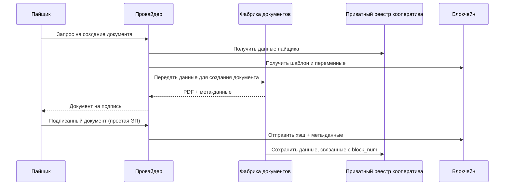

# Фабрика документов

Фабрика документов (`@coopenomics/factory`) — ключевой компонент архитектуры цифрового кооператива. Она генерирует юридически значимые PDF-документы на основе шаблонов из блокчейна, приватных данных участников и переменных кооператива — и делает это воспроизводимо.

Фабрика встроена в монорепозиторий цифрового кооператива:  
[https://github.com/coopenomics/mono/tree/main/components/factory](https://github.com/coopenomics/mono/tree/main/components/factory)

---

## Место фабрики в архитектуре

```mermaid
sequenceDiagram
    participant Пайщик
    participant Провайдер
    participant Фабрика as Фабрика документов
    participant Реестр as Приватный реестр кооператива
    participant Блокчейн

    Пайщик->>Провайдер: Запрос на создание документа
    Провайдер->>Реестр: Получить данные пайщика
    Провайдер->>Блокчейн: Получить шаблон и переменные
    Провайдер->>Фабрика: Передать данные для создания документа
    Фабрика-->>Провайдер: PDF + мета-данные
    Провайдер-->>Пайщик: Документ на подпись
    Пайщик->>Провайдер: Подписанный документ (простая ЭП)
    Провайдер->>Блокчейн: Отправить хэш + мета-данные
    Фабрика->>Реестр: Сохранить данные, связанные с block_num
```

Документы, которые генерирует фабрика, участвуют во всех ключевых процессах кооператива:

- вступление в кооператив
- внесение взносов (денежных, имущественных, результатами труда)
- решения совета и общих собраний
- договоры по программам (ЦПП "Генератор", "Благорост")
- финансовые операции и отчётность

---

## Как это работает

### Шаги генерации

1. **Запрос**: провайдер передаёт фабрике минимальный набор данных — `coopname`, `username`, `registry_id` и специфические поля для типа документа.
2. **Фиксация момента**: фабрика получает текущий `block_num` и с этого момента все данные загружаются строго на этот блок.
3. **Загрузка шаблона**: из блокчейна (контракт `draft`) загружается шаблон Nunjucks и переводы.
4. **Загрузка данных**: из приватного хранилища (MongoDB) загружаются данные участника, кооператива, переменные.
5. **Валидация**: данные проверяются по JSON Schema (Ajv).
6. **Рендеринг**: HTML генерируется через Nunjucks с подстановкой данных и переводов.
7. **PDF**: WeasyPrint конвертирует HTML в PDF; в мета-данные PDF встраивается `title`, `creator`, `creation date`.
8. **Хэш**: SHA-256 хэш от итогового PDF — это идентификатор документа для блокчейна.
9. **Сохранение**: документ вместе с мета-данными сохраняется в MongoDB.

### Шаблоны в блокчейне

Каждый шаблон документа хранится в таблице `drafts` контракта `draft`. Шаблон содержит:

- `registry_id` — уникальный номер в реестре
- `title` — заголовок документа
- `description` — описание
- `model` — JSON Schema для валидации данных
- `context` — тело шаблона (Nunjucks)
- `translations` — словарь переводов по языкам

Поскольку шаблоны хранятся в блокчейне со своим `block_num`, фабрика может воспроизвести шаблон в той версии, которая существовала на момент генерации оригинального документа.

---

## Простая электронная подпись

После генерации документа пайщик подписывает его **простой электронной подписью**. Подписание происходит автоматически с использованием приватного ключа пользователя.

Согласно соглашению пайщика с кооперативом (документ `registry_id: 2`), пайщик при подключении к цифровой среде подтверждает, что согласен с использованием простой ЭП. Это придаёт подписанным документам ту же юридическую силу, что и собственноручной подписи.

Приватный ключ — это одновременно средство аутентификации, подписания и доступа к системе. Он может храниться:

- в браузере (в зашифрованном виде)
- в мобильном приложении
- на физических устройствах (USB-токены, смарт-карты)

### Графический оттиск на заявлении на вступление (`registry_id: 100`)

Не путать с криптографической подписью транзакции. В Action для заявления на вступление поле **`signature`** — это **изображение рукописной подписи** (оттиск), которое вставляется в макет PDF (как правило, строка с данными изображения: например, `data:image/png;base64,...`).

- В **мета-данные, предназначенные для публикации в блокчейн**, это поле **не попадает**: перед сборкой `Meta` оно отделяется от входных данных и в публичный объект не включается.
- Изображение **сохраняется в приватном хранилище** в коллекции `signatures` вместе с `username` и **`block_num`** момента генерации — чтобы при повторной генерации документа по тому же блоку оттиск подставлялся из базы, даже если сейчас передан другой файл.
- В **блокчейн графический оттиск не публикуется**.

!!! note "Поля вне публичной Meta"
    У части документов часть полей Action обрабатывается отдельно: не включается в `Meta`, не уходит в цепочку, а хранится только в MongoDB с привязкой к `block_num` (как в примере с `signatures`). Состав таких полей зависит от типа документа (`registry_id`).

---

## Контроль смарт-контрактов

Подписанный документ не публикуется в блокчейн напрямую — он **вкладывается в действие** (action) транзакции. Смарт-контракт проверяет:

- **авторизацию**: наличие членства, прав на действие
- **бизнес-логику**: соответствие порядку исполнения кооперативного контракта
- **платёжные обязательства**: наличие оплаты, внесённого взноса и т.д.

Если проверка пройдена — транзакция с хэшем и мета-данными документа записывается в блокчейн. Если нет — транзакция отклоняется.

---

## Приватные данные и их защита

Персональные данные участников **никогда не публикуются в блокчейн**. В блокчейне хранится только обезличенная информация: хэш документа, мета-данные, номер шаблона.

Приватные данные хранятся в MongoDB кооператива:

- данные физлиц, ИП, организаций
- платёжные реквизиты
- переменные кооператива (`vars`)
- сгенерированные документы (binary PDF)

Хранилища разных кооперативов изолированы. Связать документ с конкретным пайщиком могут только в том кооперативе, где этот пайщик является участником.

---

## Восстановление реестра документов

При необходимости кооператив может восстановить любой документ из прошлого:

1. Из блокчейна берут мета-данные документа (с `block_num`)
2. Фабрика по этому `block_num` загружает шаблон в той версии, что действовала тогда
3. Из приватного хранилища загружаются данные участника на тот же `block_num`
4. Документ регенерируется побайтово идентичным оригиналу

Это гарантирует, что ни один документ не может быть задним числом подменён или фальсифицирован.

---

Подробнее об устройстве компонентов, API и примерах использования — в соответствующих разделах.
