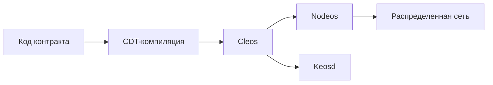

# Введение

Операционная система кооперативной экономики основана на открытом коде блокчейнов EOSIO и Antelope. Она предоставляет ряд компонентов и библиотек, которые используются для управления узлами распределенного реестра, сбора данных, взаимодействия с этими узлами и разработки смарт-контрактов. 

<!-- Базовые взаимосвязи между этими компонентами показаны на следующей диаграмме:

Жизненный цикл разработки смарт-контрактов в системе кооперативной экономики

-->

## Nodeos
Nodeos — это основная программа узла операционной системы кооперативной экономики. Отвечает за работу всех протоколов кооперативной экономики на серверах делегатов. Nodeos предлагает широкий спектр возможностей через плагины, которые могут быть включены или отключены при запуске с использованием командной строки или файлов конфигурации, что подключает или отключает API различных уровней.

[:octicons-arrow-right-24: Репозиторий nodeos, cleos и keosd](https://github.com/coopenomics/blockchain)

## Cleos
Cleos (CLI + операционная система = cleos) представляет собой интерфейс командной строки, который взаимодействует с nodeos, позволяя разработчикам и аналитикам отправлять команды и действия в распределенный реестр. Cleos — это командный инструмент, который взаимодействует с REST API, предоставляемыми nodeos. Также cleos используется для развертывания и тестирования смарт-контрактов системы кооперативной экономики. 

## Keosd
Keosd — это программа для управления ключами, предназначенный для хранения приватных ключей и подписания транзакций. Keosd предоставляет безопасное хранилище для шифрования ключей в соответствующем файле кошелька. Keosd не предназначен для прямого доступа через сеть сторонними веб-приложениями и используется разработчиками. 

## CDT
Contract Development Tools (CDT) — это набор инструментов для написания смарт-контрактов под операционную систему кооперативной экономики на языке программирования C/C++, которые переводятся в язык бинарных инструкций WebAssembly. Этот новый инструментальный набор построен на основе Clang 7, что означает наличие большинства современных оптимизаций. Используется разработчиками для написания смарт-контрактов. 

[:octicons-arrow-right-24: Репозиторий CDT](https://github.com/coopenomics/cdt)

## WHARFKIT SDK
WHARFKIT SDK — это SDK для интеграции с распределенным реестром системы кооперативной экономики, который используется для взаимодействия с распределенным реестром с использованием RPC API.

[:octicons-arrow-right-24: Репозиторий WHARF](https://github.com/wharfkit)
[:octicons-arrow-right-24: Документация](https://wharfkit.com)

## Смарт-контракты
Кооперативные и системные смарт-контракты содержат основной слой бизнес-логики оцифрованной методологии кооперации. 

[:octicons-arrow-right-24: Подробнее](/contracts)
[:octicons-arrow-right-24: Репозиторий](https://github.com/coopenomics/contracts)

## Библиотека типов
Библиотека типов предоставляет информацию о интерфейсах действий и таблиц смарт-контрактов, при необходимости, прямо в вашу IDE.

[:octicons-arrow-right-24: Подробнее](/cooptypes)
[:octicons-arrow-right-24: Репозиторий](https://github.com/coopenomics/cooptypes)

## IFRAME-кошелёк
Компонент предоставляет программный интерфейс для интеграции клиентской части вашего приложения. Библиотека готова к работе со всеми модулями программного комплекса Цифрового Кошелька сразу после конфигурации. Использовать её - это самый простой и быстрый способ интегрироваться с Кооперативной Экономикой. 

[:octicons-arrow-right-24: В разработке](#)

## Генератор документов

Компонент предоставляет методы для генерации и регенерации кооперативных документов. 

[:octicons-arrow-right-24: Репозиторий](https://github.com/coopenomics/generator)

## Парсер истории

Библиотека считывает цепочку блоков, распаковывает её и извлекает из неё дельты таблиц и факты исполнения действий. Парсер используется для построения сервисного ПО. 

[:octicons-arrow-right-24: Репозиторий](https://github.com/coopenomics/parser)

