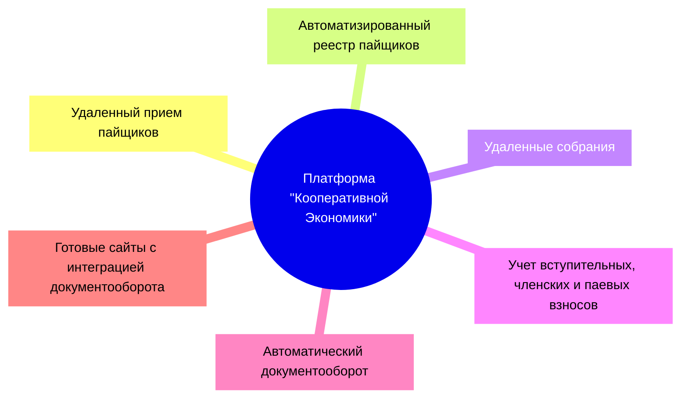

Платформа "Кооперативной Экономики" предоставляет системообразующее программное обеспечение для ведения электронного документооборота потребительских и производственных кооперативов, и создаёт условия для возникновения экосистемы цифровых продуктов на её основе. 

Платформа создана для удовлетворения потребностей руководителей кооперативов в автоматизации и прогрессе. Платформа применяется поставщиками программного обеспечения для того, чтобы сделать управление кооперативами таким же простым, как нажатие кнопки. 

!!!note "для кого?"
    Платформа создана для разработчиков программного обеспечения, которые разрабатывают и поставляют приложения для подключенных кооперативов. Таких разработчиков и поставщиков мы называем - "Провайдеры".

Платформа позволяет провайдерам:

- Реализовать удаленный приём пайщиков;

- Вести автоматизированный реестр пайщиков;

- Проводить удаленные собрания совета и общие собрания пайщиков;

- Вести автоматизированный учет вступительных, членских и паевых взносов, а также их возвратов и использования;

- Без труда вести автоматический документооборот по типовым действиям пайщиков; 

Платформа позволяет провайдерам реализовать программные продукты с интегрированным документооборотом по стандартизированным целевым потребительским программам кооперации, и поставлять их - кооперативам. 

Платформа основана на методологии кооперации союза потребительских обществ "РУСЬ" и   технологии блокчейн. Блокчейн предоставляет технологическую возможность бесшовного взаимодействия между кооперативами, когда пайщик или группа пайщиков одного кооператива, может быть заказчиком (коллективным участником в целевой потребительской программе) в другом кооперативе, но при этом, не являться его членами напрямую, а поручать своему кооперативу решить их задачу по удовлетворению их потребностей. 

Другими словами, Платформа объединяет кооперативы в распределенную сеть локальных, региональный и международных объединений пайщиков в цифровой среде, реализующей общие стандарты для кооперации. А цифровая карта, которая выдаётся каждому пайщику при регистрации в любом кооперативе, обеспечивает ему "быстрый вход" в любой кооператив платформы. 

Именно так Платформа образует Кооперативную Экономику. А все дальнейшие разделы этой документации посвящены стандартам кооперации и технологическим аспектам построения приложений на Платформе. 