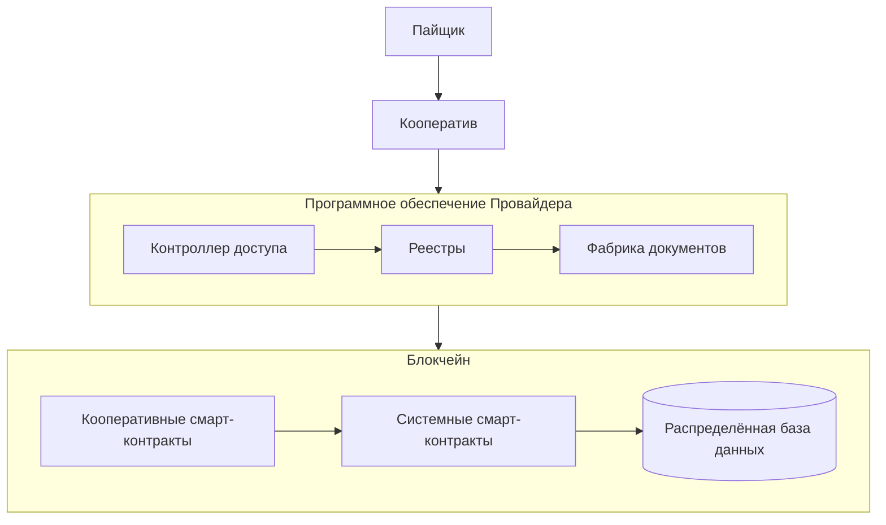
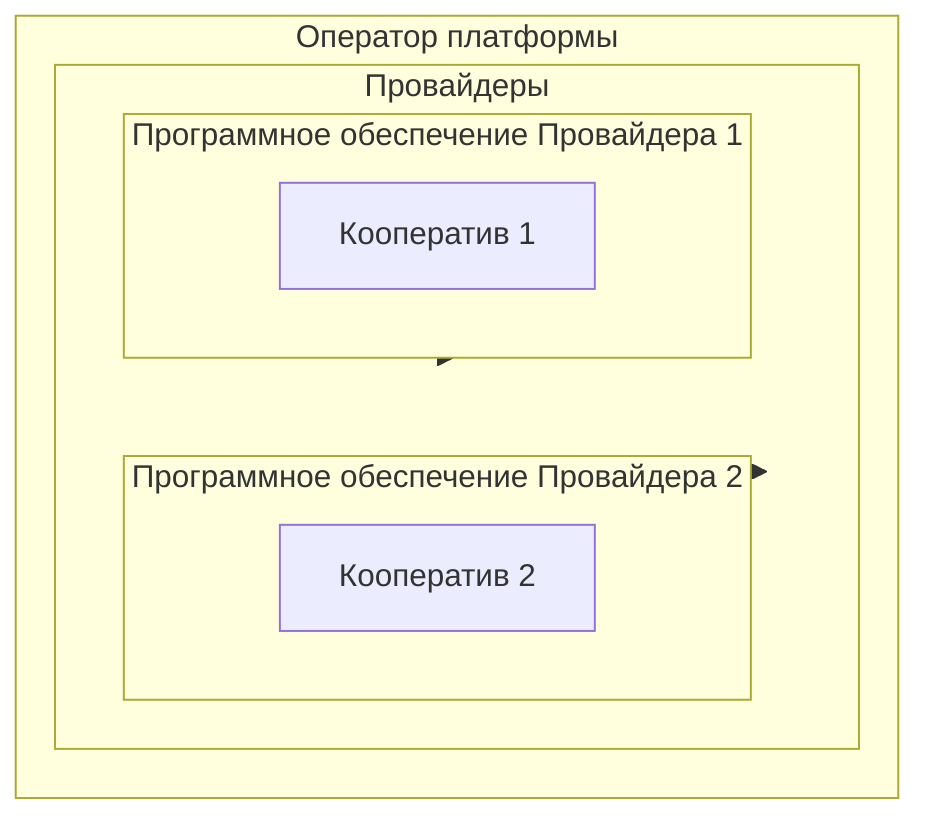
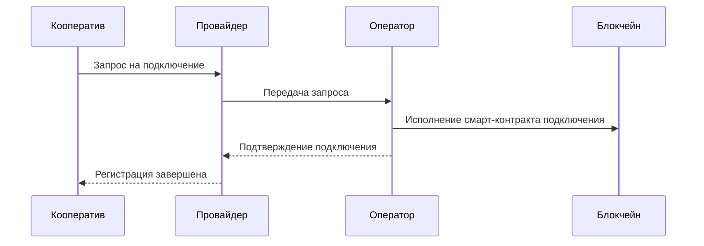
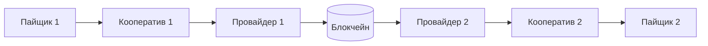
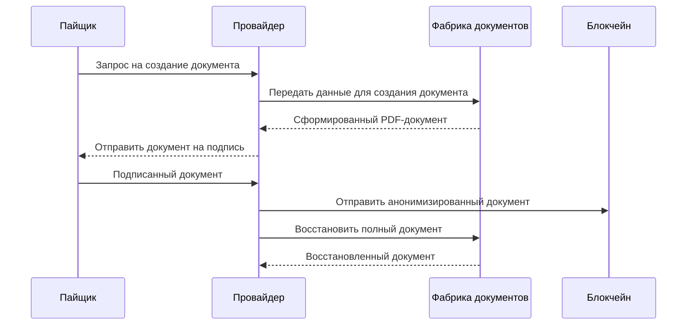

Пайщик, обращаясь к одному из подключенных кооперативов на платформе, обращается в программное обеспечение провайдера, который предоставляет его кооперативу сервис. Кооператив же обладает соглашением с провайдером о правилах и условиях предоставления сервиса. 

!!!note "Провайдеры - это организации, которые предоставляют кооперативам программное обеспечение платформы кооперативной экономики как готовый сервис "с кнопками". "
    

Провайдеры обеспечивают для кооперативов и их пайщиков контроль прав доступа к реестрам и фабрике документов. Фабрика документов производит цифровые документы в соответствии с методологией кооперации в моменты нажатия пайщиком соответствующих кнопок в приложении провайдера на основании информации из реестров. 

!!!note "Фабрика документов - стандатизированное программное обеспечение провайдеров для производства цифровых документов"

Фактическое подключение кооперативов осуществляется оператором. Оператор платформы кооперативной экономики осуществляет исполнение кооперативного смарт-контракта о подключении нового кооператива, результатом которого является регистрация аккаунтов в блокчейне и конфигурация системных смарт-контрактов, необходимая для нормальной работы подключенного кооператива. 

Оператор у платформы один, а провайдеров может быть много, на каждую подключаемую страну, как минимум, по одному. Оператор обеспечивает функционирование блокчейна и его токеномики, а также реализует и поддерживает системные контракты, на которых основана работа кооперативных смарт-контрактов кооперативов. Весь блокчейн находится во внутреннем кооперативном контуре оператора и поэтому его участие в подключении новых кооперативов - обязательно. 

При подключении к платформе председатель, члены совета и все пайщики нового кооператива получают карты пайщиков, которые содержат в себе уникальные идентификаторы имен аккаунтов и приватный ключ доступа, которым осуществляется простая цифровая подпись электронных документов, а также интер-кооперативный "быстрый вход" в другие кооперативы. 

Каждый кооператив, который подключается провайдером, получает у провайдера приватную базу данных и контроллер доступа к ней, который всецело или частично реализует функциональность платформы кооперативной экономики. Приватные базы данных кооперативов содержат реестр пайщиков, реестр движения паевых и членских взносов, и реестры документов. А контроллеры доступа осуществляют контроль прав доступа к этим данным и методы их изменения согласно реализованным сценариям кооперации в их приложения. 

!!! note "Важно"
    Провайдеры предоставляют программное обеспечение, вход в которое осуществляется посредством карты пайщика. То, что реализует программное обеспечение провайдера полностью зависит от провайдера. Каталог провайдеров представлен в разделе "Подключение". 

Провайдеры в своих контроллерах реализуют методы вызова кооперативных смарт-контрактов, которые могут быть отработаны совершенно в другом приложении другого провайдера за счёт того, что они используют общие протоколы обмена информацией через блокчейн. Так, пайщик одного кооператива используя программное обеспечение провайдера А, может произвести операцию по взносу, который будет возвращен другому пайщику в другом кооперативе, который использует программное обеспечение провайдера Б. 

Подобные меж-провайдерные и меж-кооперативные операции возможны за счёт применения общих стандартов по документообороту, которые позволяют провайдерам создавать юридические документы таким образом, что другие провайдеры могут их применять. Одновременно с этим, блокчейн обеспечивает единство публичных методов и контроль аудентификации для действий, которые необходимо исполнить в кооперативом смарт-контракте. 

Таким образом, у каждого кооператива есть приватная база данных, в которой находятся внутренние реестры именно этого кооператива, а у другого кооператива есть своя собственная база данных, которая может быть даже устроена иначе, однако, сам процесс, по которому провайдеры создают документы - идентичен, т.к. они применяют одну и ту же фабрику документов, которые отправляются в кооперативные смарт-контракты, в блокчейн.

Фабрика документов - это программный продукт для провайдеров, который обеспечивает единый стандарт в процессе производства юридических документов. Фабрика использует для своей работы шаблоны документов, в которые подставляет данные пайщиков в соответстветствии с тем действием, которое он запрашивает.

При запросе пайщика в программном обеспечении Провайдера, Провайдер автоматически обращается в приватный реестр кооператива, а также в блокчейн, и извлекает оттуда всю необходимую информацию для подготовки юридического документа в соответстветствии с тем действием, которое запросил пайщик. 

После извлечения данных, провайдер передает эти данные в фабрику, которая формирует PDF-документ и возвращает его провайдеру, который в свою очередь, вовзращает его на подпись пайщику. 

После подписи документа, который всегда относится к процессу исполнения того или иного кооперативного смарт-контракта, провайдер отправляет действие пайщика в блокчейн, прикладывая к действию анонимизированную копию документа, из которой можно восстановить оригинал, обладая полным набором тех же приватных данных о пайщике, которые использовались при формировании документа. 

В анонимизированной копии документа нет сведений о пайщике, но есть его цифровая подпись, которая позволяет идентифицировать факт подписи документа анонимным пайщиком. Деанонимизировать же пайщика может только кооператив, у кого есть приватные данные этого пайщика. Обладая приватными данными пайщика, кооператив может через своего провайдера повторно вызвать фабрику документов, передав в неё анонимизированный документ и приватные данные пайщика, и получить полную PDF-версию документа с цифровой подписью пайщика, которую он теперь может использовать согласно исполняемому им кооперативному смарт-контракту. 

Все эти процессы генерации и регенерации документов скрыты и происходят автоматически при нажатии пайщиками кнопок в приложениях провайдеров. Однако эти действия по формированию документов на основании общих стандартов и позволяют вести автоматизированный учёт электронного документооборота в потребительских и производственных кооперативах. 

