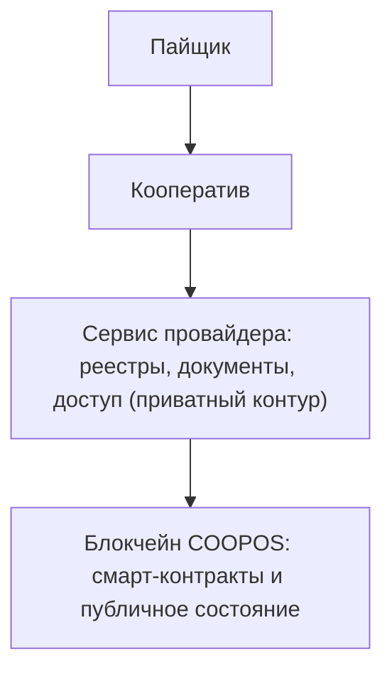
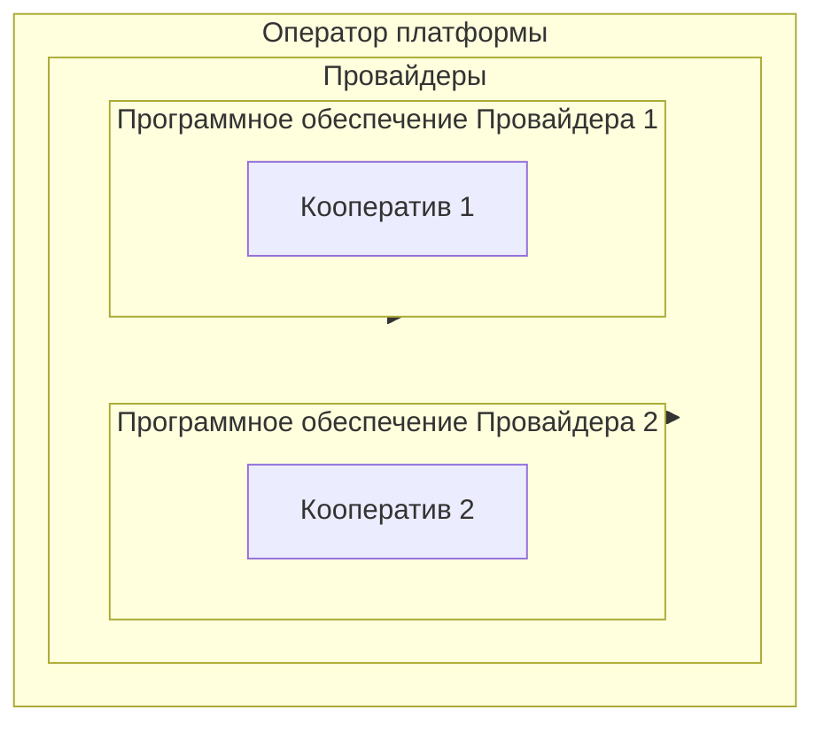
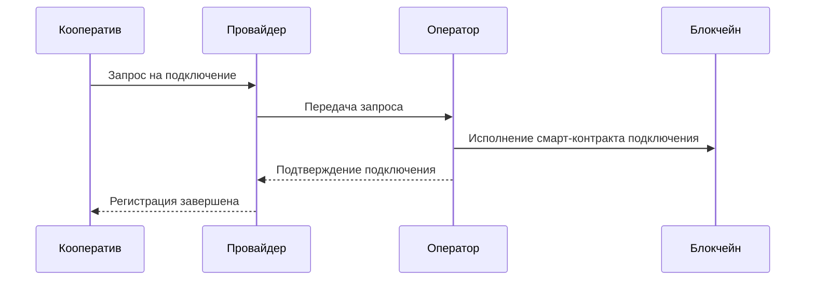
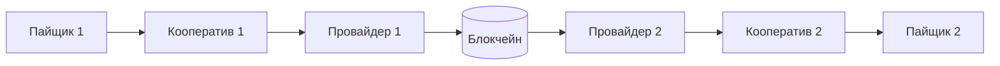
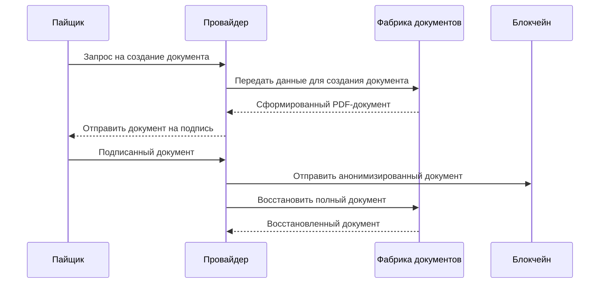

# Обзор

На этой странице — **карта элементов** экосистемы, различие **публичной платформы** и **кооперативных бэкендов** провайдеров, роли оператора и провайдеров, а ниже — потоки документов и фабрика. См. также сжатое [Введение](../index.md).

## Элементы экосистемы

| Элемент | Роль |
|--------|------|
| **Блокчейн (COOPOS)** | Общая цепь: консенсус, узлы, публичное состояние, системные и кооперативные смарт-контракты, API. Документация: раздел [Блокчейн](blockchain/intro.md) и вложенные страницы. |
| **Библиотека типов** | Согласованные типы для контрактов и интеграций между сервисами. [Библиотека типов](https://docs.coopenomics.world/cooptypes). |
| **Кооперативные контракты** | Логика и экономика кооперации на цепи (в т. ч. эмиссия, сценарии пайщиков). [Кооперативные контракты](https://coopenomics.world/contracts). |
| **Фабрика документов** | Стандартизированное ПО для выпуска юридических документов по методологии кооперации; согласует реестры кооператива, шаблоны и действия в цепи. |
| **Инструменты разработчика (CDT)** | Компиляция контрактов C++ → WASM, ABI и смежный toolchain в духе EOSIO. **Отдельный раздел в оглавлении этой документации запланирован**; пока см. [Программы (инструменты COOPOS)](blockchain/programs.md). |

## Платформа и кооперативные бэкенды

**Платформа** в смысле стандартов кооперативной экономики включает **публичный блокчейн** (COOPOS), **опубликованные контракты и типы**, протоколы доступа к цепи и **фабрику документов** как общий подход к юридическим документам. **Кооперативный бэкенд** (сервис провайдера под конкретный кооператив) ведёт ФИО, полные реестры, внутренние документы и матрицу прав доступа; фабрика разворачивается у провайдера, но по **единой спецификации** платформы. В цепь попадают обезличенные и минимально достаточные данные для исполнения контрактов и межкооперативной согласованности.

```mermaid
flowchart TB
    П[Пайщик] --> К[Кооператив]
    К --> Б["Сервис провайдера: реестры, документы, доступ (приватный контур)"]
    Б --> Ц["Блокчейн COOPOS: смарт-контракты и публичное состояние"]
```

## Провайдеры, оператор и сервис кооператива

Пайщик, обращаясь к одному из подключенных кооперативов на платформе, обращается в программное обеспечение провайдера, который предоставляет его кооперативу сервис. Кооператив же обладает соглашением с провайдером о правилах и условиях предоставления сервиса. 

!!!note "Провайдеры - это организации, которые предоставляют кооперативам программное обеспечение платформы кооперативной экономики как готовый сервис "с кнопками". "
    

Провайдеры обеспечивают для кооперативов и их пайщиков контроль прав доступа к реестрам и фабрике документов. Фабрика документов производит цифровые документы в соответствии с методологией кооперации в моменты нажатия пайщиком соответствующих кнопок в приложении провайдера на основании информации из реестров. 

!!!note "Фабрика документов — стандартизированное программное обеспечение провайдеров для производства цифровых документов"

Фактическое подключение кооперативов осуществляется оператором. Оператор платформы кооперативной экономики осуществляет исполнение кооперативного смарт-контракта о подключении нового кооператива, результатом которого является регистрация аккаунтов в блокчейне и конфигурация системных смарт-контрактов, необходимая для нормальной работы подключенного кооператива. 

```mermaid
flowchart TB
    subgraph Провайдеры[Провайдеры]
        subgraph Провайдер1[Программное обеспечение Провайдера 1]
            Кооператив1[Кооператив 1]
        end
        subgraph Провайдер2[Программное обеспечение Провайдера 2]
            Кооператив2[Кооператив 2]
        end
    end

    subgraph Оператор[Оператор платформы]
        direction TB
        Провайдеры
    end

    Провайдер1 --> Оператор
    Провайдер2 --> Оператор
```

Оператор у платформы один, а провайдеров может быть много, на каждую подключаемую страну, как минимум, по одному. Оператор обеспечивает функционирование блокчейна и его токеномики, а также реализует и поддерживает системные контракты, на которых основана работа кооперативных смарт-контрактов кооперативов. Весь блокчейн находится во внутреннем кооперативном контуре оператора и поэтому его участие в подключении новых кооперативов - обязательно. 

```mermaid
sequenceDiagram
    participant Кооператив
    participant Провайдер
    participant Оператор
    participant Блокчейн

    Кооператив->>Провайдер: Запрос на подключение
    Провайдер->>Оператор: Передача запроса
    Оператор->>Блокчейн: Исполнение смарт-контракта подключения
    Оператор-->>Провайдер: Подтверждение подключения
    Провайдер-->>Кооператив: Регистрация завершена

```

При подключении к платформе председатель, члены совета и все пайщики нового кооператива получают карты пайщиков, которые содержат в себе уникальные идентификаторы имен аккаунтов и приватный ключ доступа, которым осуществляется простая цифровая подпись электронных документов, а также интер-кооперативный "быстрый вход" в другие кооперативы. 

Каждый кооператив, подключаемый через провайдера, получает **свой кооперативный бэкенд**: приватные базы данных и прикладной сервис (реестр пайщиков, движение паевых и членских взносов, реестры документов, правила доступа и сценарии кооперации). Это **вне** ответственности публичной цепи: платформа не администрирует эти хранилища. 

!!! note "Важно"
    Провайдеры предоставляют программное обеспечение, вход в которое осуществляется посредством карты пайщика. То, что реализует программное обеспечение провайдера полностью зависит от провайдера. Каталог провайдеров представлен в разделе "Подключение". 

Провайдеры **в своих сервисах** реализуют вызовы кооперативных смарт-контрактов; тот же сценарий может завершиться в приложении другого провайдера, потому что обмен идёт через **общие протоколы и состояние блокчейна**. Например, пайщик в кооперативе с ПО провайдера А инициирует взнос, а возврат получает пайщик в кооперативе у провайдера Б. 

```mermaid
flowchart LR
    Пайщик1[Пайщик 1] --> Кооператив1[Кооператив 1]
    Кооператив1 --> Провайдер1[Провайдер 1]
    Провайдер1 --> Блокчейн[(Блокчейн)]
    Блокчейн --> Провайдер2[Провайдер 2]
    Провайдер2 --> Кооператив2[Кооператив 2]
    Кооператив2 --> Пайщик2[Пайщик 2]

```

Подобные меж-провайдерные и меж-кооперативные операции возможны за счёт применения общих стандартов по документообороту, которые позволяют провайдерам создавать юридические документы таким образом, что другие провайдеры могут их применять. Одновременно с этим блокчейн обеспечивает единство публичных методов и проверку авторизации для действий, которые должны исполниться в кооперативном смарт-контракте. 

Таким образом, у каждого кооператива есть приватная база данных, в которой находятся внутренние реестры именно этого кооператива, а у другого кооператива есть своя собственная база данных, которая может быть даже устроена иначе, однако, сам процесс, по которому провайдеры создают документы - идентичен, т.к. они применяют одну и ту же фабрику документов, которые отправляются в кооперативные смарт-контракты, в блокчейн.

Фабрика документов - это программный продукт для провайдеров, который обеспечивает единый стандарт в процессе производства юридических документов. Фабрика использует для своей работы шаблоны документов, в которые подставляет данные пайщиков в соответствии с тем действием, которое он запрашивает.

При запросе пайщика в программном обеспечении провайдера тот обращается в приватный реестр кооператива и в блокчейн и извлекает данные, нужные для юридического документа по запрошенному действию. 

```mermaid
sequenceDiagram
    participant Пайщик
    participant Провайдер
    participant Фабрика as Фабрика документов
    participant Блокчейн

    Пайщик->>Провайдер: Запрос на создание документа
    Провайдер->>Фабрика: Передать данные для создания документа
    Фабрика-->>Провайдер: Сформированный PDF-документ
    Провайдер-->>Пайщик: Отправить документ на подпись
    Пайщик->>Провайдер: Подписанный документ
    Провайдер->>Блокчейн: Отправить анонимизированный документ
    Провайдер->>Фабрика: Восстановить полный документ
    Фабрика-->>Провайдер: Восстановленный документ

```

После извлечения данных провайдер передаёт их в фабрику, та формирует PDF и возвращает его провайдеру, а провайдер направляет документ пайщику на подпись. 

После подписи документа, который всегда относится к процессу исполнения того или иного кооперативного смарт-контракта, провайдер отправляет действие пайщика в блокчейн, прикладывая к действию анонимизированную копию документа, из которой можно восстановить оригинал, обладая полным набором тех же приватных данных о пайщике, которые использовались при формировании документа. 

В анонимизированной копии документа нет сведений о пайщике, но есть его цифровая подпись, которая позволяет идентифицировать факт подписи документа анонимным пайщиком. Деанонимизировать же пайщика может только кооператив, у кого есть приватные данные этого пайщика. Обладая приватными данными пайщика, кооператив может через своего провайдера повторно вызвать фабрику документов, передав в неё анонимизированный документ и приватные данные пайщика, и получить полную PDF-версию документа с цифровой подписью пайщика, которую он теперь может использовать согласно исполняемому им кооперативному смарт-контракту. 

Все эти процессы генерации и регенерации документов скрыты и происходят автоматически при нажатии пайщиками кнопок в приложениях провайдеров. Однако эти действия по формированию документов на основании общих стандартов и позволяют вести автоматизированный учёт электронного документооборота в потребительских и производственных кооперативах. 

