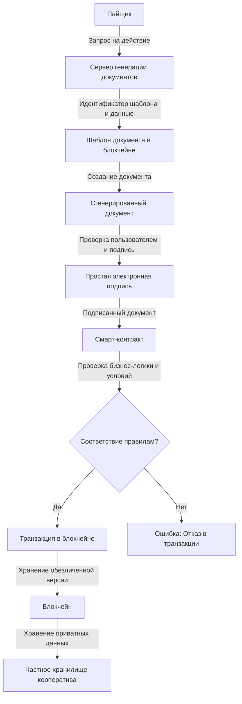

# Платформа

Платформа "Кооперативной Экономики" представляет собой системообразующее программное обеспечение, разработанное для удовлетворения широкого спектра потребностей потребительских и производственных кооперативов. Основная цель платформы заключается в автоматизации кооперативной деятельности, что позволяет эффективно управлять кооперативами в соответствии с методологией Союза Потребительских Обществ “РУСЬ”. 

Платформа предоставляет высокотехнологичную среду, которая позволяет кооперативам реализовать множество функций:

- Удаленное принятие пайщиков в кооперативы с возможностью оформления цифровой документации, обеспечивающей юридическую силу на всей территории России.

- Ведение Реестра пайщиков, строго соответствующего нормативным актам Российской Федерации, что обеспечивает правовую защищенность всех участников.

- Проведение дистанционных голосований пайщиков и членов Совета кооперативов, с автоматическим созданием Протоколов голосования, что упрощает процесс принятия решений и делает его прозрачным и документально подтвержденным.

- Управление финансовыми потоками, включая учет вступительных, членских и паевых взносов, а также возврата паевых взносов, что способствует эффективному управлению средствами кооператива.

- Учет и контроль расхода членских взносов, что позволяет кооперативам прозрачно управлять своими средствами и отчитываться перед пайщиками.

- Ведение автоматизированного первичного документооборота по типовым целевым потребительским программам, что облегчает выполнение задач кооперативов и снижает нагрузку на административный персонал.

Все юридически значимые действия, такие как подача заявлений, принятие решений Советом, подписание актов приема-передачи и создание протоколов голосования, регистрируются в системе распределенного реестра. Это обеспечивает неизменность данных и их автоматическую юридическую силу благодаря использованию простой электронной подписи в режиме реального времени.

Одним из ключевых преимуществ платформы является интегративная кооперация, когда пайщики одного кооператива могут беспрепятственно получать доступ к продуктам и услугам других кооперативов через внутренние цифровые документы. Это обеспечивает гибкость и взаимосвязанность всех кооперативов в единой цифровой среде.

Платформа создана для удовлетворения потребностей пайщиков не только в рамках кооперативов, но и в более сложных экономических взаимодействиях, таких как длинные цепочки создания ценности и планирование производства. Это делает платформу "Цифровой Экономики" мощным инструментом для кооперативного движения, обеспечивая его устойчивое развитие в условиях цифровой трансформации.

## Операционная система

Операционная система кооперативной экономики представляет собой серверное программное обеспечение, которое реализует блокчейн-протоколы для обеспечения отказоустойчивого выполнения смарт-контрактов и управления распределенной базой данных. Эта база данных содержит всю информацию о действиях участников сети и их последствиях, что делает ее основным хранилищем всех значимых данных в системе.

Основная задача операционной системы заключается в предоставлении надежных и гибких инструментов для создания и управления учетными записями кооперативов и их пайщиков. Эти учетные записи выполняют роль цифровых идентификаторов, обеспечивающих безопасное взаимодействие участников в децентрализованной среде. Участники могут безопасно выполнять транзакции, вызывать смарт-контракты и управлять своим участием в кооперативе через эту цифровую инфраструктуру.

## Делегаты
Делегаты — это участники платформы, которые предоставляют вычислительные ресурсы своих серверов для поддержания операционной системы. Делегаты играют важную роль в обеспечении бесперебойного функционирования системы, выполняя ключевые задачи по обработке транзакций и поддержанию блокчейна.

На платформе действует система выборов делегатов, где 21 основная команда и 150 резервных команд получают право предоставлять свои ресурсы и получать за это вознаграждение. Эти команды обеспечивают выполнение программного комплекса операционной системы, что включает в себя:

- Предоставление оперативной памяти для хранения данных, связанных с кооперативами и их пайщиками.
- Выделение процессорного времени для выполнения расчетов, связанных с операциями в системе.
- Обеспечение пропускной способности для передачи информации между узлами сети.

Эти три ключевых ресурса формируют технико-экономическую модель работы операционной системы, обеспечивая ее устойчивое функционирование.

## Провайдеры

Провайдеры программного обеспечения играют роль посредников между операционной системой и конечными пользователями — кооперативами и их пайщиками. Провайдеры создают и распространяют программное обеспечение, которое реализует протоколы операционной системы и позволяет кооперативам эффективно взаимодействовать в цифровой среде.

Провайдеры поставляют программное обеспечение, которое кооперативы могут использовать в виде мобильных, десктопных и веб-приложений. Это программное обеспечение позволяет пайщикам кооперироваться и взаимодействовать друг с другом, используя привычные цифровые инструменты, аналогичные обычным сайтам и приложениям.

На текущий момент основным провайдером платформы является ПК ВОСХОД, который предоставляет продукт [Цифровой Кооператив](https://цифровой-кооператив.рф). Этот продукт реализует систему персональных рабочих столов для пайщиков, предоставляя им доступ к функциональности кооперативов через единое цифровое пространство.

## Архитектура

### Ядро

Ядро операционной системы кооперативной экономики представляет собой комплекс программ, обеспечивающих выполнение всех ключевых функций платформы. Эти программы обеспечивают связь между узлами сети, управление распределенной базой данных, контроль доступа и исполнение смарт-контрактов.

Основные компоненты ядра включают:

- nodeos: Основной сервис ядра, который управляет хранением данных в блокчейне, поддерживает одноранговые сетевые соединения и планирует выполнение смарт-контрактов. Этот компонент поддерживает модульность через плагины, которые могут быть настроены для различных задач.

- cleos: Инструмент командной строки для взаимодействия с REST API, предоставляемыми nodeos. Cleos позволяет развертывать, тестировать и управлять смарт-контрактами, а также взаимодействовать с системой на уровне командной строки.

- keosd: Демон-менеджер ключей, обеспечивающий безопасное хранение приватных ключей и выполнение цифровых подписей. Keosd хранит ключи в зашифрованных кошельках, обеспечивая безопасность транзакций.

- CDT (Contract Development Tools): Инструментарий для разработки смарт-контрактов на языке C/C++, который позволяет создавать, оптимизировать и отлаживать смарт-контракты, компилируемые в WebAssembly (Wasm).

Эти компоненты обеспечивают стабильную работу операционной системы, поддерживая все аспекты взаимодействия кооперативов и их пайщиков в цифровой среде. Они обеспечивают надежность, безопасность и производительность платформы, делая ее устойчивой к внешним и внутренним воздействиям.

### Протоколы
Протокол - это спецификация, реализующая набор программных правил коммуникации между участниками системы. Другими словами, низкоуровневая договоренность на уровне программного кода, которая позволяет всем участникам обмениваться информацией. 

#### Протокол Программного Интерфейса (API). 
Протокол Программного Интерфейса (API) предоставляет набор конечных точек, через которые внешние приложения и пользователи могут осуществлять программное взаимодействие с системой. API служит связующим звеном между платформой и внешним миром, позволяя разработчикам интегрировать свои приложения, автоматизировать процессы и получать доступ к данным в системе.

API-протокол включает методы для чтения информации из распределенной базы данных, отправки транзакций, получения состояния смарт-контрактов, управления учетными записями и выполнения других операций. Он реализует стандарты запросов и ответов, которые обеспечивают стабильное и предсказуемое взаимодействие между различными компонентами системы. 

#### Протокол Сети (NET) 
Протокол Сети (NET) является важнейшим компонентом платформы кооперативной экономики, отвечающим за коммуникацию и передачу данных между узлами сети. В условиях распределенной системы надежная и эффективная передача данных является ключевым фактором для поддержания целостности и производительности всей платформы.

Протокол NET определяет правила и механизмы, по которым узлы обмениваются информацией, включая передачу блоков, транзакций и других сообщений. Этот протокол гарантирует, что все узлы платформы, участвующие в поддержании ее работы, получают актуальные данные и синхронизированы друг с другом. Он также управляет распространением новых данных по всей сети, обеспечивая своевременное обновление состояния базы данных на всех узлах.

Ключевым аспектом NET-протокола является его способность поддерживать высокую пропускную способность и устойчивость к сбоям. Это достигается за счет использования оптимизированных алгоритмов маршрутизации и обработки данных, а также встроенных механизмов для восстановления после потери связи между узлами. Протокол также поддерживает различные уровни приоритета для разных типов сообщений, что позволяет более эффективно управлять сетевыми ресурсами и минимизировать задержки в критически важных операциях.

Таким образом, протокол NET обеспечивает фундаментальную инфраструктуру для связи и взаимодействия всех участников системы, гарантируя, что платформа остается децентрализованной, устойчивой и производительной в любых условиях.

#### Протокол Консенсуса (CONSUNSUS) 
Протокол Консенсуса играет центральную роль в поддержании согласованности распределенной базы данных на платформе кооперативной экономики. В традиционных системах на основе технологии DPOS (Delegated Proof of Stake) консенсус достигается путем голосования за делегатов, которые затем подтверждают блоки транзакций. Однако в нашей платформе кооперативной экономики этот процесс был адаптирован для отражения уникальной структуры управления, основанной на принципах демократического участия.

Вместо стандартного DPOS, где сила голоса определяется количеством токенов, у нас внедрена система, где управление осуществляется собранием уполномоченных кооперативов. В этом подходе каждый кооператив имеет право назначить своего уполномоченного представителя, который обладает одним голосом независимо от экономического веса кооператива. Это обеспечивает равенство в процессе принятия решений и позволяет каждому участнику системы вносить свой вклад в управление платформой.

Технологически платформа по-прежнему использует элементы DPOS для эффективного подтверждения блоков и поддержания безопасности сети. Однако финальное решение о принятии или отклонении изменений в базе данных, а также стратегических решений, принимается собранием уполномоченных на основе принципа "один представитель — один голос". Это делает процесс консенсуса более справедливым и демократическим, соответствующим принципам кооперативной экономики.

#### Протокол Состояния (STATE)
Протокол Состояния (STATE) является ключевым элементом, обеспечивающим формирование и поддержание распределенной базы данных на платформе кооперативной экономики. Эта база данных хранит все актуальные данные о состоянии учетных записей, смарт-контрактов, балансов, прав доступа и других критически важных данных, необходимых для функционирования системы.

Протокол STATE отвечает за создание, обновление и синхронизацию состояния системы на всех узлах сети. В условиях кооперативной экономики, где управление осуществляется демократическими принципами, протокол STATE гарантирует, что любое изменение состояния системы отражает коллективные решения, принятые уполномоченными кооперативами через протокол CONSUNSUS. Это включает как обновления балансов и записей транзакций, так и изменения в смарт-контрактах и правах доступа.

Протокол также управляет механизмами проверки и применения изменений в состоянии. При получении новых данных протокол проверяет их на соответствие правилам платформы и подтверждает их валидность через механизм консенсуса. После подтверждения изменения записываются в распределенную базу данных, что гарантирует, что все узлы сети имеют одинаковое и актуальное представление о состоянии системы.

Таким образом, протокол STATE играет фундаментальную роль в обеспечении целостности и актуальности данных на платформе. Он обеспечивает, чтобы все действия, выполняемые в системе, были корректно отражены в распределенной базе данных и синхронизированы между всеми участниками сети, поддерживая стабильность и прозрачность кооперативной экономики.

#### Протокол Виртуальной Машины (WASM)
Протокол Виртуальной Машины (WASM) является важнейшим компонентом платформы кооперативной экономики, который обеспечивает выполнение смарт-контрактов в распределенной базе данных. Виртуальная машина (VM) работает как изолированная среда выполнения, где смарт-контракты исполняются по строго определенным правилам, что гарантирует безопасность и предсказуемость их работы.

На платформе кооперативной экономики используется WebAssembly (WASM) в качестве виртуальной машины. WASM предоставляет высокопроизводительную среду для выполнения смарт-контрактов, поддерживая широкий набор инструкций и обеспечивая возможность выполнения сложных вычислений с минимальными задержками. Смарт-контракты, написанные на различных языках программирования, компилируются в WASM, что делает их выполнение быстрым и эффективным.

Протокол WASM также включает в себя механизмы контроля ресурсов, таких как процессорное время и использование памяти, что предотвращает злоупотребление ресурсами и защищает сеть от потенциальных атак. Кроме того, он обеспечивает детерминированность исполнения, то есть одинаковые входные данные всегда приводят к одинаковым результатам, что крайне важно для децентрализованных систем.

На платформе кооперативной экономики протокол WASM интегрирован с другими ключевыми протоколами, такими как CONSUNSUS и STATE, что обеспечивает надежное выполнение смарт-контрактов и их правильное отражение в распределенной базе данных. Благодаря этому, кооперативы могут использовать смарт-контракты для автоматизации процессов, управления активами и выполнения других задач, необходимых для поддержания и развития кооперативной экономики.

Таким образом, протокол WASM является критически важным компонентом, обеспечивающим безопасное, эффективное и детерминированное выполнение смарт-контрактов на платформе, поддерживая принципы децентрализации и кооперации.

#### Протокол Истории (HISTORY)

Протокол Истории (HISTORY) выполняет ключевую функцию в формировании и хранении полной и неизменяемой записи всех действий, которые происходят на платформе кооперативной экономики. Этот протокол отвечает за сбор, обработку и предоставление доступа к историческим данным, что делает его важным инструментом для аудита, анализа и восстановления данных.

В рамках платформы кооперативной экономики протокол HISTORY фиксирует все события, включая транзакции, изменения состояния учетных записей, выполнение смарт-контрактов, решения, принятые через протокол CONSUNSUS, и другие действия. Все эти данные хранятся в распределенной базе данных, что обеспечивает их доступность и неизменяемость, гарантируя, что прошлые события не могут быть изменены или удалены.

Протокол HISTORY предоставляет интерфейсы для запросов исторических данных, что позволяет участникам системы получать доступ к детальной информации о прошлых действиях. Эти данные могут быть использованы для анализа поведения системы, проверки легитимности транзакций, восстановления данных в случае сбоев и для других целей, связанных с прозрачностью и подотчетностью системы.

Кроме того, протокол HISTORY играет важную роль в обеспечении доверия среди участников кооперативной экономики. Поскольку все действия в системе записываются и доступны для проверки, участники могут быть уверены в честности и открытости всех процессов, происходящих на платформе.

Таким образом, протокол HISTORY является важным компонентом платформы, обеспечивая полную и неизменную запись всех событий, происходящих в системе, что способствует поддержанию прозрачности, доверия и ответственности в рамках кооперативной экономики.

#### Протокол Контроля Доступа (AUTH)
Протокол Контроля Доступа (AUTH) является фундаментальным элементом безопасности платформы кооперативной экономики. Он обеспечивает проверку и управление правами доступа участников при выполнении действий на платформе, гарантируя, что только авторизованные пользователи и приложения могут инициировать определенные операции или изменять данные в системе.

На платформе кооперативной экономики протокол AUTH реализует многоуровневую систему контроля доступа, где каждому участнику, учетной записи или смарт-контракту могут быть назначены определенные права и роли. Эти права определяют, какие действия могут быть выполнены и с какими ресурсами можно взаимодействовать. Например, участники могут иметь различные уровни доступа к управлению активами, выполнению транзакций, модификации смарт-контрактов и другим критически важным операциям.

Протокол AUTH также поддерживает гибкие механизмы аутентификации и авторизации, включая использование цифровых подписей и мультиподписей (multi-signature). Это позволяет обеспечить дополнительную безопасность для операций, требующих одобрения нескольких участников, что особенно важно в условиях кооперативной экономики, где решения принимаются коллективно.

Кроме того, протокол AUTH интегрирован с другими ключевыми протоколами платформы, такими как CONSUNSUS и STATE. Это гарантирует, что все изменения в правах доступа и любые действия, требующие аутентификации, согласовываются и фиксируются в распределенной базе данных, поддерживая целостность и прозрачность системы.

Таким образом, протокол AUTH играет критическую роль в обеспечении безопасности и управляемости платформы, контролируя, кто и какие действия может совершать в системе. Это позволяет поддерживать высокую степень доверия среди участников и защищает платформу от несанкционированных действий и угроз.

#### Протокол Транзакций (TRANSACTION)
Протокол Транзакций (TRANSACTION) является ключевым механизмом, обеспечивающим создание, обработку и подтверждение транзакций на платформе кооперативной экономики. Транзакции представляют собой основное средство обмена данными и выполнения операций внутри системы, будь то переводы активов, вызов смарт-контрактов или любые другие действия, которые изменяют состояние распределенной базы данных.

Протокол TRANSACTION определяет формат и структуру транзакций, а также процессы их подписания и валидации. Каждая транзакция должна содержать точную информацию о действиях, которые она инициирует, и должна быть подписана авторизованным участником, права которого проверяются через протокол AUTH. После создания и подписи транзакция передается в сеть для обработки.

Протокол также включает механизмы проверки транзакций на соответствие правилам системы и протоколу CONSUNSUS. Это гарантирует, что все транзакции корректны, не нарушают установленные права и не противоречат текущему состоянию базы данных. Если транзакция удовлетворяет всем требованиям, она включается в новый блок и становится частью неизменной записи в распределенной базе данных.

Кроме того, протокол TRANSACTION поддерживает оптимизацию потока транзакций, обеспечивая высокую производительность и низкие задержки даже при высокой загрузке системы. Это достигается за счет использования передовых алгоритмов пакетирования и обработки транзакций, а также интеграции с протоколом NET для эффективного распространения данных по сети.

Таким образом, протокол TRANSACTION обеспечивает надежную и безопасную работу системы, позволяя участникам платформы кооперативной экономики совершать различные операции с уверенностью в их корректности и соблюдении правил системы. Это фундаментальный элемент, который поддерживает целостность, безопасность и эффективность всех процессов на платформе.

## Системные смарт-контракты
Системные смарт-контракты являются основой функционирования платформы кооперативной экономики, обеспечивая выполнение ключевых системных процессов, связанных с управлением кооперативами, их финансовыми потоками и юридически значимыми действиями. Эти контракты работают на уровне операционной системы и обслуживают базовые потребности всей сети кооперативов. Они определяют основные правила взаимодействия, проверяют права доступа и обеспечивают выполнение всех системных операций в рамках платформы.

Основные системные смарт-контракты:

- eosio.bios: Базовый контракт, отвечающий за инициализацию и управление параметрами блокчейн-сети. Он используется при развертывании и настройке новых блокчейн-узлов, а также обеспечивает выполнение базовых функций управления сетью.

- eosio.system: Контракт управления жизненным циклом аккаунтов и другими критически важными функциями блокчейн-сети, такими как управление ресурсами (оперативной памятью, CPU и сетевой пропускной способностью), обработка транзакций, управление ставками и выборами делегатов.

- eosio.token: Контракт, обеспечивающий создание, выпуск и управление токенами внутри платформы. Этот контракт отвечает за все операции с токенами, включая их передачу между участниками, создание новых токенов и уничтожение неиспользуемых.

- eosio.msig: Контракт многосигнатурных транзакций, который позволяет участникам сети создавать транзакции, требующие подписи нескольких участников перед их выполнением. Этот механизм повышает безопасность при принятии важных решений, требующих одобрения нескольких сторон.

- eosio.wrap: Контракт, предоставляющий механизм завернутых транзакций, которые могут быть инициированы и подтверждены авторизованными учетными записями. Этот контракт используется для выполнения административных функций с повышенными правами доступа, например, при замене утерянных ключей аккаунта.

Кроме стандартных контрактов, платформа кооперативной экономики включает следующие уникальные системные контракты:

- draft: Контракт управления шаблонами документов. Этот контракт позволяет создавать, редактировать и хранить шаблоны юридически значимых документов, которые затем могут быть использованы кооперативами для автоматического создания документов на основе заданных шаблонов.

- registrator: Контракт реестра пайщиков, который обеспечивает регистрацию новых аккаунтов и управление процессом вступления пайщиков в кооперативы. Этот контракт контролирует правильность и легитимность процесса вступления, а также поддерживает актуальность данных в реестре.

- soviet: Контракт совета кооперативов, который получает повестку заседаний, обеспечивает голосование членов совета и фиксирует принятые решения по документам, созданным на основе шаблонов из контракта draft. Этот контракт автоматизирует процесс принятия решений внутри кооперативов.

- fund: Контракт управления фондами кооператива, который отвечает за учет и распределение средств, находящихся в фондах кооператива. Этот контракт также может обеспечивать управление целевыми фондами, использующимися для финансирования различных программ и инициатив внутри кооператива.

- gateway: Контракт шлюза финансовых потоков, который управляет процессами взносов и возврата взносов. Этот контракт обеспечивает правильность и своевременность обработки финансовых операций, гарантируя выполнение всех обязательств между кооперативом и его пайщиками.

Эти системные смарт-контракты совместно обеспечивают надежную и безопасную работу платформы кооперативной экономики, автоматизируя ключевые процессы управления кооперативами и поддерживая их повседневную деятельность.

## Кооперативные смарт-контракты

Кооперативные смарт-контракты формируют методологическую основу цифрового взаимодействия между пайщиками и кооперативами в платформе кооперативной экономики. Эти контракты обеспечивают автоматизацию специфических процессов, связанных с участием пайщиков в различных целевых программах кооперативов, и обеспечивают легитимность всех действий.

Кооперативные смарт-контракты охватывают различные аспекты экономических отношений внутри кооперативов и обеспечивают прозрачность и подотчетность всех операций. Они делятся на несколько категорий в зависимости от сектора деятельности и типов взаимодействия:

### Продукты питания

- Поставка: Смарт-контракты в этой категории автоматизируют процессы поставки продовольственных товаров. Эти контракты обеспечивают выполнение обязательств по поставке продуктов питания, отслеживание их состояния и соблюдение условий договора между кооперативами и поставщиками.

- Заказ: Эти контракты позволяют пайщикам кооперативов оформлять заказы на продукты питания, управлять доставкой и контролировать выполнение всех условий заказа. Контракты также могут включать функции коллективных заказов, что позволяет группам пайщиков заказывать продукты по более выгодным условиям.

- Инвестиции: Смарт-контракты, которые управляют инвестициями пайщиков в проекты по производству и поставке продуктов питания. Эти контракты могут включать механизмы распределения выгоды, обеспечения залогов и контроля за выполнением условий инвестиционных соглашений.

### Недвижимость
- Строительство: Контракты, управляющие процессами финансирования и строительства объектов недвижимости, включая управление затратами, контроль за выполнением этапов строительства и распределение долей собственности среди пайщиков.

- Приобретение: Эти смарт-контракты автоматизируют процессы покупки недвижимости кооперативами или пайщиками, включая проверку прав собственности, оформление документов и управление финансовыми потоками, связанными с приобретением недвижимости.

- Аренда: Контракты аренды недвижимости обеспечивают управление условиями аренды, оплату арендных платежей и контроль за соблюдением условий аренды, включая возможные коллективные формы аренды, когда несколько пайщиков арендуют объект совместно.

### Средства транспорта

- Поставка: Смарт-контракты для поставки транспортных средств управляют процессом передачи автомобилей или других транспортных средств от поставщиков к кооперативам и пайщикам, обеспечивая контроль качества и выполнения условий поставки.

- Аренда: Эти контракты автоматизируют аренду транспортных средств, обеспечивая учет арендных платежей, контроль состояния арендуемых объектов и соблюдение условий договора аренды.

- Обслуживание: Смарт-контракты, управляющие процессами технического обслуживания транспортных средств, включая планирование, оплату и контроль за выполнением работ по ремонту и обслуживанию.

### Результаты услуг
- Заказ: Контракты, которые управляют процессом заказа различных услуг пайщиками кооперативов. Эти контракты обеспечивают выполнение обязательств по предоставлению услуг, учет оплат и контроль качества результатов услуг.

- Поставка: Эти смарт-контракты автоматизируют процесс оказания услуг, начиная от принятия заявки и заканчивая контролем за выполнением работы и оценкой качества предоставленных услуг.

Все описанные контракты могут расширяться до коллективных форм взаимодействия, таких как:

- Коллективные заказы: Пайщики могут объединяться для совместного заказа товаров или услуг, получая преимущества от коллективной покупки, такие как снижение стоимости и улучшение условий поставки.

- Коллективное пользование: Смарт-контракты, позволяющие нескольким пайщикам совместно использовать имущество или ресурсы, управляя их распределением и оплатой пропорционально их вкладу.

- Коллективная аренда: Эти контракты позволяют нескольким пайщикам совместно арендовать имущество, распределяя между ними обязанности по оплате аренды и управлению арендованным объектом.

- Коллективное спонсорство и инвестиции: Пайщики могут совместно инвестировать в проекты или спонсировать инициативы, распределяя риски и прибыль между участниками.

Эти кооперативные смарт-контракты формируют основу цифровой системы хозяйствования, где все действия, связанные с экономическими отношениями, автоматизируются и контролируются в рамках единой платформы, обеспечивая прозрачность, легитимность и эффективность взаимодействия между участниками в кооперативной цифровой среде.

## Электронный документооборот

### Как это работает 
- Пайщик: Начинает процесс, отправляя запрос на выполнение действия (например, заказ поставки).

- Сервер генерации документов: Получает запрос, идентификатор шаблона и данные, необходимые для создания документа.

- Шаблон документа в блокчейне: Используется для генерации документа на основе шаблона и переданных данных.

- Сгенерированный документ: Возвращается пользователю для проверки и подписания.

- Простая электронная подпись: Пайщик подписывает документ с использованием приватного ключа.

- Смарт-контракт: Проверяет документ на соответствие бизнес-логике кооператива, включая авторизацию, права доступа и соблюдение условий.

- Соответствие правилам?: Если проверка успешна, транзакция записывается в блокчейн.

- Транзакция в блокчейне: Подтвержденная и записанная транзакция хранится в блокчейне.

- Блокчейн: Содержит обезличенную версию документа.

- Частное хранилище кооператива: Хранит приватные данные, необходимые для восстановления документации.

Система электронного документооборота кооперативной экономики представляет собой комплексный механизм, обеспечивающий создание, управление и хранение документов в цифровой форме. Эта система построена на основе блокчейн-технологий, обеспечивающих прозрачность, неизменность и безопасность всех действий. Ключевую роль в системе играют шаблоны документов, цифровые подписи пайщиков и смарт-контракты, контролирующие выполнение бизнес-логики и соблюдение правил кооператива.

Основные элементы системы включают:

- Шаблоны документов — хранятся в блокчейне и используются для создания документов на основе заданных переменных.

- Переменные и переводы — используются для динамической генерации документов на различных языках и для заполнения данных, специфичных для каждого пользователя и кооператива.

- Цифровые подписи — обеспечивают юридическую силу документов.

- Смарт-контракты — контролируют соответствие бизнес-логике, проверяют авторизацию, права доступа и другие аспекты документооборота.

- Реестры кооперативов — содержат приватные данные, необходимые для полного восстановления документации.

Далее рассмотрим основные компоненты и процессы системы более подробно.

### Шаблоны документов в блокчейне
Шаблон документа представляет собой текстовый файл, написанный с использованием технологии Jinja. Шаблон содержит статический текст и области, где должны быть вставлены переменные данные. Эти переменные включают в себя как конкретные данные пользователей (например, имена, суммы, даты), так и текстовые переводы на различные языки.

Пример структуры шаблона:

- Статический текст: Фиксированные фразы и абзацы, которые остаются неизменными в любом сгенерированном документе.

- Переменные: Специфические данные, такие как имя пайщика, дата подписания, сумма паевого взноса и т.д.

- Переводы: Языковые переменные, которые заменяются на соответствующий текст в зависимости от выбранного языка.

Каждый шаблон документа имеет уникальный идентификатор в блокчейне, который позволяет однозначно определить шаблон. Это обеспечивает возможность точно восстановить документ на основе шаблона и данных, даже спустя долгое время.

### Генерация документа по шаблону
Когда пайщик инициирует действие, например, заказ поставки, система автоматически отправляет запрос на сервер генерации документов кооператива. В этом запросе указываются данные, которые должны быть включены в документ, а также идентификатор соответствующего шаблона.

Сервер использует шаблон, извлекает необходимые переменные и генерирует документ, который полностью готов к подписанию. Этот документ возвращается пайщику для подписи.

### Простая электронная подпись
После генерации документа, пайщик подписывает его цифровой подписью. Подпись осуществляется автоматически сразу после того, как документ создан и проверен пользователем. Цифровая подпись обеспечивает юридическую силу документа и подтверждает, что пайщик действительно согласен с его содержанием.

Цифровая подпись обеспечивает юридическую силу документов и подтверждает, что пользователь (пайщик) действительно согласен с их содержанием. Процесс подписания документа цифровой подписью происходит автоматически и не требует дополнительных действий со стороны пользователя после генерации документа. 

Простая электронная подпись — это вид электронной подписи, который соответствует требованиям законодательства РФ и используется в кооперативной экономике на основе соглашения между пайщиком и кооперативом. Согласно этому соглашению, пайщик при подключении к цифровой среде подтверждает, что согласен с использованием простой электронной подписи для подписания документов. Это означает, что все документы, подписанные простой электронной подписью, обладают такой же юридической силой, как если бы они были подписаны собственноручной подписью пользователя.

Простая электронная подпись формируется с использованием приватного ключа пользователя, который генерируется и выдается ему при регистрации в системе кооператива. Приватный ключ является уникальным для каждого пользователя и служит не только средством создания цифровой подписи, но и средством аутентификации и доступа в систему. Использование приватного ключа позволяет гарантировать, что только авторизованный пользователь может подписывать документы от своего имени.

Приватный ключ может храниться различными способами в зависимости от предпочтений пользователя и уровня требуемой безопасности:

- В браузере: Приватный ключ может быть сохранен в зашифрованном виде в веб-браузере, что обеспечивает удобный доступ к системе с любого устройства.

- В мобильных приложениях: Пользователи могут хранить свои приватные ключи в мобильных приложениях, что позволяет подписывать документы с мобильных устройств.

- Физические устройства: Для повышения уровня безопасности приватный ключ может быть сохранен на физических устройствах, таких как защищенные USB-токены, смарт-карты и т.д.

### Контроль смарт-контрактов
После подписания, документ не просто отправляется в блокчейн, а вкладывается в действие, формирующее транзакцию. Каждый документ, связанный с транзакцией, проходит проверку смарт-контрактом, который контролирует выполнение всей бизнес-логики кооперативного смарт-контракта в соответстветствии с методологией кооперации СПО "РУСЬ":

- Авторизация: Проверка прав доступа пайщика, подтверждение его членства в кооперативе и соблюдение всех условий участия.

- Контроль прав доступа: Смарт-контракт проверяет, имеет ли пайщик право на выполнение конкретного действия (например, инициирование заказа или внесение взноса в кооперативе).

- Проверка платежей: Смарт-контракт может подтвердить наличие оплаты или других финансовых обязательств, необходимых для выполнения действия.

- Проверка порядка: Смарт-контракт проверяет порядок исполнения кооперативного смарт-контракта, и, например, не позволяет поставщику получить возврат деньгами до момента завершения гарантийного срока, и так далее, и тому подобное.

Таким образом, блокчейн не только хранит документ, но и обеспечивает соответствие всех действий установленным правилам и условиям кооператива. В случае успешного выполнения всех проверок документ, подписанный пайщиком, отправляется в блокчейн, где сохраняется его обезличенная версия.

### Хранение приватных данных
Приватные данные, такие как личные данные пайщика и специфические для кооператива данные, никогда не публикуются в блокчейне. Они хранятся в частных хранилищах кооперативов, что обеспечивает их защиту и конфиденциальность.

Все данные, которые публикуются в блокчейне, обезличены. Это значит, что они не содержат прямой публичной привязки к конкретным пользователям, а лишь включают информацию, необходимую кооперативам подтверждения юридических фактов действий. Приватные данные включают в себя информацию, которая необходима для восстановления и верификации документов, хранящихся в блокчейне.

Связь документов с пользователями могут установить только кооперативы, в которых пользователи являются пайщиками, т.к. приватные данные хранятся исключительно в хранилищах кооперативов. Эти хранилища изолированы друг от друга, что исключает возможность утечки данных между различными кооперативами. 

### Восстановление реестра документов

В случае необходимости кооператив может восстановить полный реестр своих документов, используя обезличенные данные из блокчейна и приватные данные, хранящиеся в его хранилищах. Это позволяет в любое время восстановить точное содержание документов, подписанных пайщиками, и провести аудит всех выполненных действий.

Процесс восстановления данных осуществляется с учетом всех мер безопасности, исключающих несанкционированный доступ. Публичные данные обезличены, что исключает идентификацию конкретных пайщиков, в то время как приватные данные защищены в хранилищах кооператива.

## Заключение

Система электронного документооборота кооперативной экономики основана на передовых технологиях, обеспечивающих прозрачность, безопасность и конфиденциальность всех операций. Использование блокчейна для хранения шаблонов документов и обезличенной информации, смарт-контрактов для контроля соответствия бизнес-логике, а также изолированных хранилищ для приватных данных гарантирует, что все действия пайщиков и кооперативов остаются защищенными и подотчетными. Эта система является ключевым элементом в создании доверия и устойчивости в кооперативной экономике.

Для более глубокого понимания технических деталей работы системы, включая реализацию смарт-контрактов, механизм управления шаблонами документов, процесс генерации и проверки цифровых подписей, а также структурирование и хранение данных в блокчейне и приватных хранилищах, вы можете ознакомиться с разделом [Документация](/documentation). В этом разделе мы подробно рассмотрим архитектуру системы, используемые технологии, а также приведем примеры кода и схемы для лучшего понимания всех компонентов системы.

<!-- 
### Клиентское ПО
Провайдеры предоставляют кооперативам клиентское программное обеспечение, в виде мобильных, десктопных, веб и прочих приложений, которые подключаются к операционной системе по API и взаимодействуют с Цифровыми Целевыми Потребительскими программами, отправляя подписанные простой электронной подписью действия и получая информацию из таблиц распределенной базы данных согласно её текущему Состоянию.  

### Сервисное ПО
Провайдеры предоставляют кооперативам сервисное программное обеспечение в виде дополнительных средств автоматизации, которые включают в себя, не ограничиваются:

- средствами оповещения;

- средствами формирования бухгалтерской отчетности;

- средствами авторизации на платформе;

Сервисное ПО исполняется на серверах Провайдеров и обеспечивает полноценное функционирование их клиентского ПО для Кооперативов-Клиентов. 

 -->

<!-- 

## Токеномика

### Утилити-токен
Платформа кооперативной экономики использует утилити-токен AXON, свободно передаваемый в рамках контура кооперативной экономики. Токен используется Делегатами для учёта количества переданной, хранимой и обработанной информации Кооперативов в процессе их деятельности. В AXON делегаты получают вознаграждение за предоставленные вычислительные ресурсы. 

### Учётная единица
У каждого кооператива есть внутренняя учётная единица, тикер которой соответствует государственной валюте центрального банка страны регистрации. Например, в России, это RUB. В этой учетной единице ведётся расчет вступительных, паевых и членских взносов согласно законодательству. 

### Эмиссия
Эмиссия AXON производится по протоколу эмиссии, описанному в соответствующем разделе. Эмиссия происходит только тогда, когда экономическая система расширяется, а количество кооперативов-клиентов и спрос на токены от них растёт. 

При уменьшении спроса на AXON, система продолжает функционировать на заданном объеме токенов в обороте до момента начала цикла сжигания. Автоматическое сжигание AXON производится до начала следующего цикла роста спроса на него. Таким образом, система автобалансирует количество токенов в обороте. 

Эмиссия же внутренних учётных единиц кооперативов происходит в процессе приёма паевых взносов, а сжигание - при возврате паевых взносов пайщикам. 

### Оборот
Каждому кооперативу-клиенту для осуществления своей деятельности на платформе необходимо арендовать вычислительные ресурсы у делегатов. Аренда происходит путём преобретия токенов AXON и ежедневной автоматизированной их передаче - делегатам в обмен на квоту вычислительных ресурсов. 

Квота вычислительных ресурсов расходуется по мере увеличения количества завершенных сделок, которые осуществляют пайщики кооператива-клиента. Оплата квоты производится ежедневно с кошелька AXON кооператива. 

Оплаченные AXON перераспределяются в пользу делегатов платформы согласно полученным ими голосам и времени участия. 

## Кооперативные приложения

Ведущие кооперативные приложения Провайдеров могут быть грубо разделены по секторам и типам следующим образом:

- Продукты питания
    - Поставка 
    - Заказ
    - Инвестиции
- Недвижимость
    - Строительство
    - Приобретение 
    - Аренда
- Средства транспорта
    - Поставка
    - Аренда
    - Обслуживание
- Результаты услуг
    - Заказ
    - Поставка

Таким образом, типичные смарт-контракты кооперативной экономики основные экономические отношения через следующие целевые потребительские программы:

- поставка и заказ имущества или результатов услуг;
- аренда имущества;
- инвестиции и спонсорство;

Эти типичные смарт-контракты целевых потребительских программ расширяются до коллективных форм взаимодействия, таких как: коллективные заказы, коллективное пользование, коллективная аренда, коллективное спонсорство и инвестиции, что всё вместе и образует кооперативную экономику как цифровую систему хозяйствования. 
 -->

